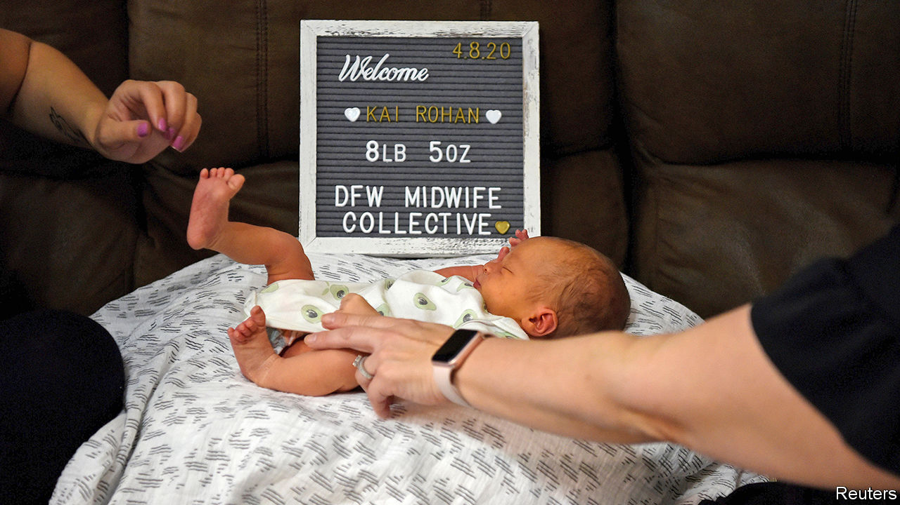

## Midwives wanted

# The pandemic is making America rethink its shunning of midwifery

> The quest for safe childbirth

> Jun 18th 2020WASHINGTON, DC

IN A NORMAL year, Robina Khalid might take on 70-80 clients at her midwifery practice in New York City. But 2020 has not been a normal year. She got around 150 calls in the first half of March alone. Some enquiring women were already late in their third trimester, she says, but were terrified of having their babies in a hospital for fear of contracting covid-19. Ms Khalid’s practice was not the only one inundated by calls from women entertaining the idea of a home birth. As the virus spread, so too did interest in alternative birthing options.

Even in cities at first less hard-hit than New York, many expectant mothers avoided hospitals where they could. Nancy Gaba, chair of obstetrics and gynaecology at the George Washington University Hospital in Washington, DC, noticed an initial uptick in unplanned home births around the time the World Health Organisation (WHO) declared the coronavirus outbreak a pandemic.

In the past, midwives have tended to be marginalised in America. Licensing rules vary across states, and insurance coverage for midwifery services is patchy. By contrast, Sweden has a 300-year-old tradition of professional midwifery. When a hospital in London recently went into partnership with a football stadium to give women a safe place for their prenatal check-ups during the pandemic, midwives were among the staff immediately brought in to help. In poorer countries, too, midwives are essential to maternal and public health.

Beyond the pandemic, American women face two problems that licensed midwives can help with. First, America is one of only 13 countries where the maternal mortality rate increased between 2000 and 2017, putting it in the august company of Venezuela and Syria. The risk of dying during childbirth can be exacerbated by a lack of trust between patients and health workers. In America that is especially true for black women, who die from pregnancy-related complications at more than three times the rate that white women do. Midwives cannot perform complex surgery or deliver babies for women with certain chronic health problems. But they can support low-risk women through labour. That frees doctors to do the harder stuff.

Second, because midwives’ calling-card is not intervening in labour, collaboration between midwives and obstetricians has been shown to lower the number of Caesarean sections. Nearly a third of babies born in America each year are delivered by C-section. But the WHO reckons that the necessary rate hovers between 10% and 15%. Caesarian deliveries can be life-saving for new-born babies and mothers, but they are major surgeries. They increase the risk of infection, haemorrhages and blood clots. George Washington University Hospital introduced midwifery services a decade ago, and has since seen its C-section rate drop by nearly 6%.

Will the interest in midwifery outlast the pandemic? It seems likely. The practice was growing even before the virus started to spread. And collaboration between doctors and midwives can prove effective. “Our doctors were willing to learn from our midwife colleagues,” says Dr Gaba. “If other places could do something like that, I think women would really benefit.”■

Editor’s note: Some of our covid-19 coverage is free for readers of The Economist Today, our daily [newsletter](https://www.economist.com/https://my.economist.com/user#newsletter). For more stories and our pandemic tracker, see our [coronavirus hub](https://www.economist.com//news/2020/03/11/the-economists-coverage-of-the-coronavirus)