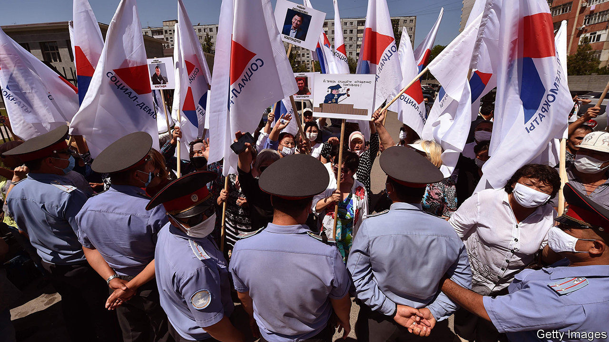

## Jail to the chief

# A former president of Kyrgyzstan is imprisoned for corruption

> But a parliamentary commission seems reluctant to rake over a more recent scandal

> Jun 25th 2020ALMATY

THE PRESIDENCY of Kyrgyzstan is not a job for the fainthearted. In the past 15 years two incumbents have been toppled by mass protests. Last year an ex-president, Almazbek Atambayev, was arrested amid a deadly clash between supporters and police. This week a court handed him an 11-year prison sentence on corruption charges that he says are politically driven.

The court ruled that Mr Atambayev had helped wangle the early release from prison of a mafia don, Aziz Batukayev, supposedly on compassionate grounds, using a fake diagnosis of leukaemia. Mr Batukayev walked free and flew to Russia in 2013, but prosecutors started probing Mr Atambayev’s role only after he began feuding with Sooronbay Jeyenbekov, a former protégé who had succeeded him as president in 2017.

Mr Jeyenbekov may have learnt a thing or two from his ex-mentor on neutralising rivals. When Mr Atambayev was president, his opponents had a habit of landing behind bars on corruption charges—a fate that has now befallen not only him, but also several allies. Sapar Isakov, an Atambayev-era prime minister, is serving 18 years in jail on graft charges.

Investigators have vigorously pursued the corruption charges against Mr Atambayev, but an equally momentous case, which brought protesters onto the streets when it hit the headlines last year, is moving glacially. It concerns a smuggling racket which allegedly enjoyed official protection, cost the government millions of dollars in forgone customs revenue and saw almost $1bn spirited out of the country. In mid-June a parliamentary commission, set up to investigate a murder at the centre of the scandal, finally released its findings. It concluded that the money involved was the proceeds of business dealings in neighbouring Uzbekistan and so was “not related to Kyrgyzstan”. There has been only one arrest of note in connection with the scandal.

However, investigators recently revealed that they are pursuing a novel line of inquiry: that the since-assassinated source for the exposé that brought the scandal to light had in fact bribed a reporter to publish claims of a massive customs swindle. That, retorted the outlet in question, Radio Free Europe, an American-funded broadcaster and website, was but the latest manoeuvre in a “campaign of retaliation” against corruption-busting journalists. Reporters have also been hounded by libel lawsuits and death threats. The culprits, says Radio Free Europe, are “corrupt individuals seeking to protect their wealth and power”. ■