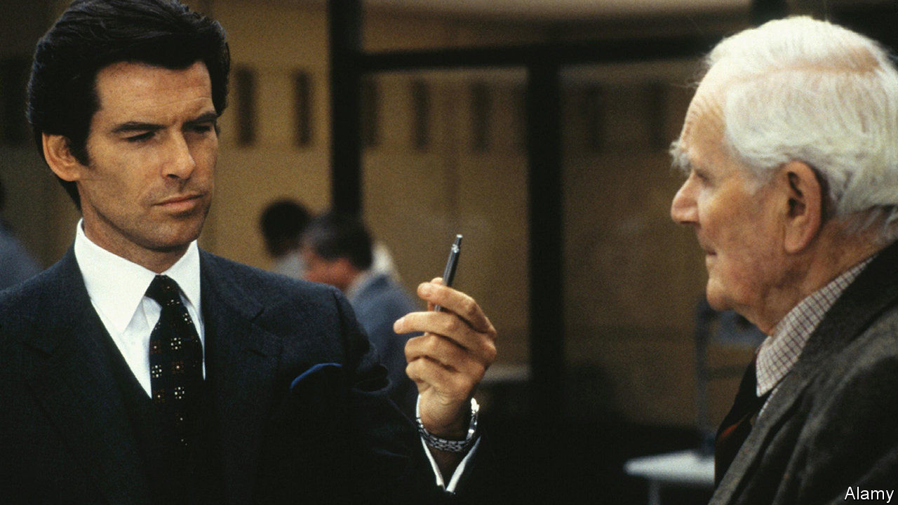

## Pen and stink

# A malfunctioning spy camera causes a scandal in Fiji

> The state broadcaster recruited an undercover operative to snoop on the opposition

> Jun 27th 2020WELLINGTON

“WE DON’T REALLY go in for that any more,” says a British spook witheringly of gadgets disguised as pens in “Skyfall”, a James Bond film. In Fiji, though, such devices have become a national fascination. A man called Ferrel Farizal Khan told the head of the Fiji Broadcasting Corporation, Riyaz Sayed-Khaiyum, that he was an undercover agent of sorts, running “Fiji Exposed”, an anonymous blog which features stories about the extramarital affairs of prominent politicians and businessmen. Mr Khan also claimed that he was being paid by the two main opposition parties to publish anti-government stories and to hack into the national elections database to seek evidence of government ballot-rigging. So Mr Sayed-Khaiyum, who is the brother of the omnipresent attorney-general, Aiyaz Sayed-Khaiyum, equipped him with a camera disguised as a pen to record opposition figures misbehaving.

Mr Khan returned empty-handed, saying that the spy-pen had failed to work. By then, Mr Sayed-Khaiyum was becoming suspicious of the supposed double-agent, whom he reported to the police. They are duly investigating Mr Khan. But they also took his allegations seriously enough to raid the offices of the National Federation Party, one of the two opposition outfits, hunting for evidence of links to “Fiji Exposed”—to no avail.

Mr Khan, meanwhile, claims to have recorded his conversations with Mr Sayed-Khaiyum, not on a spy-pen but on a mobile phone. “You prepare well,” he advised his denouncer, “as I now have nothing to lose.” Mr Sayed-Khaiyum, for his part, has held a press conference to “set the record straight”. He says he was never convinced by Mr Khan and threatened to sue the opposition parties for mocking him. He clearly does not have the political acumen of his brother, who is sometimes known as A2Z because he is thought to oversee everything the government does. Whether that includes his brother’s work is unclear.■