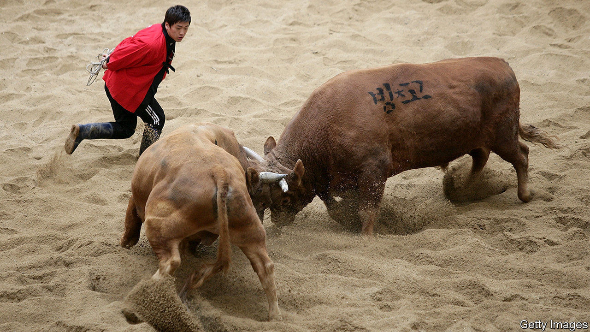

## Locking horns

# Bullfighting is under attack in South Korea

> If the pandemic doesn’t spike it, animal-rights activists might

> Jun 25th 2020JINJU

TO WORK OUT if a male calf will make a good fighting bull, you have to study its face. A promising one will have a glint in its eye, a hint of the courage and resolve needed to face down another bull in the ring. “It’s difficult to define, but you can just tell if they have that spirit,” says Lee Eul-boo, who heads the bullfighting association in Jinju, a city in the far south of South Korea. Mr Lee should know: besides breeding the animals for other trainers, he keeps ten fighting bulls of his own.

In South Korea bulls are pitted against one another in the ring rather than against human opponents, so the animal’s appetite for confrontation is essential to the drama. If both bulls are in the mood, they will lock horns and wrestle until one retreats. Frequently, however, an intimidated bull will slink away without a fight.

Despite the risk of such an anticlimax, bull-on-bull fights have been popular entertainment in South Korean villages for hundreds of years. The practice declined as people moved from the countryside to the city, but in recent years it has enjoyed a revival as a tourist attraction. Jinju, which claims to have conducted bullfights for centuries, built a new stadium for them 15 years ago. Other towns encourage visitors to bet on the outcome of fights. In a normal year, says Mr Lee, he would spend most weekends in summer on the road, taking his bulls to competitions.

The covid-19 pandemic has put a stop to that. Excitable crowds in stadiums present too much of an infection risk, whether they are watching baseball or bullfights. At present, fans are stuck with video reruns of past fights. Mr Lee pulls one up on the association’s office computer. Damduck, one of his bulls, headbutts his opponent into submission in a few seconds. “He has won countless fights—he’s a very good fighter,” Mr Lee says proudly.

It is unclear when Damduck will next be able to fight. Jinju’s bullfighting stadium is in dire need of refurbishment. The local government has in principle decided to put up the cash, but has not set a date for work to begin. The pandemic will probably not accelerate things. What is more, some members of the local assembly have begun to ask whether the fights are cruel, much to the dismay of Mr Lee. “We would do anything for our bulls, we don’t abuse them,” he says. Critics attack not just the fights themselves, which occasionally result in injuries to the bulls, but also the training regimen, which is rumoured to involve forcing bulls to drag car tyres uphill and feeding them soju, a local spirit. (Mr Lee says his bulls eat only nutritious homemade porridge.)

Huh Jeong-lim of the local culture committee says no decision has been reached on how to resolve the conflict between animal-rights activists and bull owners. “It will be a long-term discussion,” she says. Mr Lee, for his part, hopes the fights will pick up again once the pandemic is at bay. “It puts you on the edge of your seat watching them butt heads,” he says. “It’s just a fight—everybody loves a fight.” ■