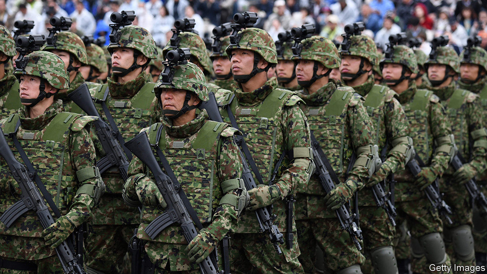

## Ready, cane, fire

# Japan’s soldiers are greying. Time to draft robots?

> Recruiting more women might help, too

> Jun 25th 2020TOKYO

BRIGHT YOUNG faces gaze out from a recruitment poster on the thick grey walls of the Defence Ministry in central Tokyo. But in greying Japan, finding enough youngsters to fill the ranks has become, by the ministry’s own admission, “an imminent challenge”. The number of Japanese between 18 and 26 years old, long the prime recruiting pool, peaked at 17m in 1994. It has since fallen to 11m. By 2050 it will sink below 8m. “Young blood is what all militaries need, and it’s exactly what we’re lacking,” says Yamaguchi Noboru, a retired lieutenant-general in the Self-Defence Forces (SDF), as the country calls its army, in deference to its pacifist constitution.

The SDF has missed its recruiting targets every year since 2014, reaching just 72% of its goal in 2018. It fields only 227,000 of the 247,000 troops it budgets for, a shortfall of 8%. Among the lowest ranks, the gap is over 25%. Low pay, harsh conditions and the limited prestige of soldiering in a peacenik nation with little unemployment always made recruiting hard, but demography compounds the difficulties. The inverted population pyramid ought to worry Japan as much as Chinese expansionism or North Korean missiles, argues Robert Eldridge, an American former military official and the author of a book in Japanese on demography and the armed forces: “Demographic change is not just an economic issue, it’s a national-defence issue.”

The army is using many of the same strategies as private companies to cope with an ageing workforce. “Just like the rest of Japan, the SDF is trying to see what AI and robotics can do for them,” says Sheila Smith of the Council on Foreign Relations, an American think-tank. The government has announced plans to acquire and develop new unmanned aircraft and submarines. While these will be for surveillance, “the next step is strike capability”, says Nagashima Akihisa, a government MP and former deputy defence minister.

But persuading politicians to fund the development and deployment of offensive weapons is hard in a country whose constitution states, “The Japanese people forever renounce war.” Nor is technology a panacea for personnel shortfalls, notes Koda Yoji, a retired vice-admiral. Drones and robots require operators and skilled engineers—the sort of people the SDF already has trouble attracting. A cyberdefence unit set up in 2014 has only 220 members.

An alternative is to expand the pool of potential personnel. Female troops used to be confined to non-combat roles such as nursing and administration, but in recent years the high command has allowed them to fly fighter jets and drive tanks, among other things; soon they will be allowed to sail on submarines. At the defence ministry, officers speak of “work-life balance” and stress family-friendly perks such as an on-site day-care centre. Yet progress has been slow: women made up just 7% of Japan’s armed forces in 2018, compared with an average of 11% among NATO countries. And the government’s goals are modest: to increase the share to 9% by 2030. The National Defence Academy caps the number of women it admits at 15%. Sexist attitudes about roles in the army still prevail, says Sato Fumika of Hitotsubashi University. In the SDF’s recruiting pamphlets, the pages that focus on women are printed on pink backgrounds.

Another way to keep up the numbers is simply to tolerate older soldiers. In 2018 the SDF raised the maximum age for new recruits from 26 to 32, the first increase since 1990. This year the retirement age for senior officers will start rising gradually. Older soldiers can focus on maintenance, logistics and training, thus freeing younger troops to concentrate on more muscular missions. Experienced soldiers may even bring advantages in “new domains and new frontiers” of warfare, where physical prowess matters less, says Colonel Kagoshima Hiroshi, who works in recruitment. Those past retirement age are encouraged to continue working for reduced pay. As Nagaiwa Toshimichi, a retired lieutenant-general, laughs, “I’m 71 years old, but I’m ready to fight.” He is only half-joking. ■

## URL

https://www.economist.com/asia/2020/06/25/japans-soldiers-are-greying-time-to-draft-robots
