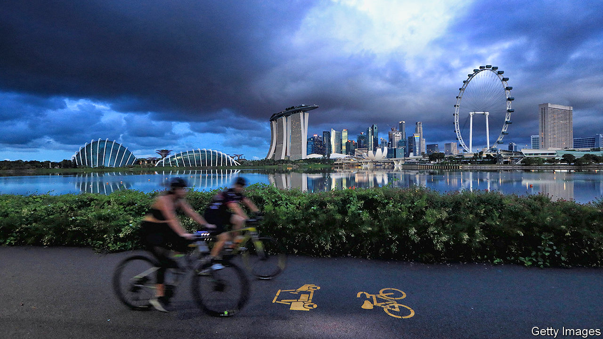

## Thirteenth time lucky

# Singapore’s ruling party calls an election

> It is likely to win, as it always does

> Jun 25th 2020SINGAPORE

“THIS GENERAL election will be like no other that we have experienced,” Singapore’s prime minister, Lee Hsien Loong, declared this week, announcing that the city-state would go to the polls on July 10th. Procedures may be a little different from usual, given the continuing outbreak of covid-19. But the outcome will be just like the previous 12 national elections: the ruling People’s Action Party (PAP) will romp home with a huge majority of seats.

The PAP is a slick political machine which has held power since before independence in 1965. Its share of the popular vote has never dipped below 60%. Even at its lowest ebb, in 2011, the party retained 93% of the elected seats in Parliament. Last time around, in 2015, it won almost 70% of the popular vote, perhaps boosted by the death earlier that year of Lee Kuan Yew, Singapore’s first prime minister and the incumbent’s father.

The PAP’s popularity stems in large part from its competence. It has presided over decades of rapid economic growth, with little of the corruption that plagues neighbouring countries. But the party is too thorough to leave its prospects up to voters. It has devised an electoral system that makes life difficult for its opponents. In most constituencies a party must field a slate of four or five candidates to compete, with the winning slate taking all the seats. The need in such seats to find multiple well-known candidates, pay for all the deposits (at almost $10,000 a pop) and win over a much larger pool of voters puts a heavy burden on opposition parties. In fact, only one such constituency—Aljunied—is not in the PAP’s hands, having fallen to the Workers’ Party in 2011.

The agencies that draw electoral districts and supervise the vote are not independent, but answer to the prime minister. Exacting rules govern everything from the size and placement of signs to a ban on negative campaigning. Candidates must not say anything “that may cause racial or religious tensions or affect social cohesion”.

The rules will be even tighter than normal this year because of the coronavirus. Rallies are banned, which is a blow to the opposition, which usually counts on big jamborees to fire up cautious voters. Instead, up to five members of a party can campaign together on “walkabouts”. Each member of the group must stay a metre away from the others and from the public, to limit potential contagion. The government will also help candidates to stream online pitches to voters. Campaigning on television and radio is strictly limited, but that did not prevent six ministers, including Mr Lee, from giving televised speeches earlier this month outlining the PAP’s vision—nothing to do with the election, just part of the fight against covid-19.

The biggest hindrance to the opposition, however, is the perpetual stifling of public debate. The constitution lists no fewer than eight different reasons why Parliament might limit freedom of speech, and it has made eager use of them. Since the previous election, the government has strengthened laws on harassment and contempt of court and dreamed up a new law to expunge online statements it deems false: the Protection from Online Falsehoods and Manipulation Act. A tightening of the Public Order Act requires organisers of public protests to apply for a permit at least 28 days before the event or face a fine of $14,400 or up to a year in prison, or both. The overall effect—driven home by frequent investigations and prosecutions of opposition politicians for assaults on truth and the good name of the authorities—is to discourage criticism and participation in parties other than the PAP.

Nonetheless, the opposition has won over some notable recruits. Lee Hsien Yang, the prime minister’s brother, has joined a new opposition outfit, the Progress Singapore Party (PSP), which was founded last year. Its leader, Tan Cheng Bock, formerly served as an MP for the PAP for 25 years but speaks now of a climate of fear in Singapore. The party wants to boost job creation, delay any rise in a nationwide goods-and-services tax for five years, and lower the voting age from 21 to 18.

The government’s main vulnerability stems from its handling of covid-19 and the economic damage the epidemic will bring. At first Singapore was held up as a model in the battle against the disease. Then tens of thousands of cases began to emerge in dormitories for migrant workers. In total the country has seen more than 40,000 infections. In response, it imposed a “circuit breaker” from early April until mid-June during which most Singaporeans had to stay at home. Partly as a result, the government forecasts that the economy will shrink by 4-7% this year.

The PAP’s “4G” cadres—its rising fourth generation of leaders—have been given leading roles in managing the pandemic. Their lacklustre champion, Heng Swee Keat, the finance minister, who is expected to take over from Mr Lee during the next parliamentary term, has devised several stimulus packages worth a total of $72bn, almost 20% of GDP. More than half comes from Singapore’s formidable reserves. “Our reserves allow us to deal with this crisis from a position of strength, and give us options in a period of uncertainty like this,” he says.

It should all be enough to retain the support of anxious voters. In recent surveys, some 80% of respondents told Blackbox, a Singaporean pollster, that the country is heading in the right direction. The real test for the PAP will come after the election. A prolonged downturn will gnaw away at the basic compact between the PAP and its voters, who disregard its domineering and nannyish ways because of the economic growth and social stability it has provided. Meanwhile Mr Lee has said he will retire before his 70th birthday, early in 2022. Although Singaporeans seem likely to vote against change, they are bound to get it, sooner or later. ■

## URL

https://www.economist.com/asia/2020/06/25/singapores-ruling-party-calls-an-election
