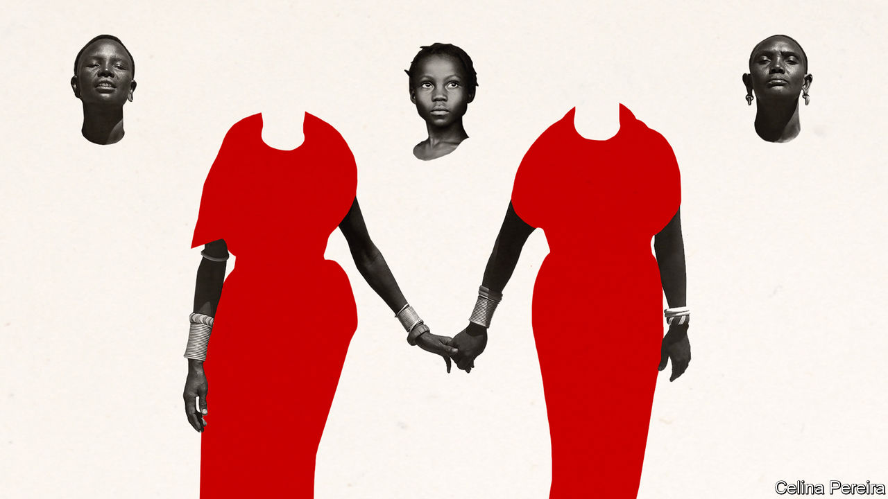
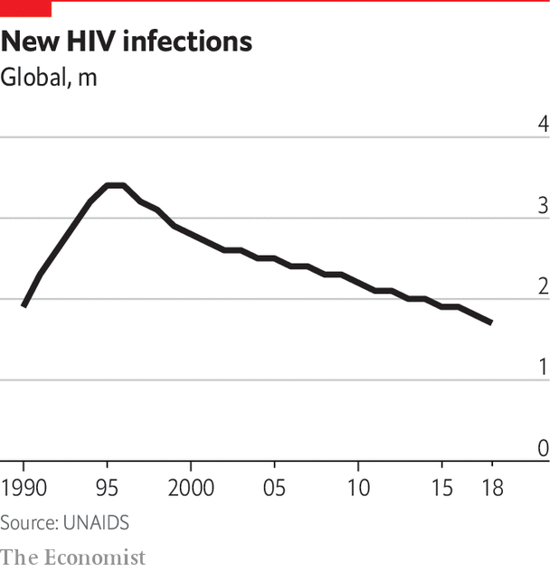
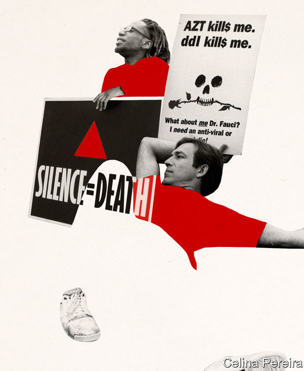

## Perspectives

# How HIV/AIDS changed the world

> The worst of that pandemic may be over, but its effects endure

> Jun 25th 2020JOHANNESBURG

IN THE EARLY 1990s, at the end of every workday, Matshidiso Moeti would lock a notebook in her desk at Botswana’s ministry of health. Written inside were the names of Botswanans who had tested positive for HIV. The stigma of having the virus that causes AIDS meant there had to be the “deepest secrecy”, she recalls.

Soon a single notebook was not enough. By the end of the 1990s more than a quarter of Botswanans aged 15-49 had the virus, the highest rate in the world. Between 1986 and 2001 life expectancy fell by more than a decade, from 61 to 50 years—lower than when the country became independent in 1966.

The HIV/AIDS pandemic was the formative experience for many of the doctors leading the response to covid-19. Dr Moeti is director of the World Health Organisation’s Africa region. Anthony Fauci, who advises President Donald Trump, earned his spurs during America’s AIDS crisis. “I draw on HIV for just about everything we do,” says Salim Abdool Karim, who advises President Cyril Ramaphosa of South Africa.

The two great pandemics of the past 50 years are very different. HIV is usually spread via sex, can take years to cause disease and if untreated is highly lethal. In Cameroon it was called le poison lent, the slow poison. SARS-CoV-2, the virus that causes covid-19, is less deadly, but spreads and manifests much more quickly. Nevertheless HIV/AIDS is a constant reference point. When Dr Moeti reads the latest covid-19 case numbers, she thinks of those notebooks.

An understanding of HIV/AIDS matters for another reason. It is a reminder that pandemics do not readily disappear. Life-prolonging treatments have turned HIV/AIDS into a mostly chronic disease. New infections have decreased for 25 years. Yet 1.7m people were newly infected in 2018. Globally 32m people have died from AIDS. Despite biomedical advances there is no cure and no vaccine. Human behaviour and norms had to change. Tens of millions deal with the vast indirect impacts, especially in sub-Saharan Africa. The worst of the pandemic may be over, but its effects endure.

The history of HIV in humans began around a century ago. Scientists think that the virus responsible for the vast majority of cases, HIV-1, crossed the species barrier from chimpanzees in the 1920s or earlier in central Africa. It spread slowly for decades, before transmission accelerated worldwide in the 1970s.

In 1981 the Centres for Disease Control and Prevention (CDC), an American public-health body, warned about outbreaks of pneumonia and a skin cancer, Kaposi’s sarcoma, in gay men, as well as a number of “opportunistic infections” taking advantage of a breakdown in the body’s immune system. When other cases were soon reported among Haitian migrants, haemophiliacs and heroin users, as well as babies of infected women, what had been Gay-related immunodeficiency disease (GRID) became Acquired immunodeficiency syndrome (AIDS). Diagnoses followed in other parts of the world. In 1983 HIV was discovered as the cause.

The early years of the pandemic were characterised by confusion and fear. Once AIDS symptoms emerged people typically died within 12 months. By the end of the 1980s it was one of the leading causes of death for young men in many rich countries. Andrew Sullivan, a gay journalist who is HIV positive, recalls “witnessing the sickness and death of others, knowing that you too could be next, even as you feel fine.” In “How to Survive a Plague”, the American author David France recounts trips to the doctor at the merest hint of a skin blemish.

Some revelled in the terror. Most people catch HIV through heterosexual sex, but in many rich countries the majority of cases were among gay men. “The poor homosexuals—they have declared war upon nature, and now nature is exacting an awful retribution,” said Pat Buchanan, an adviser to Ronald Reagan, who was elected president of the United States in 1980. Venom was coupled with hysteria. Just one undertaker in New York City would embalm AIDS victims.

It did not help that the Reagan administration was neglectful. The federal government shortchanged and slowed efforts to prevent, treat and research HIV/AIDS. The president did not mention the disease in public until 1985. Similarly Margaret Thatcher, then prime minister of Britain, was squeamish about safe-sex campaigns and had to be overruled by Norman Fowler, her health secretary, who launched the “Don’t Die of Ignorance” campaign in 1986.

Ultimately it was people with AIDS who did much to turn the tide of the disease. Safe-sex campaigners popularised the use of condoms, while activists pressed the Food and Drug Administration, which approves medicines, to accelerate clinical trials. In America Dr Fauci, then as now the head of the National Institute of Allergy and Infectious Diseases, went from being a target of activists to becoming an ally. Larry Kramer, the irascible founding father of AIDS activism, who died aged 84 on May 27th, considered Dr Fauci “the only true and great hero” in officialdom (Kramer originally thought he was “an incompetent idiot”).

The first evidence that combination antiretroviral therapy (ART), a cocktail of HIV-suppressing drugs, could radically change the course of the disease arrived in 1996. ART led to dramatic reductions in mortality rates. Patients spoke of a “Lazarus effect”. It was a turning point in rich countries. Histories of the American epidemic often end here—with a coda on how the HIV/AIDS epidemic helped human rights and probably accelerated public acceptance of same-sex marriage.

But in developing countries the situation remained grim. Most HIV-positive people have always lived in Africa, where the virus is overwhelmingly spread via heterosexual sex. By 1996 AIDS was the most common cause of death in sub-Saharan Africa. In Zimbabwe life expectancy fell to 43 in 2003.

There is no single reason for the severity of the pandemic in Africa. There are biological reasons to consider, from the amplifying role of tuberculosis, high rates of other sexually transmitted diseases, the potential role of African genomes, and the viral subtypes common in Africa. Then there is the swish of Occam’s razor by John Iliffe in “The African AIDS Epidemic”, in which he writes that: “Africa had the worst epidemic because it had the first epidemic.”

Multiple theories have been put forward, most containing some truth. Poverty, for example, matters. When ART cost at least $10,000 per person per year, as it did in 1996, only elites could be treated. But poverty does not explain why prevalence was already so high. More than a fifth of adult residents of capitals such as Kampala and Lusaka were HIV-positive by 1990. Other poor parts of the world, including central America, South Asia and the Caribbean were less affected. Botswana and South Africa, two of the richest African countries, are two of the hardest hit.

Patterns of commerce and migration are important. Across Africa goods are moved by long and slow truck journeys. Studies have highlighted the high rates of HIV among truck drivers and prostitutes at stops. Another arrangement that encouraged the spread of HIV, especially in southern Africa, was the migratory labour system that began in colonial times and persists to this day. Miners would spend many months away from their families. Often they lived in single-sex dormitories, surrounded by prostitutes attracted by the miners’ steady wages. Studies of mining towns found extremely high rates of HIV.

It was once suggested, with a large degree of prejudice, that African “promiscuity” was to blame. Subsequent research in various countries suggests that Africans have no more partners over a lifetime than anyone else. What is key is the detail. Studies by Martina Morris of the University of Washington suggest that in some African countries it is relatively common to have concurrent partners, which raises the infection risk. In Uganda, which successfully reduced infection rates, a “zero grazing” campaign is cited as a cause, in which men were encouraged to reduce the number of their sexual encounters.

Sex is wrapped up with power dynamics. It is impossible to understand AIDS in Africa without a grasp of sexual inequality. A survey of rural women who migrated to Kinshasa, Congo’s capital, revealed that many contracted HIV after entering into transactional sexual relationships, often with older, richer men. To this day, across the region, the rates of HIV infection among young women are far higher than among young men. In some cases women either do not feel a need to insist on condom use or are not able to insist.

Another amplifying factor was the responses of African leaders. Some, such as Uganda’s Yoweri Museveni, talked openly about the disease (even if he was sceptical about condoms). Others saw HIV/AIDS as a Western plot or denied that it existed because Africa did not have homosexuals.

Worst was Thabo Mbeki, who succeeded Nelson Mandela as president of South Africa in 1999. While surfing the internet, he encountered the ideas of HIV denialists, or “dissidents”, who claimed that the virus was not the cause of the disease. He prevented poor South Africans from getting state-funded ARTs, while backing a scheme to develop a local alternative that turned out to be an industrial solvent. Activists and judges eventually brought about a more rational set of HIV policies. But not before 340,000 needless deaths, estimates Nicoli Nattrass, an economist.

Religion also played a role; sometimes for good, but often for ill. Data from Afrobarometer, a pollster, suggest that religious figures are more respected than other pillars of society. As in America, many saw HIV/AIDS as punishment for sin, with some churches opposing condoms and refusing to bury AIDS victims. Traditional religions could be unhelpful, too. In Malawi hundreds of thousands flocked to one healer who claimed ancestral spirits had instructed him in the use of a tree bark to cleanse people of the disease.

Blame, stigma and denial discouraged open conversations about HIV/AIDS. In Congo, SIDA, the French initials for AIDS, was said to stand for syndrome imaginaire pour décourager les amoureux, or “imaginary syndrome to discourage lovers”. Though some famous Africans, such as Philly Lutaaya, a Ugandan singer, were honest about their condition; others, like Fela Kuti, a Nigerian musician, were not.

The fear of what an HIV diagnosis might mean for your family, or your position within it, was pervasive. Some traditional religions saw early deaths as a break in the ancestral chain. And if you were the first in your family to test positive, you could be accused of bringing the disease into a household. Since women were more likely to get tested, and because of the possibility of transmitting the virus to a fetus, they were at greater risk of stigmatisation.

It is perhaps unsurprising then that, despite widespread knowledge of HIV/AIDS by the 1990s, only a minority of HIV positive Africans got tested. And why bother with a test when there was no affordable treatment? HIV was often only one issue among many. Data from Afrobarometer suggest that HIV/AIDS has never been a major election issue anywhere, bar Botswana.

The result was that HIV/AIDS enfeebled workers. A study of a Kenyan tea-plantation between 1997 and 2002 found that those with HIV picked 4-9kg per day less than those without. Alan Whiteside, a South African economist, found similar results in mines, cement works and textile factories. Farmers with HIV cultivated less land. The cumulative agricultural effects have led researchers to wonder whether HIV/AIDS intensified famines in the early 2000s.

Death brought further ruin. Funerals are expensive—nearly a year’s income, according to one study in Kinshasa. Then there was making do without an earner. A study of Tanzanian families in 2008 found that consumption over five years was 19% lower in families where an adult died of AIDS compared with the average family. And the effects on African families go further than that. In 2012 it was estimated that of the 56m orphans (defined as children who lost at least one parent) in sub-Saharan Africa, 15m were a result of AIDS.

Orphans on average are enrolled in school later and pulled out earlier. This can have a doubly detrimental effect. They receive less education. And there is evidence that the longer girls stay in school, the more likely they are to delay having sex, and thus to reduce the risk of HIV.

HIV/AIDS also had political effects. Most obviously it killed politicians. There were 59 byelections for Zambian MPs between 1984 and 2003, in large part because of AIDS deaths, versus just 14 in the preceding two decades. The timing of the pandemic in South Africa was especially cruel. Mandela became president in 1994, bringing an end to apartheid. But just at that life-affirming moment, “AIDS weakened the whole of society,” says David Harrison of the DG Murray Trust, a foundation. Mandela himself later apologised for not prioritising the disease—as president, he barely mentioned it. Gains in education, child and maternal health slowed.

For all its effects, though, HIV/AIDS did not cause the state and economic collapses that some feared. There are perhaps three reasons for this. The first is that prevention efforts were more effective than many expected at the time. Prevalence in Uganda, for example, may have peaked as early as the mid-1980s. In many countries grass-roots organisations led by “positive positive” women were crucial. Also important were increased condom use and male circumcision, which is associated with a 60% drop in infection risk.

The second reason is that treatment became much cheaper, and therefore more accessible. The price of combination therapy fell from at least $10,000 a year to less than $100 in the early 2000s, after drug firms bowed to intense public pressure to make it affordable in poor countries.

Although new infections and death rates are falling, there is still much to do. The United Nations is signed up to “end AIDS as a public health threat” by 2030, via a 95-95-95 strategy: 95% of those infected globally knowing their status; 95% of that group receiving ART; and 95% of them having HIV effectively suppressed. On current trends these goals will not be met, especially if covid-19 means fewer people seek treatment for HIV.

The HIV/AIDS pandemic is therefore likely to remain a lethal presence. Increasingly its burden falls on the marginalised—its skewed impact being the third reason why it did not lead to national collapses. There is a big discrepancy between the economic impact on individual families and those on states, notes Markus Haacker, an economist who has written several books on HIV/AIDS. African women continue to deal with much of the fallout from the pandemic. Janet Seeley, an anthropologist, suggests that grandmothers in Uganda and South Africa can feel great guilt when they do not live up to the popular expectation that they will heroically care for orphans and the sick.

The idea that the world may have to live with covid-19 for years, if not decades, is hardly a popular one. But the example of HIV/AIDS shows that scientific breakthroughs can take much longer than people expect. An HIV vaccine has been years away for decades.

And if there is an ultimate lesson, it is that human behaviour—from safe sex to needle exchanges and the screening of blood donations—can do much to stop a pandemic, even if that change is slow. Drugs have suppressed HIV/AIDS and societies have adjusted in subtle, often painful, ways. As the world grapples with its latest great outbreak, HIV/AIDS suggests that, while pandemics do subside, they may not end. ■