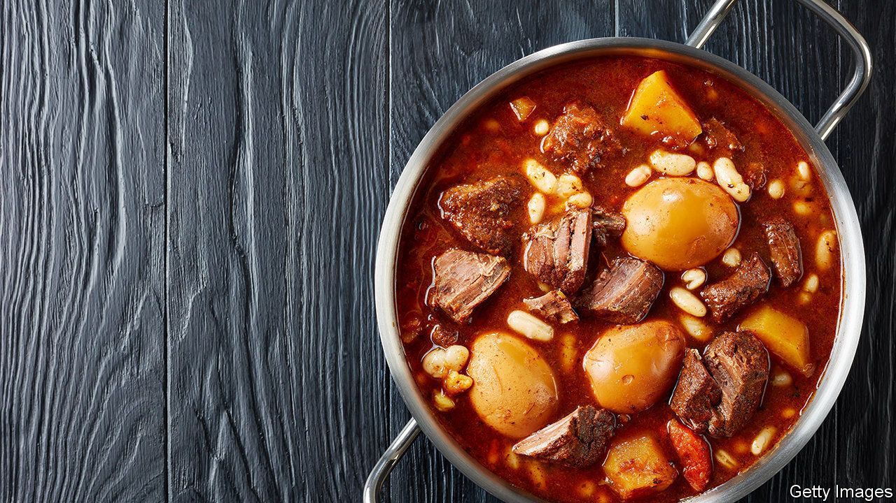

## Home Entertainment

# Cholent, a traditional Jewish dish, is a perfect lockdown meal

> What to eat when you are not allowed to cook?

> Jun 27th 2020

IN THE SHTETLS of eastern Europe, Jewish cooks faced a weekly dilemma. The Torah forbade them to prepare meals, or light an oven, between sundown on Friday evening and nightfall on Saturday night. Yet they were commanded to feast on the Sabbath. They needed something that could be made in advance but improved through steady heating (permitted if the heat was already on). The solution was cholent, as Ashkenazi families call the thick brown stew that sustained them through centuries of Saturday lunches. Today, for nostalgic Jews and curious gentiles alike, cholent is the perfect lockdown dish.

Back in der heim, most homes were poor, and had at best a small wood-burning stove. The cholent pot would be filled with whatever lay to hand—typically potatoes, barley, beans, onion and a bit of fatty meat if the household could afford it—and taken by one of the children to the neighbourhood bakery. For a small payment, it would be placed in the oven for an initial blast of heat. Then it was hurried back home to the stove for a longer sojourn, during which the contents melded into a dark, stodgy gravy. (Sephardis call their version of this concoction hamin.)

Cholent takes at least 24 hours to make properly. But then, what else are you doing at the moment? And it won’t require you to stand in a socially distanced queue at some chichi delicatessen: you will have most of the ingredients already. Layer them in the pot, add salt and pepper, cover with boiling water—and that’s it. Left in a slow-cooker, on a hotplate or in the depths of an oven at minimum heat, the cholent cries out for regular inspection. Every time the lid is raised, the aroma permeates the house. After it simmers overnight, you will wake to a delightfully fragrant kitchen.

Ultra-orthodox Jews never kicked the cholent habit. Among the more secular, the tradition faded over the generations. In recent years, though, it has begun to make a comeback among hipsters in Tel Aviv and Brooklyn, who gather at weekends for cholent parties. Tradition is part of the appeal, but so is the prospect of experimentation. Many other national and regional cuisines have rustic, long-cooked stews of their own, but cholent is different because of its inherent flexibility. The basic concept is mentioned in the Talmud, but Jews across the diaspora have cooked and adapted it wherever they settled.

In Iran, cracked wheat replaced barley. In Alsace, goose was preferred to brisket. In the East End of London, a tin of baked beans was sometimes tipped in; sweet potatoes and ketchup were introduced in America. It is amenable to innovation with spices and condiments (your correspondent’s personal twist is a spoonful of date molasses). The German poet Heinrich Heine wrote that God himself had instructed Moses in the secret of preparing cholent. But mortals may tinker with the recipe. ■