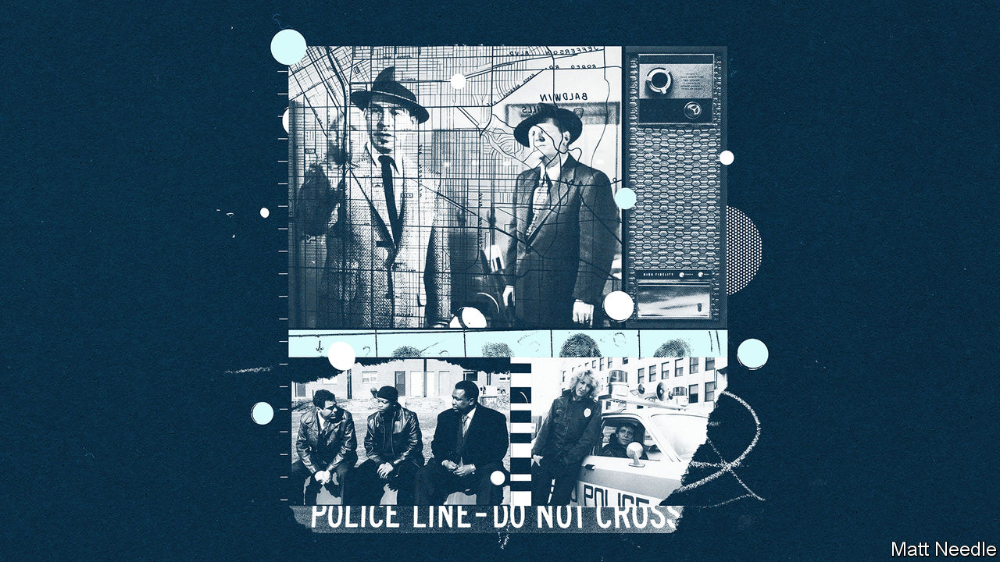

## Watching the detectives

# Television has distorted Americans’ view of policing

> But the evolution of cop dramas in the past suggests they can do better

> Jun 25th 2020

CRIME RATES are low in America by historical standards, but television viewers could be forgiven for thinking otherwise. Of the 34 dramas that aired at prime time on the four big broadcast networks last autumn, 21 revolved around crime. On CBS the figure was 11 out of 14. Cops and robbers are essential and everywhere in the small screen’s alternative reality.

And on reality television. For 31 years viewers tuned in to “Cops” to see officers busting drug-dealers, reckless drivers and prostitutes. But no longer. Before its new season began, Paramount Network and its owner, ViacomCBS, axed the show amid spiralling protests over police brutality. The conceit of “Cops” was simple: follow officers and film their encounters. But critics said it got access in exchange for favourable coverage of police. Many of those arrested may have been too high or confused to consent to appearing. The show exaggerated the role of drugs, which accounted for 35% of arrests, three times the true rate. Compared with real-life arrest data, black and Latino men were over-represented.

The ratings for “Cops” were poor, so the decision to nix it might have been easy. But “Live PD”, a more popular show on A&E, has also been cancelled. It had admitted to erasing footage of a black man dying in police custody last year. The reckoning has hit drama series, too, as insiders grapple with television’s role in distorting perceptions of policing and normalising abuses.

Warren Leight, executive producer of “Law & Order: Special Victims Unit” (“SVU”), has said that cop shows are collectively “mis-contributing” to society. Dream Hampton, a producer and director, has suggested a moratorium on new ones. Too often, she said, they “justify the cutting of corners, the throwing away of the constitution”. They also make policing look more effective than it is. In real life, just 46% of violent crimes were resolved with an arrest in 2018, compared with every one on “SVU”.

All this matters, because many people believe what they see on the box. Over 40% of Americans think crime shows are realistic. This can have peculiar real-world effects, such as armchair sleuths telling detectives how to do their job. In one study, police in Canada confided their frustration over “CSI” fans who tried to interview witnesses and identify evidence themselves.

Overall, TV-watchers are more likely than others to have confidence in the police. They are also more prone to think, wrongly, that police misconduct yields truthful confessions—not surprisingly, given how such behaviour is often portrayed. A study of a season’s worth of four American crime shows in 2011 found that, on average, police acted badly once per episode. Almost all instances were justified and went unpunished. Rule-bending actually boosted officers’ roles as moral enforcers. The effect was to forgive their abuses.

Racism has been swept under the carpet in a different way. Colour of Change, a pressure group, analysed 26 crime shows that aired in 2017-18. Racism, it found, was rarely a factor when TV policemen acted wrongfully. In fact, racial disparities in thecriminal-justice system went largely unmentioned. Neither excessive force nor incarceration affected minorities disproportionately, as they do in reality. Aaron Rahsaan Thomas, executive producer of “S.W.A.T.” on CBS, likens these themes to medicine—easier to avoid for networks chasing the largest possible audiences. In particular, “CSI” and “SVU” skirt issues of race by making most offenders and victims white. The explanations for crime tend to be psychological, not sociological.

Take a long view, though, and it is clear that things can change for the better on TV, because in some respects they already have. Police dramas have been a staple of schedules for decades, for obvious reasons: the stakes are high; the action is fast-paced; the endings are morally satisfying. But the genre has evolved. In the 1950s Jack Webb, the creator of “Dragnet”, adapted genuine cases. The Los Angeles Police Department signed off the scripts; its officers were portrayed as virtuous and efficient.

In the 1980s and 1990s shows such as “Hill Street Blues” and “Homicide: Life on the Street” tackled rising urban crime. Policing cities was portrayed as hard and complicated; cops broke the law to get the job done. “I believe in the constitution,” affirms a detective in “NYPD Blue”. But if a murder suspect walks free, he says, “I do what I have to do” to extract a confession. In the 21st century two shows—“The Shield” and “The Wire”, which both first aired in 2002—declined to absolve rogue police. “The Wire” humanised both cops and criminals and drew parallels between them, as officers act badly and cover it up. Still, neither show implies that police forces are so corrupt or broken that they ought to be dismantled, as some in America are now urging.

How can TV reflect that mood? Jason Mittell of Middlebury College suggests a series inspired by Camden, New Jersey, which disbanded its police force in 2013 and reconstituted it with an emphasis on community relations. Murders decreased. That, he says, “would let viewers imagine what it means to rethink this institution, what happens to society when it is recast.”

A more realistic show might be less frenetic. “The constant running and chasing cars—that’s not what policing is like,” says Ronal Serpas, a former police chief of New Orleans now at Loyola University. He notes that most cops never fire their gun on duty. They are more likely to answer house alarms and attend to neighbourhood spats.

Broadcasters will not entirely ditch a formula that has proved so successful. But they may have more appetite for dramas that focus on the policed, such as “When They See Us”, a recent Netflix series about black and Latino teenagers wrongfully convicted of raping a jogger in Central Park in 1989. Savvier viewers will want more stories that reflect reality better, predicts Mr Thomas of “S.W.A.T.”. “The public is ready for a more nuanced conversation.” ■

## URL

https://www.economist.com/books-and-arts/2020/06/25/television-has-distorted-americans-view-of-policing
