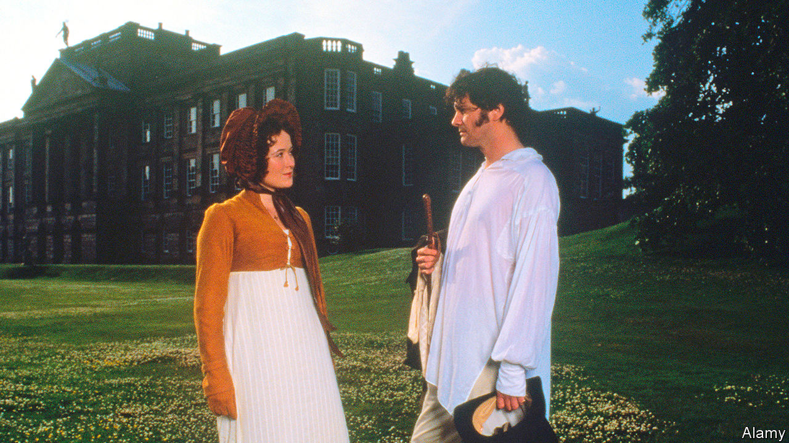

## Home Entertainment

# The BBC’s “Pride and Prejudice” is a lockdown delight

> Like many families in quarantine, the Bennet sisters spend their days driving each other nuts

> Jun 27th 2020

IT IS A truth universally acknowledged, at least among the hip, that British costume dramas are as naff as pastiches of Jane Austen’s opening lines. As twee as they are numerous, they truss reactionary class politics in sentimental plots to flog to suggestible foreigners. But at least one landmark of the genre should be spared the scorn. The BBC’s “Pride and Prejudice” remains as delirious a delight as when it was first broadcast in 1995. Or more so.

True, the production feels dated, and not only as the high-waisted Regency gowns are meant to. It now seems quaint that Colin Firth, playing Mr Darcy, became an instant heart-throb by emerging from a pond in a clingy shirt. Darcy’s approach to courtship is outmoded in a less endearing way. The art of the glance is beyond him: in a habit that these days would border on harassment, for much of the series he stalks and glowers at Elizabeth Bennet (Jennifer Ehle), torn between desire (for her sass and cheekbones) and snobbery (some of her relatives are in trade). “Can you tell me why Mr Darcy keeps staring at me?” she eventually asks a bystander.

Yet the wheels on the Barouche box have come full circle, and today the drama is more apposite than it was 25 years ago. The five Bennet sisters, including “three of the silliest girls in England”, spend much of their time sitting at home, reading, sewing and driving each other nuts—much like families in lockdown. Just as deliverymen are now welcomed like celebrities, the arrival of the post is a seismic event. Occasionally the sisters go into town to flirt with the militia, but mostly they find stimulation in socially distanced walks around their garden or down a muddy lane, on which they discuss their parlous finances or the health of relatives and receive offers of marriage.

As in Austen’s novel, the characters are enchantingly vivid, if in exaggerated form. Some are so ghastly that whenever they are off-screen you long for them to reappear—above all Mrs Bennet (Alison Steadman), a hyperventilating social climber, and Mr Collins (David Bamber), a slimy clergyman. Those two combine with Mr Bennet (Benjamin Whitrow), the girls’ laconic father, to hilarious effect. When Elizabeth declines Mr Collins’s proposal, Mrs Bennet begs her husband to change their daughter’s mind. “Your mother will never see you again if you do not marry Mr Collins,” he deadpans, “and I will never see you again if you do.” Look out for Mr Hurst (Rupert Vansittart), a doltish toff who is drunk or asleep in every scene.

Amid an orgy of sideburns and double staircases, Andrew Davies’s screenplay zooms in on the story’s essential, timeless themes, namely lust and money. And on the grubby relationship between them: despite its cloistered, comforting innocence, Austen’s world is ultrapractical about love. Even admirable Elizabeth traces her regard for Darcy to her first glimpse of his grand estate. All the same, when at last she accepts him (on a muddy walk), you would be a monster not to smile. ■

## URL

https://www.economist.com/books-and-arts/2020/06/27/the-bbcs-pride-and-prejudice-is-a-lockdown-delight
