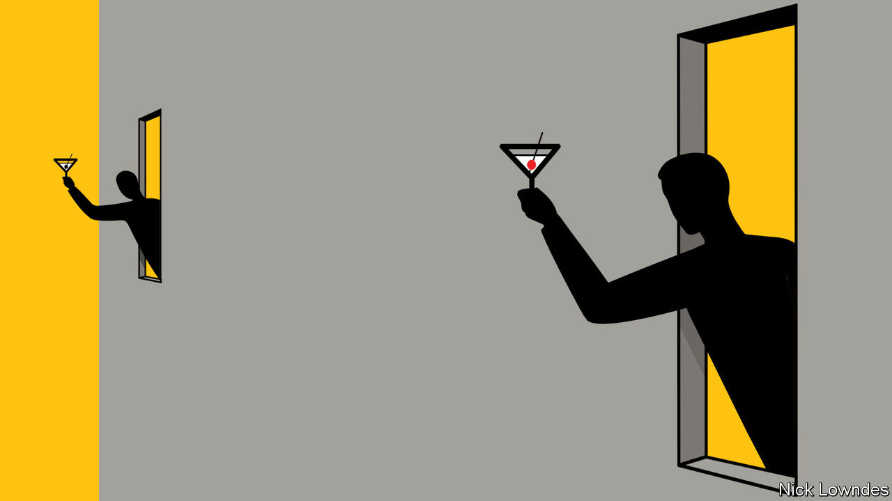

## Johnson

# The rules of coronaspeak

> Good coinages are much rarer than failed ones. Here are some useful guidelines

> Jun 27th 2020

Editor’s note: Some of our covid-19 coverage is free for readers of The Economist Today, our daily [newsletter](https://www.economist.com/https://my.economist.com/user#newsletter). For more stories and our pandemic tracker, see our [hub](https://www.economist.com//news/2020/03/11/the-economists-coverage-of-the-coronavirus)

NECESSITY, THEY say, is the mother of invention. Perhaps boredom is its father, and—in the world of language and its coinage—social media the incubator. The coronavirus pandemic has produced a vast number of new terms, serious and (mostly) playful, to describe the predicaments of lockdown.

Start with the coronaverse, which people everywhere now inhabit, or the quarantimes, the era in which they now live. Early fears of the total breakdown of society in a coronapocalypse have proved, thankfully, too pessimistic. But viral anxiety reigns, as do complaints of Zoom fatigue. Participants appear on screen for meetings with a quaransheen of unwashed sweat on their faces. Feelings seem to be on an emotional coronacoaster. Meanwhile, covidiots are spurning lockdown restrictions in ways likely to make the pandemic worse, amid an infodemic of dodgy news and half-informed coronasplaining. At least there is a locktail hour at the end of the week (or, for many, at the end of most days).

Most of these coronacoinages—whether you have encountered them before or not—make sense on their face. But why exactly do they work? To answer that, it helps to look at some efforts that do not. What, for example, is a morona? A pancession? Smizing? Along with the new terms above, these appear on a list collected by Tony Thorne, a linguist at King’s College London. But chances are high that most readers don’t know them, and fewer still will be using them.

There are various ways to form new words. One is to repurpose an old one: the pandemic has yielded new meanings for bubble and circuit-breaker, for instance. Then there is shortening, on which Australians seem particularly keen, having coined pando (pandemic), iso (isolation) and sanny (hand sanitiser).

But the most creative category in Mr Thorne’s collection—and the largest, at nearly 40% of the total—are portmanteau words. A portmanteau is a term like brunch, in which two words are combined, usually one or both being shortened. If neither word is truncated, as in coronacranky, the result is more an old-fashioned compound than a true portmanteau.

The first rule of a successful new portmanteau is that it points to a thing worth naming. This may seem obvious, but perhaps not so to the coiners of infits—a decent pun on outfits, but as a term for the clothes worn inside during lockdown it is a solution in search of a problem.

The second rule is that a portmanteau should be transparent; ie, the words that went into it should be obvious. Few English words end in -tini, with the result that if someone invites you for a quarantini, you know what to expect. The more of the original two words you can use, the better. This, in turn, is much aided if the distinctive sounds in those words overlap, making the result more compact. Think sext, an instant hit. The “teen” sound in quarantini (shared by both quarantine and martini) is key to its success.

By contrast, loxit, for the much-hoped-for exit from lockdown, is a dud. Lose the distinctive vowel at the beginning of exit and you have something that sounds as though it has to do with brined salmon. Pancession fails for a different reason. It stands for “pandemic recession”. But neither of its elements is sufficiently distinctive. Too many words start with pan- or end with -cession for the meaning to jump off the page.

An overlooked rule of portmanteaus is that the second element is more important than the first. That is because it is the core of the word: an XY is a type of Y, not a type of X. This explains the weakness of morona,a synonym for covidiot, from corona moron. It obeys the overlap requirement above (in the sharing of -oron-), but falls at the sequencing hurdle, since a morona is not a type of corona. Ditto for smizing, which is supposed to mean smiling with your eyes, while your mouth is hidden by a mask. It is not a kind of eyezing.

Dictionary websites often have a notice to would-be word-coiners: please don’t send us your neologism and ask to have it included. Dictionaries record not useful words, but used ones, which are actually spoken or written long or often enough to convince the lexicographers that they have found a place in the language. If you want your contribution to coronaspeak to take off, you need to lobby not the dictionary-writers, but your friends and colleagues, and get them to use and publicise it. Good coinages are much rarer than failed ones, but pay attention to usefulness, transparency and sounds, and your invention may find its way into the panglossary.

## URL

https://www.economist.com/books-and-arts/2020/06/27/the-rules-of-coronaspeak
