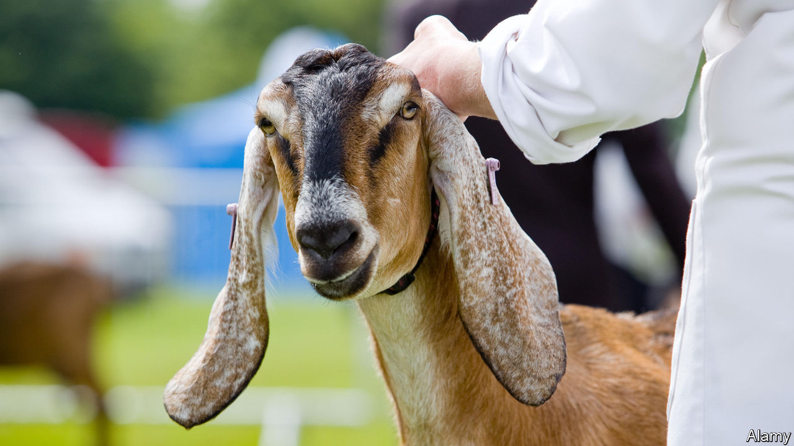

## Scottish farming

# Agricultural shows go online

> MooTube

> Jun 25th 2020

AGNES AITKEN knows exactly what she is after. “I’m looking for a pleasant head, with a kind eye when she looks at you,” she explains. “A nice personality, a long slender neck, a nice shoulder and a wide chest.” Mrs Aitken, in short, is searching for a goat. And not just any old specimen with a wispy beard and a gammy leg; one fit to be declared the finest in all of Scotland. Fortunately, at least some of the animals she has been inspecting seem to fit her exacting brief. “The quality has been good,” she goes on. “There’s also some at the tail end, but we’ll not dwell on them.”

Scotland’s summer calendar is usually packed with agricultural shows. Nancy Nicolson, farming editor of the Courier, a Dundee newspaper, goes to one every weekend between May and September, taking her wellies “no matter what the forecast”. Covid-19 has put a stop to that. It is easy enough for a caber tosser to persuade others to keep a social distance; harder to make animals (and their handlers) stay two metres apart or to prevent crowds forming for a celebratory whisky. Even with lockdown loosening, the Scottish social calendar is bereft of such festivities.

But Ms Nicolson couldn’t face a summer without a single show. Her newspaper’s solution—Scotland’s first online agricultural show—will be held on July 3rd and 4th. Mrs Aitken, who has kept goats for 27 years, is one of ten judges. She will assess home-made video clips of each goat to determine a winner. It is a daunting task. “When you’re judging an animal, it’s hands on,” she says. “The feel of it is important, the texture. You move around, you duck and dive.” None of that is possible watching a YouTube clip. Still, “it’s the same for everybody, no one has an advantage.”

The format has enabled farmers from much farther afield to enter. Scottish goats will face competition from well-groomed rivals from Cornwall and Northern Ireland. Prizes for dogs, cakes and farm machinery will be determined by a public vote. At the end of the weekend, the most prestigious prize—champion of champions—will be handed out. “An enormous Charolais bull goes up against a pygmy goat and sometimes a duck,” says Ms Nicolson.

Such a contest is a little absurd, but shows are also a serious business. Prizes help breeders fetch higher prices for their livestock. And the events bring farmers from across the country together, a welcome respite from work that can be socially isolating as well as physically demanding. Not all of that will be possible online, of course. “You can’t replicate the drams in the show marquee,” concedes Ms Nicolson. “But farmers are a competitive bunch and it’s the only show in town.”■