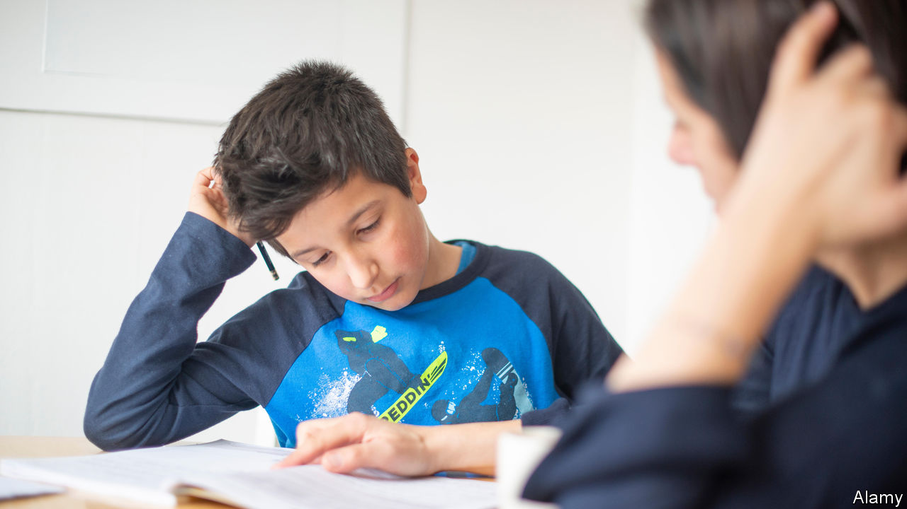

## Schools

# Does tutoring work?

> The government is spending £1bn on tutoring to help pupils catch up

> Jun 27th 2020

THREE MONTHS after Britain’s schools closed to most pupils, it is clear that the mass experiment in home education is not going well. A study by the Institute of Education at University College London finds that the average child is spending just two and a half hours a day on school work. Only half have their work checked by teachers. Even fewer of the poorest children do.

In England, the government has reacted much as a parent might deal with a child who is heading for a bad mark on an important exam—call in a tutor. Gavin Williamson, the education secretary, promises that when state schools return in September they will have £1bn to spend on catching up. Much of the money is earmarked for tutoring. But school heads have reacted coolly to the offer.

Tutoring is effective. In 2013-14 a randomised controlled trial in four schools found that, over the course of a year, tutors raised the reading and writing level of struggling 11-year-olds by the equivalent of five months above the progress they would have made without it. In 2018 a larger study of small-group tutoring by university students found that pupils advanced by three months. “There’s a reason why parents spend north of £2bn a year on tutors—it works,” says Nick Bent of the Tutor Trust, the organisation tested in the second trial.

It does not seem to matter greatly who does the tutoring. Teachers, teaching assistants, students and volunteers all seem to help, so long as they meet the pupils in real life. The evidence on online tutoring is less clear. A programme that employed Indian and Sri Lankan students to teach maths to British children remotely made no difference to their performance.

There should even be enough tutors to cope with a surge in demand. Many university students are idle and short of money. MyTutor, which runs a tutor marketplace in addition to arranging online tuition for struggling pupils, has 15,000 tutors on its books and a waiting list that has grown past 10,000, says James Grant, its co-founder.

The hitch, and the reason why school heads are not falling over with gratitude, is that nobody knows which children need tutoring or of what kind. Tutoring, as practised in schools, is a precise but inflexible tool. It targets children who are known to be lagging, and aims to get them up to a specific standard.

Most state schools have set homework but have not tried to teach online, so have only a vague sense of how much pupils have taken in. They will not know much more even when schools reopen in September. Schools cannot assume that the poorest children need the most remedial work. The UCL study found that children entitled to free school meals because of their parents’ poverty are getting slightly more help at home than others—possibly because their parents do not spend half the day tapping at laptops.

It is not even clear that all children will return to school in September. That is the government’s plan. But plans have been announced before, then abandoned. Many parents are confused and fearful. Children in year six (aged 10-11) are supposed to be at school; on June 18th only a third were. Attendance is especially low in north-west England, where Andy Burnham, the mayor of Greater Manchester, has argued that the lockdown is being ended too quickly.

“We don’t know how much learning has been lost,” says Binks Neate-Evans, the executive principal of three primary schools in Norfolk. She is planning for a “recovery term” in the autumn—and, probably, some delicate conversations with parents about the importance of their children turning up. Shutting schools was much simpler and quicker than restarting them.■

## URL

https://www.economist.com/britain/2020/06/27/does-tutoring-work
