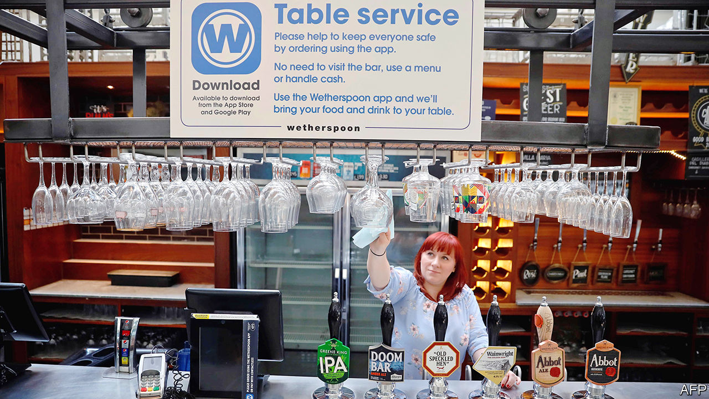

## Covid-19

# England leaves lockdown

> The amount of social interaction is about to rise sharply

> Jun 27th 2020

Editor’s note: Some of our covid-19 coverage is free for readers of The Economist Today, our daily [newsletter](https://www.economist.com/https://my.economist.com/user#newsletter). For more stories and our pandemic tracker, see our [hub](https://www.economist.com//news/2020/03/11/the-economists-coverage-of-the-coronavirus)

ON JUNE 23RD Boris Johnson declared an end to “our great national hibernation”. Pubs, restaurants, hotels, heritage sites and hairdressers would be able to reopen from July 4th, he announced, albeit with dividing screens, lots of protective kit and doors wedged open “to reduce touchpoints”. Two households would be able to meet indoors, so long as they kept at a safe distance once there. Weddings would be allowed, too, so long as the guest list did not extend beyond 30 people. And the two-metre rule would become the “one-metre-plus rule”, with people encouraged to cover their faces, but allowed to get closer than they have in months.

The forthcoming freedom reflects the government’s desperation to boost the economy and the fact that previous loosenings have not boosted the virus. The reproduction number has stayed below one, and the number of people admitted to hospital and testing positive has continued to fall (although not yet to levels seen in the rest of Europe).

According to the Times, the government’s scientific advisory committee looked at two possible courses of action: another phased reopening or a big bang. Mr Johnson plumped for the latter. He seems to have been out in front of his countrymen who, polls suggested, were nervous about ending lockdown. But they have come round: a YouGov poll finds that 47% support the prime minister, against 37% who think he is moving too fast.

Yet the grand reopening is still a gamble. While previous changes to the rules mainly increased outdoor social interaction—by allowing people to exercise more than once a day, say, or to gather in bigger groups—these will increase the amount of interaction indoors, where there is a much greater risk of transmitting the virus. And the rate of reproduction is only just below one, meaning it will not take much for the number of cases to start to rise.

A lot is therefore riding on the restrictions that will remain in place, and the new contact-tracing system. Although the accompanying app will not appear until winter, human contact-tracers have begun work. Since May 28th, they have managed to reach 73% of the 15,225 people who were referred to the scheme (other big European countries do not run centralised contact tracing, and thus lack comparable data).

The reason for missing the other quarter does not appear to be a lack of capacity. According to an insider, since a lot of new infections are happening in care homes, whose residents have few contacts with the outside world, many of the 25,000 people the government has employed to trace contacts have little to do.

If there is another outbreak, the government has raised the possibility of local lockdowns, without providing much detail about how they would work. When announcing the changes on June 23rd, Mr Johnson warned that, if things went wrong, he would “not hesitate to apply the brakes and reintroduce restrictions, even at a national level.” That would be difficult. With the government already facing widespread criticism for its management of the early stages of the crisis, having to re-enter lockdown would be a disaster. Reopening on such a scale is not just a gamble—it is a high-stakes one. ■