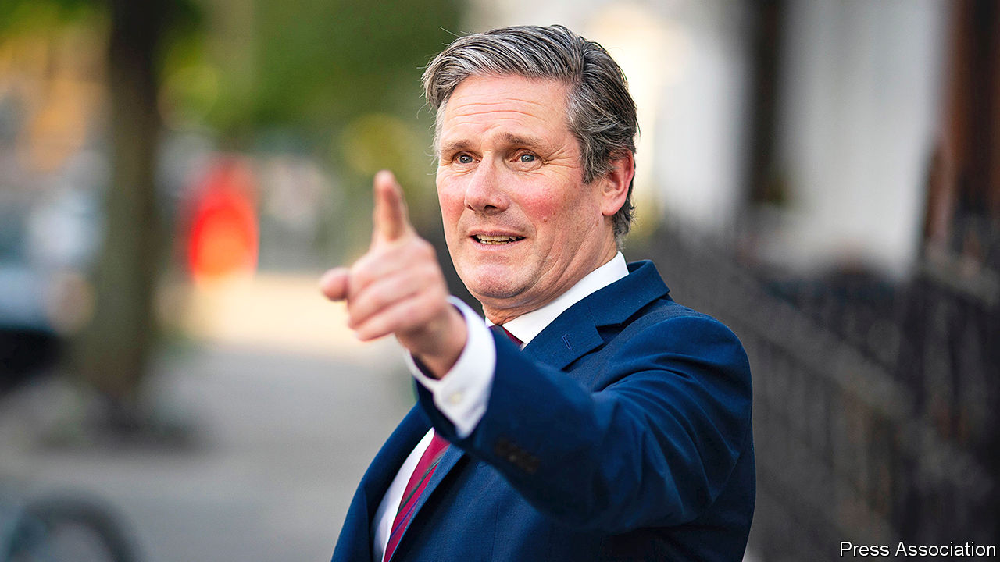
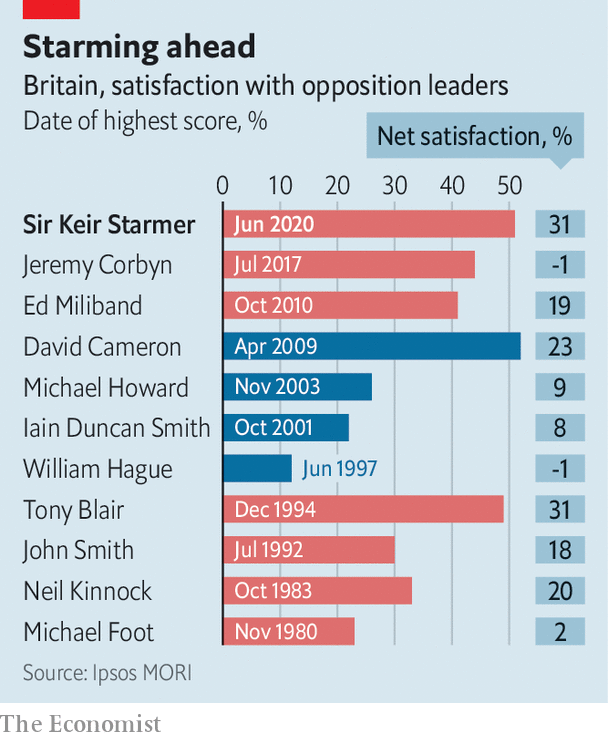

## Labour’s leader

# Keir Starmer needs to change the Labour Party

> The leader is a hit with voters. The party isn’t

> Jun 27th 2020

IN THE COURSE of his weekly online chats with voters, Sir Keir Starmer, the Labour Party’s new leader, asks callers to be blunt about where the party went wrong. A group from Northumberland does not disappoint. Participants complain about its anti-Semitism, neglect of the north and economic incompetence, along with its positions on Brexit and immigration. But Louise Hantman offers a word of comfort. “We feel quite excited that you’re there now. There’s a light on the horizon.”

She’s not the only fan. Sir Keir, who took over as leader three months ago, has had a good debut. His net satisfaction score of 31% matches the best figure Tony Blair achieved as leader of the opposition (see chart) according to Ipsos MORI. The best Mr Starmer’s predecessor, Jeremy Corbyn, scored was -1%. Worryingly for the Tories, says Ben Page, the polling firm’s chief executive, undecided voters tend to go for Sir Keir as they make up their minds. According to a survey by YouGov, voters find him less likeable than Boris Johnson, but more competent and more decisive.

Coronavirus has provided rich opportunities for Sir Keir. He has supported Mr Johnson on big strategic decisions, and needled him on testing regimes and care homes at prime minister’s questions. Mr Johnson mocks the former Director of Public Prosecutions as a dithering lawyer, but the Rt Hon Sir Keir Starmer KCB QC MP’s Scrabble-board of credentials and bookish seriousness—he pores over spreadsheets of covid-19 data before his duels with the prime minister—seem to reassure voters put off by Mr Corbyn’s anti-establishment tendencies.

But while voters tell pollsters that Sir Keir looks like a prime minister in waiting, they believe by larger margins that the Labour Party is not ready for government. The brand is soiled. The Conservative Party has an eight-point lead over Labour, according to the most recent YouGov poll, down from 24 at the height of the coronavirus crisis, and a little down from its 12-point lead in the general election. Voters think that Labour is weaker, less competent and less moderate than the Tories are.

Rehabilitating a party that disappeared down an extremist rabbit-hole and lost four elections on the trot is a big task, but there is progress. Labour has gone back to the basics of being an opposition party. Meetings start on time, MPs receive proper briefings, and the “grid” that sets the party’s news agenda is observed. Like Mr Blair, Sir Keir urges members not to blame the press for their woes, and says elections should be fought on five pledges, “not 125”. He wants the party to talk about aspiration and “people who want to get on”, as well as the downtrodden.

Sir Keir has broken the grip of the Corbynists who once controlled the party. “Starmer is master of all he surveys,” says a veteran. His supporters have won a majority on the all-powerful National Executive Committee. Corbyn loyalists have been axed from the shadow cabinet. Jennie Formby, a Corbyn ally, has quit as general secretary in favour of David Evans, a Starmer man. Sir Keir has apologised to Jewish groups for the anti-Semitism that thrived under Mr Corbyn, and his dominant position will allow him to overhaul the party’s disciplinary process. The Board of Deputies, a leading Jewish body, says things are going in the right direction. “Don’t underestimate the importance of stopping crazy things from happening,” says an old party hand. Rebecca Long-Bailey’s fate on June 25th suggests Sir Keir is serious. The shadow education secretary, who had challenged him for the leadership and was one of the few surviving Corbynistas in his team, tweeted a link to a newspaper article containing claims that American cops had learnt the techniques which killed George Floyd from Israel. (The Israeli authorities have denied this.) Sir Keir said that was an anti-Semitic conspiracy theory, and sacked her.

“How does Keir’s start compare with mine? It’s manifestly better. He’s more capable, and more reassuring, at 58 than I was at 41,” says Neil Kinnock, who modernised and moderated Labour as leader in the late 1980s. And Sir Keir’s foes, in Mr Johnson and the Corbynistas, are less daunting than Margaret Thatcher and Militant, whom Lord Kinnock faced.

Given that Labour’s performance in the general election of December 2019 was its worst since 1935, it might reasonably be assumed that things can only get better. But a report published in June by Labour Together, a group of party thinkers, and co-written by Ed Miliband, a former leader and close ally of Sir Keir’s, warns otherwise. It concludes that cultural and demographic trends loosened Labour’s grip on northern English seats for 20 years before Mr Corbyn handed them over to the Tories. Another moderate swing in the 2024 election would see 58 seats including Rotherham, Hartlepool and Halifax turn blue. Labour needs to win 123 seats to form a majority in Parliament in 2024, a swing similar to Mr Blair’s in 1997.

The biggest challenge is the economy. Sir Keir thinks the pandemic changes the debate on state spending and intervention in the economy to Labour’s advantage. But Mr Johnson wants to pour cash into railways, roads and hospitals, and voters think the Tories are better at running the economy by a margin of two to one. That makes it risky for Labour to outbid them. A shadow cabinet member warns against timidity. “If we say nothing, how does that rebuild competence? That is the big strategic dilemma we face.” Peter Mandelson, an architect of Mr Blair’s victories, thinks the party needs a new agenda that embraces life sciences, artificial intelligence and entrepreneurs. “We have to own the future, not try to reheat the past.”

Another is culture. Labour’s older voters tend to agree with statements such “an eye for an eye” and “I am proud to be British”. Its younger urban voters do not. Like Mr Blair, Sir Keir has tacked right on cultural issues, backing a Tory policy of long prison sentences for yobs who vandalise war memorials, and has ducked a debate on trans rights. He praised Black Lives Matter protesters, but condemned the toppling of a statue in Bristol. Allies say he will be tough on law and order, and unequivocal in backing Britain’s spies and armed forces. This may test the patience of the Corbyn-era intake of radical young MPs. On Brexit, Sir Keir, who pushed for a second referendum, says the issue is settled.

The third big challenge is Scotland. On the issue of independence—which the Scottish National Party wants, and the Tories oppose—Labour sat in the middle of the road, and got run over. It held 41 seats out of 59 in 2010, and now has one. Without a recovery in Scotland it will struggle to win a majority in Westminster, so it needs to take a clear position on the union. But which? Support for a second independence referendum offers the possibility of a coalition with the SNP, but may alarm English voters who fear a break-up. Ruling it out might win back older Scottish voters who left for the Tories, but cost it with the young, who favour independence.

Given where Labour was six months ago, what Sir Keir has achieved is astonishing. “Something as simple as not being ashamed of the Labour Party is incredibly refreshing,” says an old hand. “But a return to normality is not sufficient to do what’s required in four years’ time.”■

Editor's note (June 25th 2020): This article has been updated to reflect the dismissal of Rebecca Long-Bailey from the shadow cabinet on June 25th.

## URL

https://www.economist.com/britain/2020/06/27/keir-starmer-needs-to-change-the-labour-party
