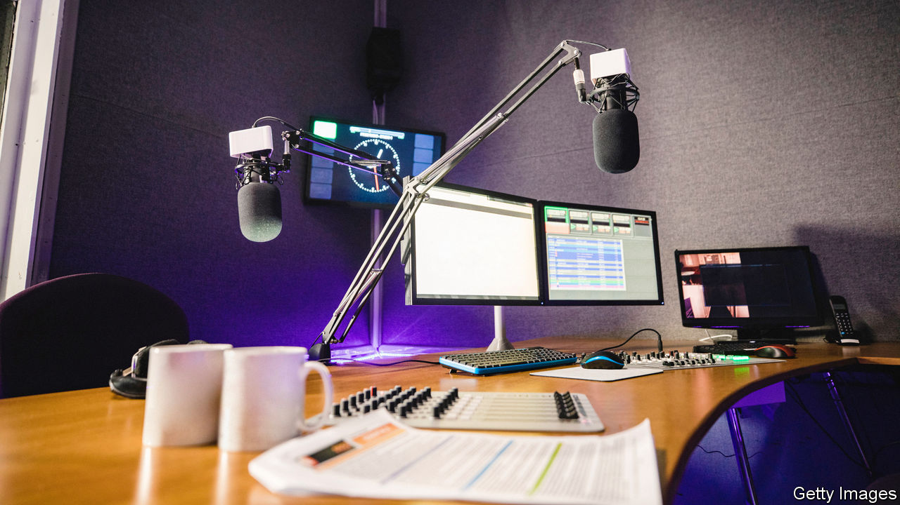

## Radio killed the video star

# Times Radio tries to lure listeners to the paper

> The new station may have political as well as commercial aims

> Jun 27th 2020

SINCE 1785 a full English breakfast has been incomplete without a copy of the Times spread across the kitchen table. From June 29th Britons will have the option of listening rather than reading as they chew their bacon, as Times Radio begins to broadcast for 20 hours a day during the week and 19 at weekends. Listeners can expect “quality, expertise and warmth”, promises Stig Abell, fresh from a 4.30am start to record a pilot of his breakfast show. The commercial aim is to warm them up to subscribe to the newspaper.

As readers have become less willing to pay for news, papers have tried alternative formats. Until recently the main hope was video. Seeking advertising and prominence in Facebook’s news feed, papers piled into making short films. But video was “particularly unsuited to the way that journalists actually look”, says Claire Enders, a pitiless analyst. “Some of them did the most ridiculous turns.” The experience was unprofitable as well as humiliating: ad revenue was thin on the ground and Facebook changed its algorithm, no longer rewarding video publishers. The heralded “pivot to video” has since become journalistic shorthand for doom.

So the focus has shifted to audio. The success of the New York Times’s “The Daily” podcast, with 2m downloads every weekday, persuaded editors that audio is an effective way to fish for subscribers. Times Radio will not run ads. With a rumoured annual budget of around £3m ($3.7m), breaking even will therefore mean persuading 10,000 listeners a year to take out a £312 digital subscription to the paper. Getting sponsors for shows will lower the bar to success; several such deals have already been done.

Podcasts are ubiquitous (The Economist has several). But Times Radio, with its all-day broadcast on digital radio, is a bigger venture. It brings opportunities: live radio has an energy that is hard to conjure in podcasts, and allows reaction to unfolding events. British radio listening is up during the pandemic, growing by 24% in March, according to MIDiA Research. Times Radio will borrow assets from other parts of News UK, its parent company: the shows are being made by Wireless, a radio firm, and some presenters are from its newspapers.

Still, radio is “a massive step up from podcasts in terms of costs”, says Keith Jopling of MIDiA. It is unclear whether it will be a correspondingly massive help in reaching new audiences. Radio is an oldsters’ medium: the average listener to Radio 4, the BBC’s most Times-esque station, is 56. And, whereas podcasts travel well abroad, Times Radio has a domestic focus.

For this reason, some people detect a political motive. News UK’s owner, Rupert Murdoch, is a long-time BBC critic; last year News UK commissioned a report claiming BBC Radio 5 Live was not meeting its regulatory obligations. In February Downing Street briefed that it had plans to “whack” the BBC; ministers were banned from appearing on its “Today” programme, over its supposed bias. The purpose of Times Radio was thus “to have a replacement for Radio 4 at the ready when the revolution comes”, believes Ms Enders. But the pandemic has put the revolution on hold. Government relations are “back to the normal world”, says a BBC executive, who claims not to be losing sleep over Times Radio.

Nor should he, given that the BBC has 60% of radio listeners, and Radio 4 alone a budget of nearly £100m. Still, Mr Murdoch, who quit the British TV business last year with the sale of Sky to Comcast, seems keen to keep a hand in British broadcasting. His son and apparent heir, Lachlan, has spent much of his career in audio. Times Radio may represent nothing more than table stakes for the Murdochs, but it is a game they have been playing for a long time. ■