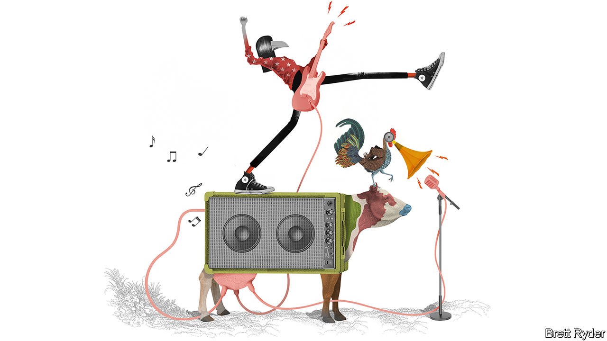

## Schumpeter

# Live-streaming will change rock ’n’ roll for the better

> How to raise live music from the dead

> Jun 27th 2020

A VISIT TO Britain’s West Country on the eve of the summer solstice prompted your columnist to reflect on the serendipitous, socialist past of live music. The road passed by Worthy Farm, which 50 years ago hosted the first Glastonbury festival, costing £1 ($2.50 at the time) a ticket. Back then its owner, Michael Eavis, a dairy farmer, had the mad idea of inviting the Kinks, whom he loved to listen to while milking, to headline a one-off gig, agreeing to pay them £500. When those rockers pulled out, he approached Marc Bolan of T. Rex. Bolan was driving through Somerset to play at Butlin’s, a holiday camp. He agreed to stand in but almost withdrew when brambles threatened to scratch his velvet-lined car.

As Mr Eavis writes in a book, “Glastonbury 50”, Bolan’s bravura performance inspired him to continue the festival. On June 24th-28th it was due to celebrate its half-century with headliners including Kendrick Lamar and Diana Ross. But, as with almost all live music, it was halted by covid-19. Looking through the fields (and the Glastonbury rain) at the distant outline of the Pyramid stage, Schumpeter felt wistful. As a lad growing up in Somerset in the late 1970s, he would slip into the festival via the back garden of a friend’s house, too cheap to buy tickets. But Mr Eavis was never in it for the dosh, anyway. When he failed to make the £500 to pay Bolan, he milked his cows hard for five months to settle the debt.

In the intervening years, the music industry has changed almost beyond recognition. Glam rockers have given way to punks, goths, ravers and rappers. Vinyl was overtaken by compact discs, then streaming. Recently Spotify and other platforms have given rise to a magic-mushrooming of “indie” artists, challenging, at last, the hegemony of the big-three record labels, Universal, Sony and Warner. As the money drained out of record sales in the 2000s, live music became the industry’s reliable earner.

Yet live music has enjoyed little of the creative effervescence found elsewhere in the music business. Quite the opposite. It was already becoming more bombastic and less edgy. The pandemic has brought it to its knees. Bands are stuck at home, roadies are on the dole, and fans face an unfestive summer. But, as at Glastonbury with mud up to your knees, rock ’n’ roll sparkles in times of gloom. Covid-19 may be the impetus live music needs to get out of a rut.

If one company gets the credit—and blame—for taking the socialism out of rock ’n’ roll, it is Live Nation. The Los Angeles-based firm helped pioneer the global consolidation of tour-promotion, venues and ticketing. With $11.5bn in revenues last year, it is the world’s largest live-entertainment company. In 2010 it bought Ticketmaster, the biggest ticketing agency. Sales have grown each year since. Its customers, 98m of them last year, dig deep to see their favourite acts. Live Nation says they are integral to its “flywheel”: the more fans it has, the more tickets, beer, advertisements and other things it flogs, the more cash it makes, the more venues it buys, the more artists it attracts—and the more fans.

In the process its promotional power has grown. Alan Krueger, the late author of “Rockonomics”, an economist’s guide to the music industry, calculated that in America the biggest four promoters were responsible for more than two-thirds of concert revenues in 2017, up from less than a quarter in 1995. Ticket prices rose by 190% over a similar period, almost as much as college tuition. Consolidation may not fully explain the inflation; concerts generate wafer-thin margins for Live Nation, which suggests big artists have considerable clout, too. But in December America’s Department of Justice extended an antitrust enforcement action against it for five-and-a-half years, prohibiting it from retaliating against concert venues that use a ticketing company other than Ticketmaster. In what Krueger called a “winner takes all” market, Live Nation has long been the victor.

Now its streak has stalled. Covid-19 has helped slash its market value from $15bn to about $10bn. (In April it got a $500m investment from that bastion of rock ’n’ roll, Saudi Arabia.) This year’s concerts have been postponed until 2021 and some second-tier artists are likely to be offered less favourable terms to perform. Musicians, whose incomes have collapsed amid social distancing, are desperate for an alternative. Recession-struck fans, too, will pine for cheaper gigs.

The response may prove the biggest jolt to live music in decades. From home quarantine or empty concert halls, artists—including classical musicians—are videostreaming live performances straight to fans. What they started off doing for charity, some are now doing for profit. Rolling Stone magazine reported that BTS, a K-pop band, earned around $20m from a virtual show for 750,000 fans on June 14th—more than Ed Sheeran gets for a gig. An avatar of Travis Scott, an American rapper, reached an audience of 27m via “Fortnite”, a video game. Laura Marling, a British singer-songwriter, streamed a paid concert from an empty chapel in north London. She sold many times more seats online than exist at the venue.

Live-streaming will not replace live performance. “You will never have a mosh pit on Zoom,” quips Crispin Hunt, former singer of Longpigs, a Britpop band from the 1990s. But it could generate competition, pitching streaming services like YouTube and Twitch (owned by Google and Amazon, respectively) against the likes of Live Nation. Russ Tannen of Dice, a ticketing agency, expects live-streaming to make music more like sport, enabling fans to see bands play live in a stadium, or with friends in a bar, or at home on TV—as they would Liverpool play football. Glastonbury is ahead of its time. It already streams live via the BBC. As Mr Tannen says: “Of the festivals, it is the World Cup.” ■