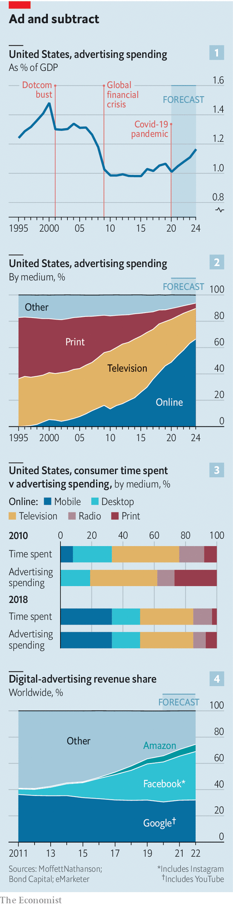

## The new admen

# The advertising business is becoming less cyclical—and more concentrated

> As ever more marketing drifts online, the digital giants’ conquest of adland looks unstoppable

> Jun 25th 2020

SOMBRE PIANO music? Check. Footage of deserted streets? Check. Maudlin voice-over lamenting “uncertain times”? Check. Seeking a television commercial fit to air amid a pandemic, brands from AT&T to Budweiser sent for their finest admen. All seemed to come up with the same cliché, proclaiming: “We’re in this together.”

This is a hard year for advertising, and not just on the creative front. Global ad spending is expected to be 10% lower than in 2019, according to GroupM, the world’s largest advertising firm by billings. The pandemic led advertisers to trim marketing budgets, deprived sellers of ad space, such as cinemas, of audiences, and left the admen with no work. Rishad Tobaccowala, an adviser to Publicis Groupe, the world’s third-biggest agency, likens it to an asteroid strike: “The Earth will go on. But some dinosaurs will die.”

As the dust settles, a reshaped advertising world is emerging. The buyers are lying low but look ready to splurge. Most of their money will for the first time go online. Offline-ad sellers, long in decline, and the creative agencies, whose middleman business is being pinched from both sides, face gradual extinction.

Despite a slump like no other, ad spending may fall by less this year than the 11.2% drop that followed the financial crisis in 2009. And whereas most of the advertising dollars pulled during the recessions of 2001 and 2009 never came back, this time they may return to pre-pandemic levels as early as next year, believes MoffettNathanson, a research firm (see chart 1 ). How come? In a word: internet.

In 2001, when Google was a startup and Mark Zuckerberg in high school, digital advertising made up 5% of America’s ad mix (see chart 2). In 2010 advertisers spent twice as much on print and radio as online, even as people were spending more time with computers and smartphones than with magazines or radio. Eventually, companies that pulled radio and print commercials in these downturns realised they didn’t need them.

They are more reluctant to trim online adverts. Whereas old-school formats are taking their customary beating this year—print advertising will fall by 32%, expects MAGNA, a research arm of Interpublic, another big agency—digital will be flat, or even tick up. The internet draws in new advertisers and persuades existing ones to spend more. Smaller firms that cannot pay for pricey television clips can afford to experiment online. The 100 biggest advertisers on American network TV account for more than 70% of ad sales but in search and on Facebook the top 100’s share is 26% and 20%, respectively. Companies are also diverting their “below the line” marketing budgets—for things like direct mail and in-store promotions—online. The analytics offered by technology giants have encouraged buyers to keep running commercials until the return on investment shows signs of decline. And the growing number of firms that only exist on the internet cannot easily cut online ads. For them, digital advertising is “the new rent”, says Mark Shmulik of Bernstein, a research firm. Online retailers save on physical shopfronts but must maintain a visible virtual presence, recession or not.

Meanwhile, everyone is at the mercy of a near-duopoly. Two landlords, Google and Facebook, control 60% of worldwide digital-ad real estate. Investors long for Google to introduce ads to its Maps app. Their calls may grow louder as Google’s net advertising revenue in America is expected to fall by 4% this year, according to eMarketer, a research firm. Facebook could put more on Instagram. WhatsApp, also part of Facebook, is “the most under-monetised app in existence”, says Bernstein.

There is one final—and vital—reason for the resilience of digital-ad spending. Whereas a decade ago it bore little relation to people’s actual media habits, today it is closely aligned with how they while away their time, notes Mary Meeker of Bond Capital, an investment firm (see chart 3).

Those habits’ further evolution will also favour digital ads. Mobile screens have overtaken TV as the biggest grabber of people’s attention. Even before the pandemic more Americans were cancelling cable-TV contracts each year. Now cash-strapped consumers are switching en masse to cheaper streaming services such as Netflix. In the next few years TV advertising, which has held up reasonably well, “will finally start to crack”, predicts MoffettNathanson.

As more ad dollars migrate online, an even bigger wodge will end up with Google and Facebook, which last year hoovered up 90% of new online ad spending, according to Bernstein. They are on track to increase their share of the worldwide digital-ad business to 70% or so within a few years, and still have ample capacity to display more ads (see chart 4).

If the flood of online ad spending continues, however, current digital-advertising space may reach “a point of saturation”, warns Andrew Lipsman of eMarketer. Ads will then seep to other digital media.

One is gaming, which has come a long way since 1993, when Electronic Arts showed pitch-side ads in its first “FIFA” football game. Last year King, which makes the “Candy Crush” games, took $150m in net ad bookings. Today gaming firms make ads more engaging by, say, letting players earn power-ups in exchange for watching a commercial. King claims that consumers are 18% more likely to remember an ad they see in “Candy Crush” than one viewed while streaming or using social media. Jonathan Stringfield, head of marketing at King’s parent company, Activision Blizzard, recalls how six or seven years ago he had to persuade sceptical advertisers that Facebook, where he worked at the time, was a serious place to market their brand. “This really feels like history repeating itself [with gaming],” he says.

Video-streaming, if anything, looks ready for an even bigger bonanza. Netflix insists it will never run commercials. But other streamers, including Disney’s Hulu and NBCUniversal’s Peacock, are already supported by advertising. As the streaming wars heat up, subscription-based services may decide to sell commercials in order to fund their investment in new content.

Then there is Amazon. The e-empire is still a distant third in digital ads but growing fast. It has bitten off a chunk of Google’s search business: more than half of all online product searches now happen on Amazon.com. Its advertisements are particularly effective: shoppers come to the site ready to buy and its purchase-history data allow it to target consumers minutely. It has yet to run commercials on its Prime Video service. But if it does, advertising dollars will pour in, says Mr Lipsman. A viewer shown an ad could place an order on Amazon without leaving the app—or, with voice control, lifting a finger. Mr Lipsman expects Amazon to sell commercials on Prime Video within two or three years. Its two big-tech rivals hope, with Facebook Shops and Google Shopping, to crack retail faster than it can expand in advertising.

The tech giants are stealing business from the admen, too, by making it easy for advertisers to create their own ads. In Britain only 13% of online search adverts and 44% of online display ads go through the five largest agencies, which handle most of TV advertising, according to Enders Analysis, a research firm. The share prices of the big five—WPP (which owns GroupM), Omnicom, Publicis, Interpublic and Dentsu—have been flat or sliding for at least three years; all have dived in the pandemic.

The agencies are fighting back, offering more data analytics and pitching themselves as broader brand consultancies. Since 2006 Publicis has spent $15bn buying specialist firms in those areas. Mr Tobaccowala estimates that only 35-40% of the group’s business is now conventional advertising. Consulting firms have expanded in the opposite direction; Accenture has acquired more than two dozen advertising agencies in the past ten years. Mr Tobaccowala believes his industry can dodge the asteroid. “Agencies are like cockroaches and not like dinosaurs,” he says. “We scurry around, we figure out the new world.” Nowadays this counts as optimism. ■

## URL

https://www.economist.com/business/2020/06/25/the-advertising-business-is-becoming-less-cyclical-and-more-concentrated
