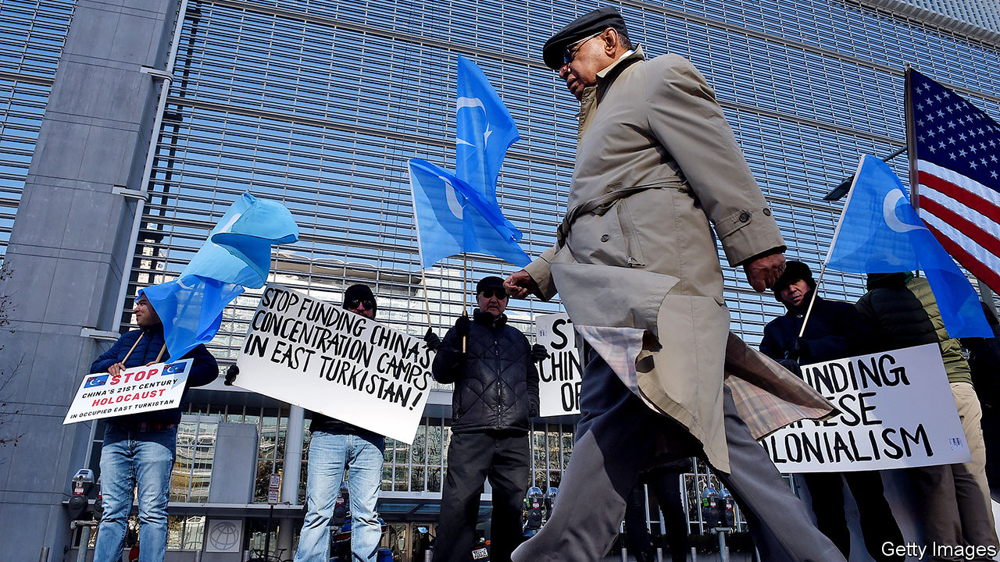

## Walk on by

# Donald Trump is not the only leader who fails to stand up for the Uighurs

> China oppresses Muslims; the world changes the subject

> Jun 27th 2020NEW YORK

IT WAS A rare spark of hope for China’s Uighur ethnic group, which forms nearly half the population of the far western region of Xinjiang. On June 17th President Donald Trump signed the Uighur Human Rights Policy Act. It aims to punish Chinese officials for human-rights abuses in Xinjiang, where since 2017 perhaps 1m people, including about one in ten Uighurs, have been thrown—without trial—into a new gulag. They have been selected for this “training” because of habits such as praying too often to Allah, showing too much enthusiasm for their Turkic culture or refusing to watch state television.

Just before Mr Trump took up his pen came a sharp sting. John Bolton, a former national security adviser, said that Mr Trump had assured China’s president, Xi Jinping, that building the prison camps was “exactly the right thing to do”. Whether Mr Trump spoke out of callousness or ignorance is unclear. Mr Xi may well have told him that the camps were necessary for curbing terrorism, and that the internees had all shown dangerous tendencies. This is China’s official line. Mr Trump should have seen through it, but he does not always read his briefing papers.

Still, the Uighurs’ supporters cheered Mr Trump’s signing of the bill—they take help where they can get it. The act has few teeth. America already had a law allowing the president to impose sanctions, such as the freezing of assets or the denial of visas, on foreign officials who violate human rights. This one goes further only by naming a couple: Chen Quanguo, the Communist Party chief of Xinjiang, and his former deputy, Zhu Hailun. (On June 19th Mr Trump, in an interview with Axios, a news website, said he had not imposed such sanctions already because he did not want to jeopardise trade talks with China.) The Trump administration had already blacklisted several dozen companies and other entities, including government institutions, that it deemed to be complicit in the atrocities, such as by providing surveillance technology. The new law does not mandate much more, except by requiring the American government to report on how the Uighurs are repressed and who is doing it.

Several countries have castigated China for the largest arbitrary roundup of a minority anywhere since the second world war, but few have done much about it. China says it gives the inmates vocational training. But they are also forced to criticise Islam, shave off their beards, eat pork, speak Mandarin instead of their own Turkic tongues and praise Mr Xi. They are not told when they will be released.

In October the European Parliament showed a bit of backbone by awarding the Sakharov Prize for Freedom of Thought to Ilham Tohti, a Uighur academic who was jailed for life in 2014 on a charge of separatism. But firms and sports leagues doing business in China have mostly ignored pleas by activists that they denounce Xinjiang’s horrors. Sweden has declared that any Uighur applying for asylum can be assumed to have suffered persecution. But some countries, such as Cambodia, Egypt and Thailand, have sent Uighur refugees back to China—and certain punishment.

China’s economic power has helped it avoid censure. On October 29th European governments and the Trump administration signed a letter at the UN publicly condemning China. In response China recruited about 50 other countries, including many with majority-Muslim populations, to endorse the official story that the camps are part of a counter-terrorism strategy that has made Xinjiang safer. The pandemic may have helped China, too, by diverting everyone’s attention.

Oddly, China has recorded fewer than 100 cases of covid-19 among Xinjiang’s nearly 22m people. The official numbers may not be accurate, but it is possible that Uighurs have been so effectively walled off from the rest of the world that they have barely been exposed to the virus.

Just before and at the outset of the pandemic, three reports—by the Centre for Strategic and International Studies in Washington, the Australian Strategic Policy Institute (ASPI) in Canberra, and Adrian Zenz, a German scholar—detailed official schemes to send many of the Uighurs in the camps to perform forced labour in factories in Xinjiang and across China. ASPI’s gave what it said was a conservative estimate that, between 2017 and 2019, at least 80,000 Uighurs had been sent to do such work outside Xinjiang. The factories are given bounties by the government for each worker taken. Many of the Uighurs endure miserable conditions: ethnically segregated dormitories in compounds with watchtowers, indoctrination sessions and salaries that are often far below the minimum wage (if they get paid anything at all).

The three reports have made some foreign companies wake up. Dozens of them have examined their supply chains for evidence of forced labour (or at least, they have said they are doing so). ASPI’s report named 83 firms as possibly being complicit in using such labour, but a number of them have disputed this. Adidas said a factory cited in the report, which displayed the Adidas logo on-site, was not one of its suppliers. Nike, also named in the report, issued a statement disavowing forced labour while suggesting that conditions at the factories named may not have been as coercive as reported.

American groups representing apparel and tech firms say they are trying to do more, but have limited leverage in their dealings with China’s government. However, they appear reluctant to use whatever clout they have, or even to say publicly what specific action they are taking. Xinjiang grows more than 80% of China’s cotton, and about 20% of the world’s. China is also a manufacturing hub and large market for most of the world’s biggest consumer brands. Companies are terrified to cross China’s ruling party in public. Corporate lobbyists argue that firms need America and the European Union to work with them to push it to change its behaviour.

With Mr Trump reluctant to impose sanctions, hawks in Congress have taken the lead. In March Marco Rubio, a Republican senator from Florida, introduced the Uighur Forced Labour Protection Act. This bill would establish a “rebuttable presumption” that any goods from Xinjiang are made with forced labour, and thus may not be imported. It would also require companies publicly listed in America to disclose any links to forced labour in Xinjiang or other atrocities there. America’s customs authorities can already block imports of products made with forced labour, but they have limited resources to help them investigate whether a shipment merits seizure on such grounds.

However, the pandemic has dramatically slowed the work of Congress. Any recently introduced bill that is not related to essential government business has almost no chance of being adopted this year. And there is little hope that leaders in Europe will do much, either. Jewher Ilham, the daughter of Mr Tohti, the jailed academic, says a high-ranking European official suggested to her that, concerning Uighurs, Europe would rather deal with China “under the table” than in public.

Many activists doubt whether such quiet diplomacy will work. Some would prefer a boycott similar to the campaign against apartheid in South Africa in the 1980s. It would name and shame companies that benefit from forced labour and call on sovereign-wealth funds, pension funds and the like to divest from any firms linked to abuses in Xinjiang.

But rallying public, let alone government, enthusiasm for this would be difficult, and such a movement probably would not change China’s behaviour. China is the world’s second-largest economy; South Africa ranked 26th in 1985. For consumers, goods wholly or partly made in China are all-but-impossible to avoid. One Uighur activist says Mr Trump’s reported remarks about the camps being a good thing could have useful shock-value, by drawing attention to the plight of Uighurs. Such is the tragic state of their cause that even bad news is better than no news at all. ■

Correction (June 30th 2020): A previous version of this article said the Trump administration had blacklisted several dozen companies deemed complicit in atrocities in Xinjiang. This has been amended to clarify that other entities, including government institutions, were targeted by these measures.