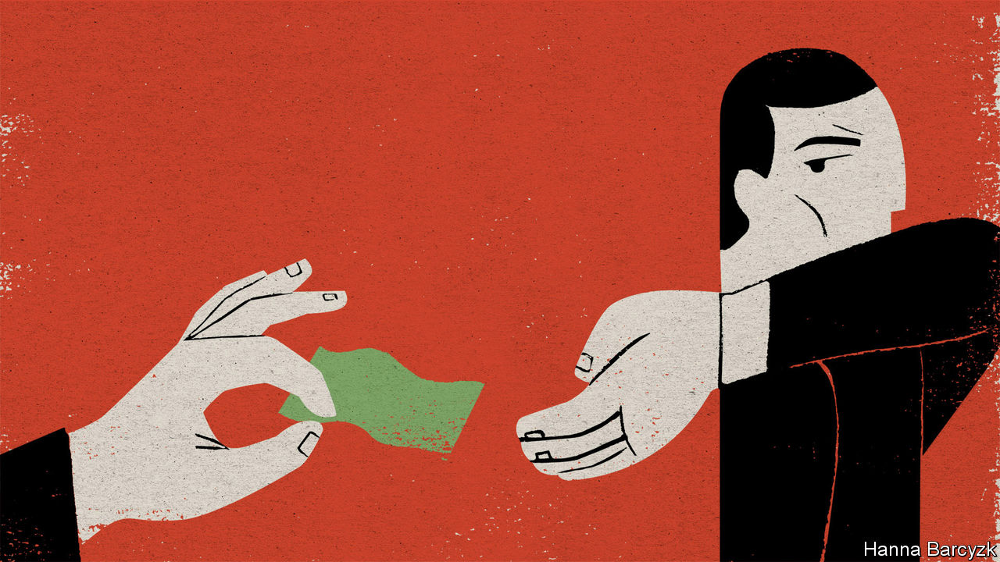

## Chaguan

# To China’s rulers, the cupidity of officials is a political crisis

> Corruption is certainly bad, but it once emboldened Chinese power-holders to take useful risks

> Jun 25th 2020

IN CHINESE, AN official sacked for corruption is said to have “fallen off a horse”. The phrase rings with the age-old satisfaction of watching the high and mighty plunge face-first into mud.

Eight years after its launch by President Xi Jinping, the largest anti-corruption campaign in Chinese history remains wildly popular, notably because it has unhorsed not just light-fingered Communist Party chiefs in villages, but big-city mayors and members of the Politburo. More than 1.5m individuals have been disciplined for graft since 2012, including both “tigers and flies”—a phrase favoured by Mr Xi who took power that year. Still, a puzzle lurks within that mood of public glee at seeing the haughty-but-dirty brought low. The puzzle is identified in a thought-provoking new book, “China’s Gilded Age: The Paradox of Economic Boom and Vast Corruption”, by Yuen Yuen Ang of the University of Michigan.

To Chinese rulers, the cupidity of the country’s 50m party functionaries, civil servants and local officials is a political crisis. Shortly after becoming party leader, Mr Xi declared that corruption was “utterly destructive politically, shocking people to the core”. As Ms Ang notes, the consensus among development agencies and scholars is that corruption hurts economic growth. Yet it is not hard to find ordinary Chinese who miss some big tigers brought down for graft. Exploring that puzzle, Ms Ang lists the achievements of Bo Xilai, the charismatic son of a revolutionary pioneer. As party secretary of Chongqing, Mr Bo transformed that giant inland city with foreign investments and a debt-fuelled construction boom, before being purged and jailed in 2012.

Mr Bo is accused of taking gifts ranging from a villa in France to the fees for his son’s education at Harrow, a British boarding school. But Chongqing also remembers him for new roads, airports, parks, hospitals and housing for hard-up residents. The book describes other swashbuckling, risk-taking leaders who were toppled for corruption but are still remembered fondly. One such is Ji Jianye, who transformed several cities in the eastern province of Jiangsu, earning the mostly admiring nickname “Mayor Bulldozer”. To Ms Ang, their careers reveal something important about Chinese corruption, and how it manages to be both rampant and co-existent with 40 years of rapid economic expansion.

Arguing that conventional measures of corruption are too crude, Ms Ang “unbundles” graft into four varieties. First there is petty theft. Perhaps involving a traffic policeman demanding and pocketing a fine, such corruption poisons economies. Then there is grand theft, eg, a dictator looting the central bank. That is also toxic to economies. Third is speed money, as when a shopkeeper pays a bribe for a permit that might otherwise never arrive. Ms Ang compares this to a painkiller that eases the agony of bad governance but cures nothing. Then comes the variety that most worries Mr Xi: access money, or high-level bribes and favours offered to powerful officials and their families, in return for contracts or other privileges. Ms Ang compares this sort of corruption to steroids. Access money can promote private investment and economic growth. That helps explain the popularity of some bent officials.

The book is not a defence of corruption. Like steroids, access money promotes unbalanced growth, it notes. Often such graft directs funds towards property deals, a swift route to riches for officials in China, where land use is state-controlled. China is especially prone to this fourth category, though petty corruption has declined over the past 20 years, thanks to dull but important things like hard-to-cheat government book-keeping. The Global Corruption Barometer, a survey by Transparency International, found that 26% of Chinese had paid a bribe to use public services in 2017, well below levels found in Vietnam or Cambodia.

Ms Ang compares China’s early phase of economic opening to America’s Gilded Age, when 19th-century robber barons suborned politicians to let them build railways, private monopolies and commercial empires. Public anger prompted the transparency drives and social reforms of the 20th-century Progressive Era.

Admirers of Mr Xi may call his anti-corruption campaign a new Progressive Era. Ms Ang is not so sure. For one thing, China lacks the muckraking journalists and throw-the-bums-out elections that helped America reform. In contrast, its purge is secretive and top-down. Studying 54 city-level party secretaries felled for corruption, Ms Ang finds a correlation with the sacking of a mentor above them in provincial patronage networks. Worse, Mr Xi has been “simultaneously straitjacketing the bureaucracy and clamping down on social and political freedoms”, squeezing entrepreneurial impulses in business and civil society.

Ms Ang is convincing about the economic risks of Mr Xi’s drive for conformity. But the party’s focus on politics is also rational, says Feng Chucheng, a political-risk analyst at Plenum, an independent research company. He notes that historically lots of bribes were paid by one official to another to secure a promotion, rather than by entrepreneurs to enable economic development. Other abuses of power involved no cash at all: helping a relative jump the queue for housing or a rationed car licence plate, for instance. Indeed the public is arguably more angered by social inequalities than by embezzled money. Mr Feng cites a singer, Tong Zhuo, who casually boasted during a broadcast in May that rules were bent to secure his place at a famous drama school. Viewers erupted. To date, 21 officials in two provinces have been punished, including Mr Tong’s stepfather, a mid-ranking party functionary.

One effect of the purge has both economic and political consequences. Officials at all levels of government are more risk-averse and reluctant to innovate, says Mr Feng. Ms Ang describes outright paralysis among decision-makers. She adds that corruption’s true root cause is the state’s enormous power over the economy. That, alas, is a horse that the party is unwilling to dismount. ■

## URL

https://www.economist.com/china/2020/06/25/to-chinas-rulers-the-cupidity-of-officials-is-a-political-crisis
