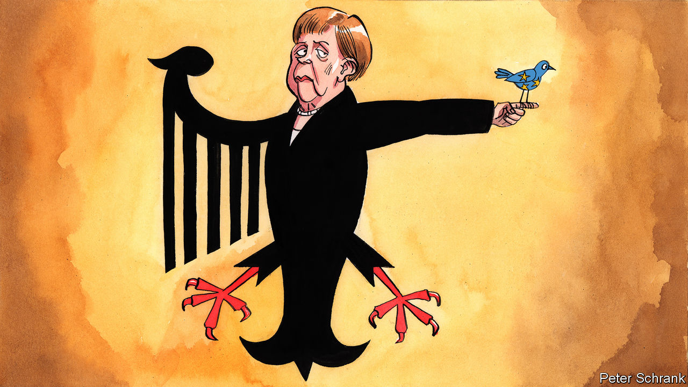

## Charlemagne

# Germany is doomed to lead Europe

> The EU’s biggest member is in charge, whether Germans like it or not

> Jun 25th 2020

WALK INTO any meeting in Brussels and, most likely, a German will be leading it. In the European Commission, Ursula von der Leyen, the former German defence minister, is in charge. For the next six months, German ministers will be cajoling their peers into signing off legislation as the country takes over the EU’s rotating presidency. In the European Council, where the bloc’s leaders butt heads, it might technically be Charles Michel, the former prime minister of Belgium, heading it. But it is Angela Merkel—longer in post than the leaders of France, Spain, Italy and Poland combined—who is the undisputed top dog. The EU’s main response to the covid-19 crisis—a flagship €750bn recovery fund paid for with debt issued collectively by the EU—is based on a plan cooked up in Berlin and Paris. The Germans are running the show.

Usually, German power in Brussels is the political equivalent of dark matter: invisible, difficult to measure and yet everywhere. Now the Germans are stars, shining so bright as to be impossible to ignore. There was no devious Teutonic plot to grab power. Mrs von der Leyen owes her position to Emmanuel Macron, the French president, rather than patronage from Berlin. (Mr Macron pushed Mrs von der Leyen because he could not bear the thought of Manfred Weber, also a German, getting the job.) It is not Mrs Merkel’s fault that no French president has won a second term since she came to power, or that most Italian prime ministers fail to complete their first. A quirk of the calendar left Germany holding the rotating presidency. Whether they want it or not, German hands now grip the EU’s levers of power, just as the bloc overhauls itself to cope with the covid-19 crisis.

Being coy on the European stage used to work well for Germany. For obvious historical reasons, Germans do not like being seen to throw their weight around. And the EU’s status quo suited them. A single market let German supply chains whirr effectively and goods flow seamlessly. The euro allowed German exports to soar without the bother of an appreciating currency. Any downsides were exported to southern Europe. Unemployment in Germany stands at only 3.5%, less than half that of the euro zone as a whole and a quarter of the Spanish figure. From a German perspective, the EU was not broken and did not require fixing.

This happy status quo is now under threat, often from Germany’s own actions. When the EU’s economy lurched to a halt, the European Commission loosened its strict rules on government funding for stricken businesses. But officials did not expect Germany to pledge €1trn for such support—nearly half of the EU’s combined total. As a result, well-run Spanish firms are likely to go under due to lack of state support, while stodgy German competitors are kept alive by German taxpayers, undermining the “fair fight” logic of the single market. At the same time, Germany’s constitutional court recently aimed a blow at the European Central Bank’s efforts to inject more liquidity into the euro-zone economy, when German judges challenged the bank’s asset-buying programmes. In this sense, German support for mutualised debt might be seen as a polite apology for causing offence.

Saying no to common debt had been a red line for the German establishment. Now, however, a recognition that Germany needs Europe—not just vice versa—dominates thinking in domestic politics. Arguments for the recovery fund, which will see huge increases in German spending on the EU’s budget, are couched in terms of self-interest. This marks a shift in world-view towards that of Alexander Hamilton, the father of debt mutualisation in the early American republic. During the euro-zone crisis, the debate over bail-outs was steeped in the idea that diligent Germans were bailing out feckless Greeks (rather than the feckless German and French banks who lent them the money in the first place). In a pandemic-induced crisis, there is less blame to go round.

Instead, there is recognition that without some form of transfer between Germany and her struggling neighbours in southern Europe, political misery beckons. The EU is supposed to be a convergence machine, spreading prosperity rather than embedding differences between rich and poor countries. It has not worked that way. When the euro was introduced at the start of the millennium, Italian GDP per capita was 20% below Germany’s. Now the gap is nearly 40%—a figure that will only widen during the crisis. Italians may question the rationale of membership if their incomes continue to stagnate. It is for this reason that Mrs Merkel frames the recovery fund as a “political instrument against populists”.

Keeping the EU on the road takes on an existential importance now that America, the bedrock of German prosperity in the post-war era, has become an erratic ally. Strengthening the EU’s internal structures, by filling the gaps in its pockmarked constitution, is seen as the best way of protecting it from external threats. Ideas that were once off-limits, such as the long-winded, politically difficult task of changing the EU’s treaties, are now openly floated by Mrs Merkel. It is, at heart, a conservative radicalism. Things are allowed to change, but only so that things stay the same—specifically the rich, peaceful lives of German voters.

German leadership in Europe makes people uneasy, particularly Germans. In private, Mrs Merkel used to point out that Germany was unsuited for such a role since the country was itself a mini-EU, its complicated federalism built on delicate compromise. Nimble decisions were impossible in such circumstances. Anyone relying on Germany to take bold steps would be disappointed, as many were. If this record is to change, now is the time. An institutional conjunction has left Germans calling the shots in Brussels. Rather than a lame chancellor limping to the end of her 15-year career, Mrs Merkel sits on a pile of political capital, gained from competent handling of the pandemic. Germany has the means to change Europe—if it chooses. ■

## URL

https://www.economist.com/europe/2020/06/25/germany-is-doomed-to-lead-europe
