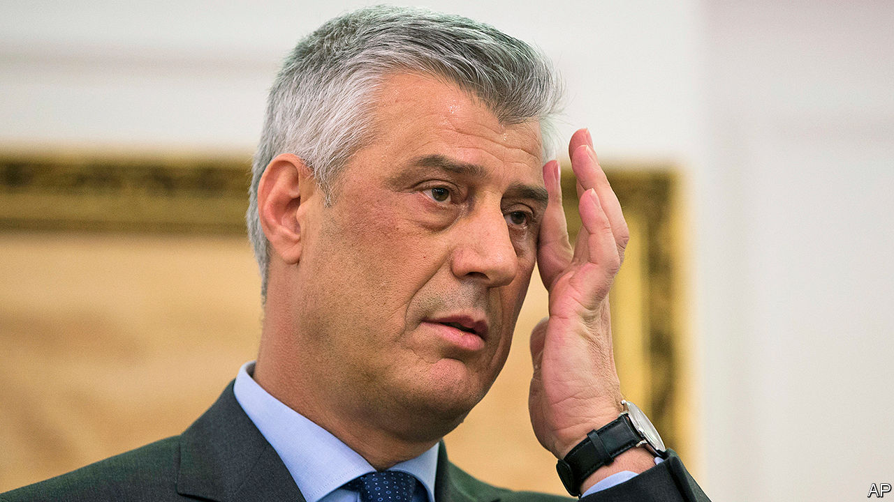

## A June surprise

# Kosovo’s President Hashim Thaci faces war-crimes charges

> Just when he was about to go to America for a summit at the White House

> Jun 27th 2020

HASHIM THACI had clearly not been expecting to be charged with war crimes, murder and torture on the afternoon of June 24th. A few hours earlier, the president of Kosovo had been busy discussing a much-ballyhooed summit planned for three days later in the White House with Aleksandar Vucic, his Serbian opposite number. Perhaps it would even have led to the pomp of a signing ceremony in the Rose Garden. Richard Grenell, an American diplomat, had done everything to secure the meeting in the hope it would give President Donald Trump a rare foreign-policy success to boost his election campaign.

Mr Thaci has towered over his country’s politics ever since he traded in his fatigues for suits at the end of the Kosovo war in 1999. He was always more of a political commissar than a fighter, but he was a key figure in the Kosovo Liberation Army, which had been battling to end Serbian rule. That year, after 78 days of bombing by NATO, Serbia handed the province over to the UN to administer; and in 2008 Kosovo declared independence, which Serbia has never accepted.

Mr Thaci and Kadri Veseli, the leader of his political party, were charged by the Kosovo Specialist Chambers, a new body in The Hague, backed by the EU and America, that was founded in 2015 after a vote in Kosovo’s parliament. Though staffed by international judges and prosecutors, it operates under Kosovo law and is a Kosovar institution.

In 2010 a Swiss prosecutor had written a report for the Council of Europe implicating Mr Thaci in drug smuggling and murder, accusations he has always denied. As a result, his allies in Europe and America encouraged him to support the creation of the chambers and their jurisdiction. He did so—but later came to rue the day. Last year he lobbied to have it shut down.

In any case, the charges still need to be confirmed by a pre-trial judge. What is odd is the reason given by the prosecution for airing the charges before this has happened. Mr Thaci and Mr Veseli “are believed to have carried out a secret campaign” to obstruct the work of the court “to ensure they do not face justice”, the prosecutors explained.

The timing of the announcement, says Agron Bajrami, who edits Kosovo’s leading daily newspaper, suggests that something was afoot that made prosecutors unveil their charges just as Mr Thaci was about to set off for Washington. The summit might have lent prestige both to Mr Trump and Mr Thaci. Not now.■