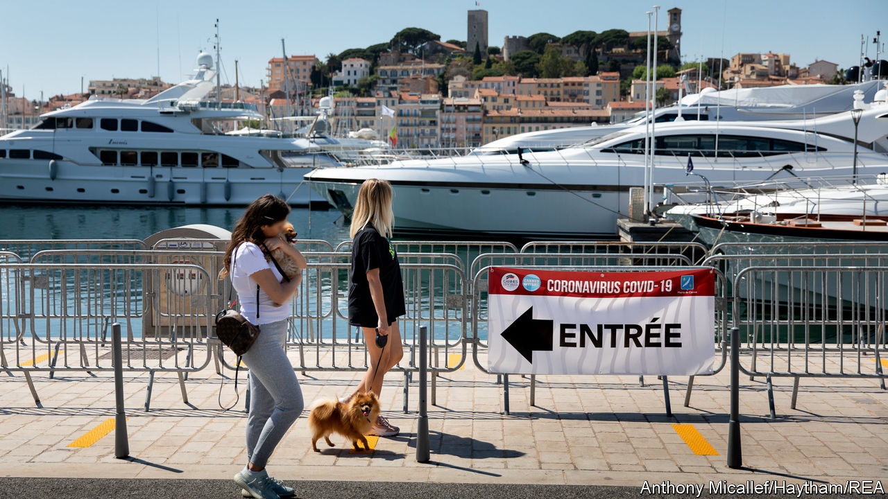

## Empty palaces

# Why the French Riviera is full of ghost yachts

> Even plutocrats fear the pandemic

> Jun 25th 2020LA CIOTAT

TUCKED BEHIND a craggy peak on the Mediterranean coast, La Ciotat has served as a harbour for local fishermen since the 15th century. Today, the port is better known for a different sort of seafarer. One in seven of the world’s superyachts over 50 metres long—equivalent to the height of the Arc de Triomphe—passes through La Ciotat Shipyards at some point each year. With 300 berths in its dry dock, the yard carries out roughly a tenth of the refit and repair of all the big yachts in the world. At this time of year most are usually out at sea, or moored in Cannes, St Tropez and beyond. Today, as France emerges from lockdown, the yard is still full of gleaming yachts, among them a 115-metre floating palace once owned by Roman Abramovich, a Russian tycoon.

Confinement has crushed tourism in France. In a normal year nearly 90m foreigners come to admire its chateaux, museums, vineyards and beaches, making France the world’s top international tourist destination, ahead of Spain. In April, with planes grounded and borders largely closed, the number of German, Italian and Spanish visitors to France fell by 99% on the previous year. For nearly three months, hotels and restaurants were shuttered. On the Riviera “the situation was catastrophic,” says Claire Behar, director of the Côte d’Azur regional tourism committee. The Cannes film festival was cancelled. Foreign tourists—yacht-owners included—had to stay away. The overall regional hit to tourism, calculates the committee, was a whopping €1.3bn ($1.5bn).

Just along the coast from La Ciotat, the colourful harbour of Cassis on a post-confinement weekend is nonetheless thronging—with French people. A queue at the ice-cream parlour stretches down the street. Beachgoers form another as they wait for masked policemen to hand out orange flags, which they use to mark an occupied socially distanced space on the sand. The marina is full. Almost every table in harbour-front restaurants is taken. Pastis and vin rosé are flowing.

Business looks brisk. But “it’s not busy at all,” says the manager at La Maison, a restaurant in the port. He says business is only at a third of normal levels for the month of June. Crucially, he adds, local French tourists “do not spend as much as the Germans or northern Europeans.” The gap could make all the difference to the survival of the many small family-owned hotels and restaurants. A government forecast expects hotel, holiday-home and campsite bookings even by the French to be only 20% of normal in July and 40% in August. As for the Americans and Chinese, usually ferried into the little port from towering cruise liners docked in nearby Marseille, they are absent.

This point is crucial for the French Med. Local tourism, however welcome, cannot replace the foreign variety. A French tourist on the Riviera spends an average of €58 a day. Russians, Americans and Middle Easterners splurge nearly three times as much. In preparation for an expected easing on July 1st of EU rules for travel, the region is launching marketing campaigns to remind people of its charms and to reassure them about covid-19. Nice airport has already begun to schedule flights to and from other European cities from July. The city is also the starting-point this year for the Tour de France cycling race, rescheduled for August 29th. The aim for the Riviera, says Ms Behar, is “to save the rest of the season”.

In the meantime locals are getting a hint of what the south of France must have felt like in the 1950s, when St Tropez was still a fishing village. Few cars with foreign number plates are to be seen on the roads. Of the French who plan a holiday this summer, 71% told a poll they intend to stay in France. Locals may secretly rather like having their beaches and restaurants to themselves. But those in the tourist industry yearn for high-spending Germans and Russians to return, even if their yachts sometimes spoil the view. ■