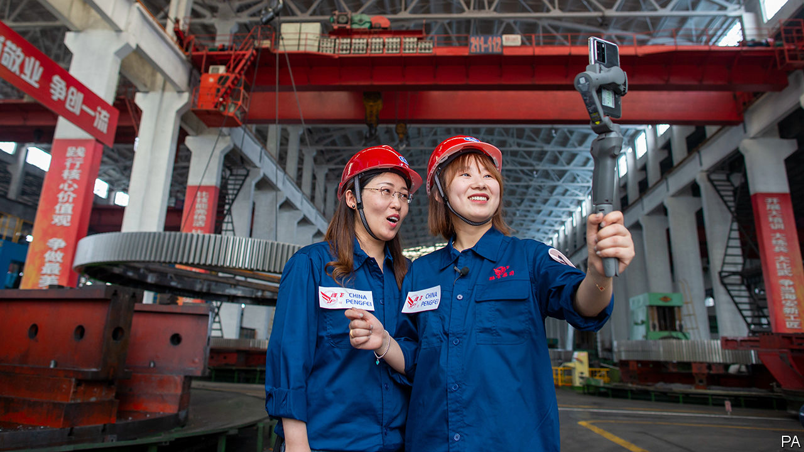
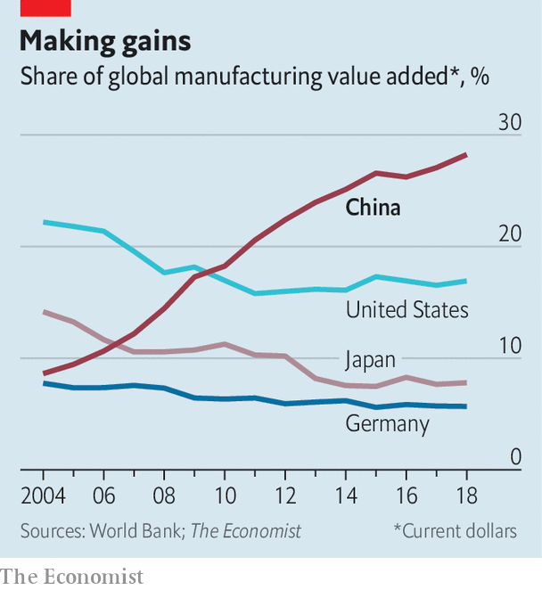

## The world’s factory

# China’s prodigious exporters have some new tricks

> The country’s export share has expanded during the pandemic

> Jun 25th 2020SHANGHAI

NORMALLY 200,000 buyers, hailing from just about every country, would have flocked to the Canton Fair, the world’s biggest trade show. This year, because of the pandemic, it was conducted entirely online, running for ten days and ending on June 24th. Although no substitute for meetings in the flesh, the virtual fair was testament to China’s manufacturing muscle. Some 25,000 exhibitors hosted live-streams, often from their factories, chatting to anyone interested in their products.

Among them Wen Li, a young product manager, demonstrated Z-Green’s self-propelled lawnmowers, to the background clang of the shop floor. Sherry, a manager with My Dinosaurs, stepped around fake bones as she introduced her company’s animatronic beasts, pausing to insert a tongue into the gaping mouth of a brachiosaurus. Joy, a saleswoman with PK Cell, sat behind an array of rechargeable lithium batteries, explaining the workings of the firm’s 23 automated production lines.

On it went. There were companies making motorbikes and electric cars, coffee machines and milk-frothers, dog toys and hummingbird-feeders. Even if the live-streams were amateurish, in halting English with poor lighting, the overall effect was powerful. Here, the fair proclaimed, is China: home to 28% of the world’s manufacturing—nearly as much as America, Japan and Germany combined—and, despite the coronavirus, still going strong.

China has two big advantages as a manufacturing power. First, its industrial base has unparalleled depth and has only grown more competitive. In 2005, 26% of the value of China’s exports was added abroad; by 2016 that was down to 17%, according to the OECD. In other words, more of the bits and bobs that end up in Chinese gadgets are themselves made in China.

The second advantage is China’s own vast market. This is why many American firms want the Trump administration to go only so far in its tussles with China, applying enough pressure to free up space for them, but not so much as to kill their opportunities. By one measure global firms look even more wedded to China, despite the trade war: over the past 18 months the value of foreign mergers and acquisitions in China reached its highest in a decade, reckons Rhodium Group, a research firm.

As is to be expected, the global downturn is hurting Chinese firms. Their exports fell by 8% in the first five months of 2020 compared with a year earlier. Yet they are in better shape than most elsewhere, thanks to the country’s success in slowing the virus. China’s earlier resumption of industrial activity has allowed exporters to gain market share. In Japan, Chinese goods accounted for a record 30% of imports in May. In Europe, they made up 24% of imports in April, also a record.

Yet this may be the high-water mark. Other countries are only too well aware of China’s manufacturing prowess—and that it leaves them vulnerable to critical shortages. That point hit home earlier this year, as they scrambled to buy ventilators and masks from China. From India to Taiwan, governments are offering loans, land and other perks to lure investors.

Such inducements have rarely worked in the past, but they stand a better chance now, for three reasons. First, China’s climb up the value chain is squeezing out low-end firms. Many garment-makers have already shifted, in part, to South-East Asia. Second, tensions with America have left companies twitchy. Apple still makes most of its iPhones in China, but has encouraged its suppliers to expand elsewhere. Third, the rolling shutdowns of factories during the pandemic have underscored the danger of being over-exposed to any one country.

Evidence of the shifting tide can be found in surveys of big companies conducted by UBS, a bank. Among its 1,000-plus respondents, 76% of firms from America, 85% from north Asia (eg, Japan and South Korea) and even 60% from China say they have already moved or plan to move some production away from China. Keith Parker of UBS estimates that companies might shift between 20% and 30% of their Chinese manufacturing capacity. That will not happen overnight, but it will chip away at China’s dominance in manufacturing.

In the meantime, Chinese businesses retain a well-honed ability to adapt. Take Sowind, a maker of household-cleaning tools—one of the companies at the virtual Canton Fair. It was promoting motion-activated, battery-powered soap dispensers for home use. In a live-stream, Ivy, a young saleswoman, tailored her pitch to the grim viral reality: “You don’t need to touch the soap dispenser, so you can avoid cross-infections.” Contacted after her broadcast, Ivy said that customers in Europe and America were buying thousands. As for the online migration of the world’s biggest trade show, she was upbeat. “It takes time to get used to a new technique, but it’s gone better than I had expected.” ■