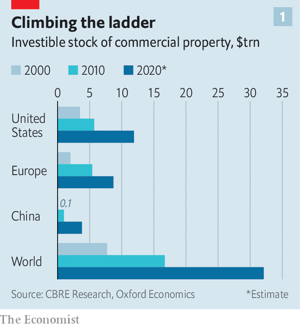
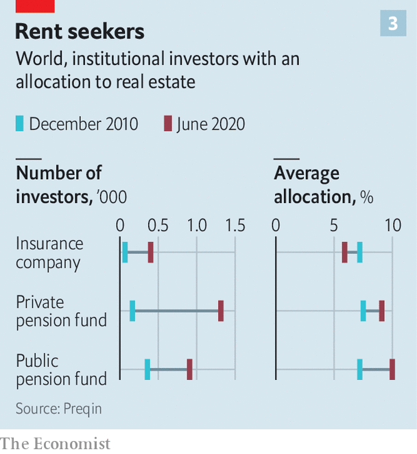
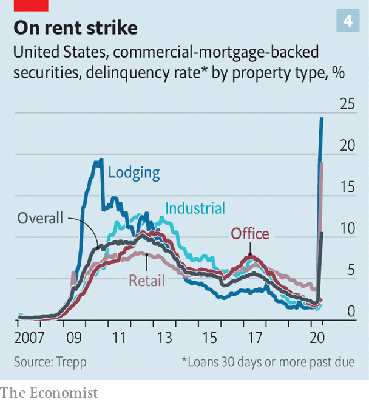

## Like a ton of bricks

# Is investors’ love affair with commercial property ending?

> After covid-19, the investment world will become more discriminating

> Jun 25th 2020

THE SECOND week of March was a heartbreaking one for Will Beckett. The boss of Hawksmoor, a chain of steakhouses that employs 700 workers in Britain, had been days away from opening his first New York outpost. Instead government-imposed lockdowns forced him to close all his restaurants down. The City types that usually queue for its sizzling cuts were forced to go without. So too were Mr Beckett’s landlords, after he told them he could not afford to pay rent for the second quarter. Most of his peers, he says, have also yet to square the bill. Restaurateurs are likely to miss their payments for the third quarter too.

Activity is gradually restarting. On June 23rd Boris Johnson, Britain’s prime minister, said he would allow restaurants to re-open on July 4th. A moratorium on repossessions, introduced in March, has been extended to September. Yet social distancing and warier, cash-strapped diners will squeeze eateries’ margins. Jonathan Downey, who runs street-food markets in London, says the hospitality industry risks “rent apocalypse”.

Most people probably have more sympathy for chefs and waiters than for landlords. But many do not realise that payments made to commercial landlords are increasingly channelled towards their own pension pots or insurance claims. The global stock of investible commercial property—hotels, shops, offices and warehouses—has quadrupled since 2000, to $32trn (see chart 1). More than a third is owned by institutional investors, which piled in, lured by lucrative, solid returns.

Covid-19 has upended the impression of solidity. Most immediately, it has severely impaired tenants’ ability to pay rent. It also raises questions about where shopping, work or leisure will happen once the crisis abates. Both are likely to prompt investors to become more discriminating. Some institutions may shift their funds away from riskier properties; other investors, meanwhile, might hunt for bargains, or seek to repurpose unfashionable stock.

The infatuation with commercial property began in earnest after the global financial crisis of 2007-09. Interest rates were cut to almost zero across much of the rich world, making it harder to generate the safe cash flows that pension funds and insurers need to meet future liabilities. “Core” property—often in desirable places and needing little refurbishment—typically produced secure annual returns in the high single digits to low teens, mostly in the form of contractual, often inflation-adjusted, rent payments (see chart 2). Buying property allows investors to park vast sums of money—from tens of millions to billions of dollars—which they can forget about for years (commercial leases often last a decade or more). And the returns have been less volatile in crises than those from public equities and commodities.

As a result both the numbers of institutional investors buying up property and the amounts they have allocated to it have risen since 2010 (see chart 3). A chunk is channelled through private property funds, which have raised $1.6trn since 2008, according to Private Equity Real Estate, a publication. All together, institutions hold about $6trn worth of assets privately, and $5trn through listed vehicles. Property is typically financed by helpings of debt, which accounts for just under half of the market’s value in America.

Investors’ appetite has been met by a growing supply of assets. Since 2000, businesses ranging from burger chains to banks have spun out trillions of dollars of property they used to own to free up cash, often leasing it back immediately after divesting. Worldwide, offices and shops account for 61% of assets, though the share of commercial housing (ie, student housing and condominiums) and logistics assets has been rising.

By the start of this year there were signs of froth. Both offices and industrial properties (warehouses, chiefly) reached record prices at the turn of 2020. Retail-property prices had already peaked in 2018. Rent growth, however, had started to level off across most sectors. All this depressed yields, and returns had started to flag.

Then the pandemic hit. As investors panicked, stockmarkets tumbled and property markets froze. Transaction volumes in May were down by about a third in the West and two-fifths in Asia, according to Real Capital Analytics, a data firm. The proportion of offers that fell through before completion doubled in Europe and rose sevenfold in America. Indices tracking listed trusts that invest in commercial property (dubbed REITs) cratered in March. Part of that might have reflected an indiscriminate sell-off of shares by investors rather than an ebbing taste for property. But benchmarks have recovered only about half their losses.

Covid-19 jolts investors out of their complacency in two ways. First, swarms of tenants have simply stopped paying rent as the economy has reeled; the extent to which losses will persist is especially uncertain. Second, it may speed up long-term shifts within the sector: from shops, say, towards warehouses. Some types of property could become less bankable.

Start with delinquency. As lockdowns shuttered shops and businesses, rent collections collapsed. Less than half of all tenants in Britain paid rent on time at the end of March; a quarter of it was still due seven weeks later, says Remit Consulting, a research firm. Hotels have been worst hit: with borders closed and travel restricted, average occupancy fell from 70% before the pandemic to a low of 15% in early April. In America, average revenue per room shrank by 84%, to $16 per night, in April. Stand-alone shops and shopping malls have also suffered. Collection rates have fallen below 50% on both sides of the Atlantic.

Offices have proved sturdier. Firms that rent out co-working spaces on short-term leases have suffered. Other tenants, bound by decades-long leases, have continued to pay. Still, collection rates range between 57% in Britain and 90% in America. Late or missed rent payments in the double digits are hardly normal.

The resulting lost rental income is likely to have passed through to missed mortgage payments. Many banks report losses with a lag and with limited detail, but delinquency rates on commercial-mortgage-backed securities (CMBS)—bundles of loans sold on capital markets—provide a barometer. In America this month they exceeded levels seen during the financial crisis (see chart 4). A fifth of debt payments on shopping properties are late; a quarter of those due on “lodgings”—including student housing, vacant since universities closed—have also been skipped.

As activity resumes, properties are adapting, at some capital expense. Hotels are implementing contactless check-in, automatic doors and new cleaning routines. Offices are introducing temperature checks and reducing pinch points at lifts. Brian Kingston, who runs the property arm of Brookfield, a private-equity firm, says it is reorganising mall layouts and car parks to make kerbside pickup easier.

But fresh outbreaks, or lingering fears of infection, could throttle the return to normality. Cash-poor and fearful, companies may limit business travel. Households may shun far-flung holidays and perhaps even shopping trips at home. That is bad news for hotels, restaurants and shops. Erin Stafford of DBRS Morningstar, a rating agency, reckons that, short of a fast recovery, half of America’s independent restaurants may go under.

Such effects will be compounded as the vast support provided by governments is rolled back. Since March the authorities have propped up commercial tenants by paying employees’ wages, topping up business cash reserves, legislating against eviction, backstopping banks and reducing credit constraints. Most measures are set to expire within months. Coface, a trade-credit insurer, expects insolvencies to jump by a third worldwide by 2021. Landlords could find that rental income dries up just as lenders, tolerant thus far, lose patience. Without progress on a vaccine or a treatment over the next three to six months, says Michael Van Konynenburg of Eastdil Secured, a bank, “we’ll start to see more enforcement actions”.

Further ahead, covid-19 will also make some types of commercial property less of a safe bet than others, by accelerating trends that were visible even before the coronavirus began to spread. The most obvious is the rise of online shopping. Since February the rich world has seen a surge in e-commerce activity. Many shoppers may choose to stick with the speed and convenience of click-and-deliver. In 2019 a record 9,300 bricks-and-mortar stores closed in America; Coresight Research, a data firm, says 15,000 could fold this year. JCPenney, a century-old department-store chain, went bust last month.

Shopping malls, particularly those in the sticks, could be in trouble. On top of the reduced rent caused by shop closures, the vacating of department stores, which often act as “anchor” tenants, may give other stores the right to pay lower rents, or even to cancel lease agreements, says Aditya Sanghvi of McKinsey, a consultancy. A third of America’s 1,100 malls could end up being demolished. On June 23rd Intu, which owns shopping centres in Britain, appointed administrators.

The pandemic’s effect on office space is less clear. Many workers may find that they quite like working from their bedrooms or kitchens. Others say they miss the camaraderie of the office. Social distancing may also force firms to spread out more, reversing a trend that saw office space per employee fall by half in a decade. If the net effect were a reduction in rented space, it could cause havoc. Victor Calanog of Moody’s, a rating agency, calculates that if tenants in New York gave up even 10% of their space over the next five years, it could result in a halving of rents sought on vacant properties.

Meanwhile, the shift to remote shopping and working presents investment opportunities. Storage and distribution facilities remain geared towards industrial use rather than pick-and-pack. Brian Chinappi of Actis, a London-based private-equity firm, says the crisis has made it even hungrier for data centres, which it is now building in Asia and Africa.

Assessing the extent of potential losses from the crisis is hard. Britain’s financial watchdog thinks uncertainty on values is so strong that it has forced listed funds to suspend redemptions. Analysts canvassed by The Economist reckon property values will fall by less than 20% overall this year, and rents by 5-10%. That compares with falls of 25% and 10-20%, respectively, in 2008-09. But a lot depends on how long rent suspensions last. MSCI, an index provider, estimates that assets subject to a six-month rent holiday and a recession could lose 37% of their worth. REIT prices suggest retail properties could have further to fall.

Figuring out who will bear those losses is even tricker. Laws differ as to whether creditors or equity holders should get preferred treatment, with the former favoured in Europe and the latter better protected in America. Most important, ownership of property assets is “a big, complicated web” that cannot easily be untangled by outsiders, says a consultant. Property vehicles are often owned by large asset managers that aggregate pension-fund money from all over the world. Despite improvements in disclosures, private funds remain opaque. Lenders are not always best-in-class either. “Try getting a French bank to reveal its property-type breakdown for commercial real-estate lending,” says one analyst.

What seems clear is that banks are in a sounder position than during the financial crisis. Loan-to-value ratios were below 60% at the end of 2019, compared with 70% in 2007, so there is more equity to absorb drops in values, says Richard Bloxam of JLL, a property consultancy. Banks’ capital buffers are bigger. In America CMBSs can catalyse credit crunches, because property lenders often use them as collateral to finance more loans. But these account for 15% of total property debt, down from over 50% in 2007. And they have held up well so far, thanks to purchases by the Federal Reserve. (The Fed’s programme, which excludes newly issued CMBSs, expires on September 30th.)

A more diverse lending universe, though, means more entities are exposed to potential losses—including institutional investors, which have piled $235bn into specialist private property-debt funds since 2008. Some funds are already struggling to repay the short-term debt they have raised against long-dated assets. Bigger shocks may well occur when batches of loans mature. Britain faces a £43bn ($53bn) commercial-property refinancing wall in 2020-21; America’s is worth $2trn over the next five years.

Such losses notwithstanding, investors’ love affair with commercial property is unlikely to be at an end. Interest rates in the rich world are close to zero, if not below it, and going nowhere. The spread between real-estate and government-bond yields is still alluring. Private-equity firms’ mountains of dry powder—now worth a third of assets under management, the highest since 2010—will put a floor under values. But those who once blindly piled in are likely to think twice. The result could be a more discerning investment approach. Institutional investors could become more cautious, favouring targets like housing blocks or prime offices that provide long-term secure income; more money seems to be chasing a shrinking pool of “defensive” assets, which could push prices up further and dampen yields. Some will hedge their bets. Alisa Mall of the Carnegie Corporation of New York, a $3.5bn endowment with a 10.5% allocation to property, says it wants to add generalist managers who can invest across sectors and geographies to its portfolio of “sharpshooter” specialists.

Yet others, mostly private real-estate funds, hope to swoop on bargains (most public vehicles are trading below their underlying asset values). Craig Duffy of GLP, a private-equity firm based in Singapore with a vast portfolio of warehouses, says the firm has $7bn of dry powder to deploy, and hopes to raise another $8bn-9bn by the end of 2020. Some will focus on debt at a time when liquidity to stretched borrowers comes at a premium: Skardon Baker of Apollo, a firm that invests in distressed assets, says its European opportunistic fund has deployed €500m in the past 12 weeks.

The big winners will probably be giant firms like Brookfield, which closed a $15bn fund last year, and Blackstone, which raised a record $20.5bn vehicle a few months later. They have war-chests allowing them to command price discounts by buying bundles of assets at once. And they are among the few firms with the development skills needed to turn buildings round. Ever greater demand for their services may allow them to charge hefty fees, on ever bigger sums. Pension funds and insurers are becoming warier of commercial property. But for private-equity barons it remains a giant moneymaker. ■