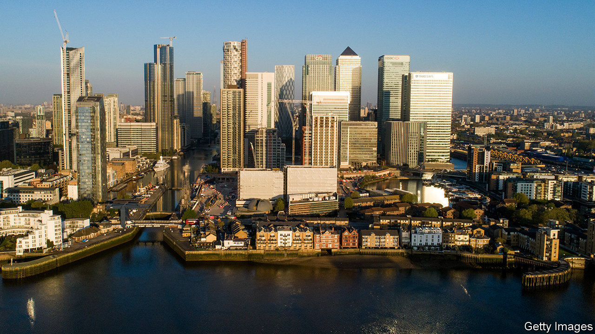
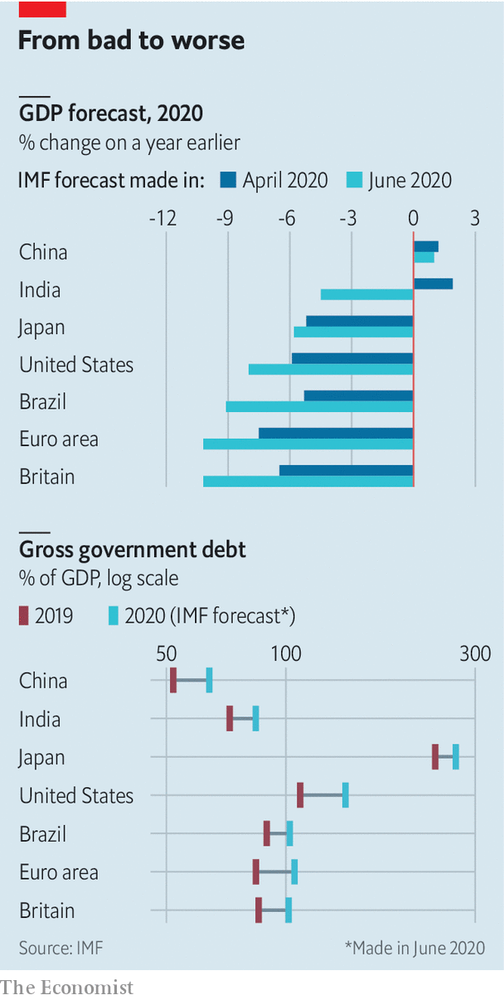

## Doom and zoom

# The IMF downgrades its global growth forecasts

> High debts and high asset prices worry Washington wonks

> Jun 25th 2020

ON JUNE 24TH the IMF said that the economic slump caused by the covid-19 pandemic would be worse than it forecast in April, and that governments would be left more indebted as a result. The fund thinks that advanced economies’ combined gdp at the end of 2021 will still be lower than it was in the first quarter of 2019. But it warned of an unusual degree of uncertainty surrounding the numbers, which assume persistent social distancing, lower productivity and widespread economic scarring. The fund also pointed out the “disconnect” between this grim outlook and high asset prices.■

## URL

https://www.economist.com/finance-and-economics/2020/06/25/the-imf-downgrades-its-global-growth-forecasts
