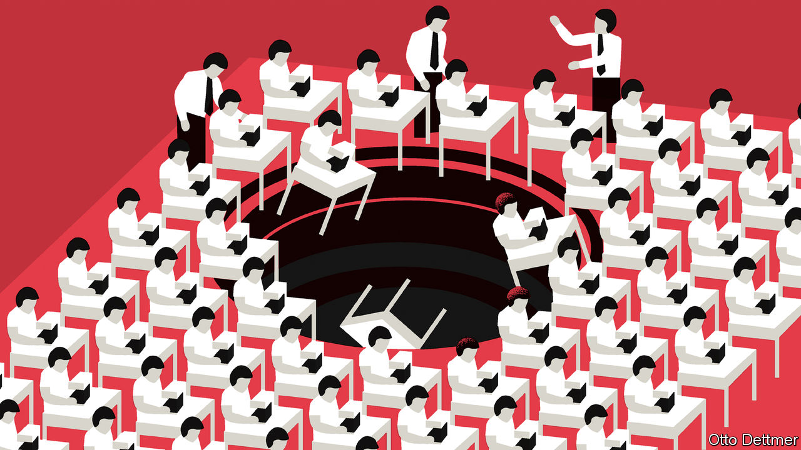

## Free exchange

# Will labour reforms in India work?

> Jobs are protected on paper but precarious in practice

> Jun 25th 2020

HAS ANY country ever lost as many jobs as India shed in April? After the government imposed a strict lockdown on March 24th, employment fell by 114m in the following month, according to the Centre for Monitoring Indian Economy, a research firm. The number, it said, was “mind-boggling”. It has also been mind-concentrating. Although employment has begun to recover, the need to create jobs has prompted several Indian states to suspend many of the country’s compendious labour regulations. These strictures include over 40 central laws and about 100 state ones dictating how employers should pay workers, contribute to their pensions, guard them from injury, settle their grievances and lay them off.

The Factories Act of 1948, for example, aims to safeguard workers’ health, safety and comfort in any plant with ten or more employees. It is quaintly fastidious. In some states, the rules prescribe the frequency of whitewashing latrines (every four months) and the size of bucket required to fight fires (nine litres). Other rules elaborate on the specifications of spittoons (galvanised iron, with conical funnels, on stands that are three-feet high).

This kind of overbearing regulation is one reason why “India grows at night, while the government sleeps”, according to an adage popularised by Gurcharan Das, an author. Reform has been incremental and piecemeal. In nine states, for example, manufacturing firms with fewer than 300 employees can now lay workers off without the government’s permission (the previous threshold was 100). A new labour code passed last year consolidated four laws on wages. Three similar codes were making their way through parliament before covid-19 struck.

The urgency of the pandemic has turned this slow march of reform into a “chaotic” scramble, says Aditya Bhattacharjea of the Delhi School of Economics. Nine states are trying to raise limits on working hours (to as many as 72 hours a week in some cases). Three big states are seeking presidential approval for more sweeping measures. Gujarat hopes to exempt new firms from most labour laws for 1,200 days; Uttar Pradesh wants to exempt all manufacturers for three years. In Madhya Pradesh new firms will be spared many provisions of the Industrial Disputes Act, including its ban on union-busting, for 1,000 days. And most small firms (with up to 50 workers) will be able to hire an independent auditor to certify their compliance with the Factories Act, without having to endure a government inspection.

These three states make up about a quarter of India’s labour force. Amitabh Kant, the head of NITI Aayog, a government think-tank, hailed the proposals as “one of the boldest and bravest initiatives since the reforms of 1991”. He credited the pandemic with “eliminating red tapism, inspector raj and all that was antiquated in our labour laws”. The reforms were also one reason S&P, a rating agency, did not downgrade India’s rating to junk this month.

Will the reforms work, though? Sceptics raise an obvious objection. If India’s workers are so well protected by the country’s cumbersome laws, why did over 100m lose their jobs in a single month? This misses the point: it is because India’s labour laws are so onerous that firms try to escape them by remaining small and shadowy. (Firms are also hiring more people through temporary-employment agencies, many of which disappeared during the lockdown, leaving their workers in the lurch.) In 2015, Urmila Chatterjee of the World Bank and Ravi Kanbur of Cornell University found that almost 10% of manufacturing employees worked for firms that should have registered themselves under the Factories Act but had not. And about 65% worked for tiny firms that fall outside the act’s scope. Jobs are protected on paper but precarious in practice; the paperwork may contribute to the precariousness.

More recent work by Amrit Amirapu of the University of Kent and Michael Gechter of Pennsylvania State University shows that there are surprisingly few firms with ten or more employees, given the number with nine or fewer. They infer that becoming big enough to fall under the purview of the Factories Act adds almost 35% to a firm’s costs per worker. But this national average masks wide variation. In some states, such as Bihar, the cost is as much as 69%. Elsewhere it is negligible. This is not because states differ greatly in their laws, but because they vary in their lawlessness. In corrupt states, dishonest inspectors demand bribes, forcing firms to stay inconspicuous. “Every business unit in Karnataka faces this agony,” complained one entrepreneur on ipaidabribe.com in 2016.

The answer, argue Mr Amirapu and Vidhya Soundararajan of the Indian Institute of Management Bangalore, is not to erase labour protections but to prevent their abuse. Even stalwart reformers like Arvind Panagariya of Columbia University believe the recent suspensions are too sweeping—they “violate the spirit of a modern-day democratic state”—and too short-lived. “No entrepreneur worth her salt will invest [in a sizeable enterprise] if she faces the prospect of the current labour-law regime returning,” he wrote in the Times of India, a newspaper.

Mr Bhattacharjea thinks the new labour codes in parliament might strike a better balance between flexibility and security. He also welcomes procedural reforms, such as computer-generated schedules that remove an inspector’s discretion about which factories to visit and when to file their reports. That makes it harder for them to prey on a factory or delay approval until a bribe is paid. Such a system has already been implemented by the central government and several states. (Coincidentally, the number of labour-related complaints on ipaidabribe.com has tapered off.)

The number of state labour inspectors grew by 18% between 2017 and 2019. If employment in the rest of the economy is to rise as quickly, these inspectors will have to enforce leaner, simpler rules with more computer-aided honesty than in the past. The government cannot afford to sleep when the economy is comatose. ■