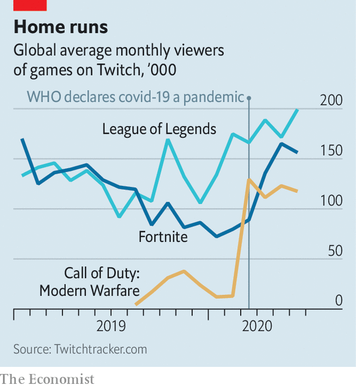
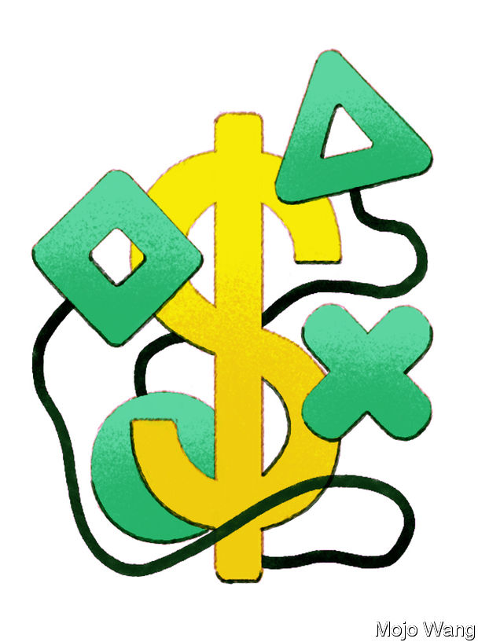

## Legends in lockdown

# The pandemic has accelerated the growth of e-sports

> Video-gamers can hold big tournaments without infecting anyone

> Jun 27th 2020

Editor’s note: Some of our covid-19 coverage is free for readers of The Economist Today, our daily [newsletter](https://www.economist.com/https://my.economist.com/user#newsletter). For more stories and our pandemic tracker, see our [hub](https://www.economist.com//news/2020/03/11/the-economists-coverage-of-the-coronavirus)

MOTOR RACING has a long and chequered history of cheating, from illegal designs to the use of nitrous oxide to give cars a boost. On May 23rd, however, a new type emerged when a Formula E driver, Daniel Abt, was disqualified for substituting a teenage video-gamer to drive for him. The cheating happened not in a real car but in a virtual version of the sport, played on “rFactor2”, a video game, organised to keep fans amused while real racing was stopped for the pandemic. The races were watched by hundreds of thousands of viewers on television as well as YouTube and Twitch, a live-streaming service owned by Amazon.

That competition was not the only example of athletes taking to a video-game version of their sport during the pandemic. In Britain Sky Sports, a broadcaster, showed matches of “FIFA”, a popular football game, with players from the real-life Premier League. In America NASCAR races have been held virtually, too.

It may seem surprising that fans might be satisfied by watching a virtual version of their sport. Yet video games have been quietly becoming more like traditional sports for some time. Covid-19, by keeping athletes indoors, has given a boost to “e-sports”—not just virtual versions of old sports, but entirely new online games, played competitively by professionals and watched by tens of millions of people.

Video games, now played often by perhaps a quarter of the world’s population, are no longer just entertainment. Many games are more like something between a sport and a social network. And games have thrived under lockdown. The number of players logged into Steam, a popular gaming platform on PCs, reached record highs in late March, with 25m players logged in at one time. Nintendo’s share price increased by 45% in the month from March 16th. Twitch saw its traffic jump by 50% from March to April.

Over the past decade the business model of games has changed radically. Revenue used to come from selling blockbuster single-player games, such as “Grand Theft Auto”, on disks. Now the biggest-grossing games, such as “Fortnite” or “League of Legends”, are given away free and updated constantly, with money made from in-game purchases. They are more social, more competitive and arguably more addictive. Some of them are becoming cultural phenomena in their own right. Executives hope they can persuade more people to watch them, buy gear and cheer teams as they do with traditional sports.

Take “League of Legends”, perhaps the biggest e-sport in the world. It was launched in 2009 by Riot Games, an American firm now owned by Tencent, China’s biggest tech firm. It is a complex strategy game, in which teams of five players command “heroes” in a battle to defeat each other. As many people play it regularly as play tennis; at any one time, 8m people may be online. It also supports a professional game that is, at least in terms of the number of players earning a living from it, also larger than tennis. The final of the League of Legends World Championship last year was watched live by 44m people. By comparison the Super Bowl, America’s biggest live sporting event, was watched by roughly twice that.

Twelve professional leagues now span all regions of the globe except Africa, with 120 franchised teams and perhaps 1,000 professional players. Whereas tennis stars in the world’s top 200 often struggle to make a living, “League of Legends” players in America are guaranteed a minimum salary of $75,000. There, players are entitled to the same visas that other foreign athletes can get. The average salary is closer to $400,000, says Chris Greeley of Riot Games. Lee Sang-hyeok, a Korean star, known by his tag “Faker”, may be the highest-paid sportsman in his country.

Older sports are moving in. F1’s e-sports competition existed before covid-19 brought it to television, as did eNASCAR races. Michael Jordan, a retired basketball star, is among those to have invested in Team Liquid, which plays in around a dozen e-sports. In November Manchester City, an English football club, unveiled its professional “FIFA” team—based in South Korea. Games of “Starcraft”, a strategy game, were first screened on cable TV there in the 1990s. Korean teenagers play, after school and before private tuition, in internet cafés, known as “PC bangs” (PC rooms).

Activision Blizzard, a publisher, runs leagues for “Call of Duty” and “Overwatch”, two first-person shooter games. These are modelled on conventional sports leagues, with teams that rent stadiums and play at home and away. Being based in a specific city enables teams to generate local support, as well as revenue from local sponsors, says Ben Spoont, the CEO of Misfits Gaming, which owns the Florida Mayhem “Overwatch” team.

Last year Epic Games, the publisher of “Fortnite”, launched a “World Cup”. Anyone could apply to play: 40m did so. The finals filled 19,000 seats of the Arthur Ashe stadium in New York and $30m of prize money was dished out to the winners.

Though South Korea remains a leader in e-sports, China is catching up. The island of Hainan, popular for its beach resorts, has set aside $141m to subsidise international e-sports. In Hangzhou government money has been used to build an “e-sports town”, featuring a 56,000-square-foot (5,200-square-metre) arena, which is home to the Chinese “League of Legends” games, sponsored by Tencent. There are also shops, a training academy and an e-sports-themed hotel.

For a generation that lives chiefly online anyway, games are a means of socialising, like traditional sports. Thurston Jepps, a 12-year-old from London, mainly plays “Minecraft”, a free-roaming construction game, and “Overwatch”. He guesses that at least four-fifths of the time he spends playing is with friends online, rather than alone. Logging into his Xbox and seeing who is online is a little like going to the park to see who is around for a kick-about. “I don’t often play single-player games unless I am kinda lonely,” he says. “Playing alone is very uncool.” Sometimes he and his friends play competitively, but often they just hang out and talk on voice-chat.

E-sports are different in some respects, however. Nobody owns the game of soccer or basketball. That is not true of e-sports. Publishers control the games. And grassroots do not exist in the same way. Children are not encouraged to play video games at schools; most amateur teams exist only online; the pathway into playing professionally is unclear. Some teams are trying to change that. Mr Spoont’s firm has held “block parties’’ to encourage parents to take the game seriously. His teams have scouts to recruit the best players internationally, much as other sports do. But he admits that there is a long way to go. “Parents are rightly anxious,” says Mr Spoont, who limits his six-year-old’s screen time.

These games bring with them fears that do not apply to kicking a football around a pitch. Fewer people now worry about violent video games causing real-world violence, but newer concerns have arisen. Last year lawyers in Canada filed a suit on behalf of two sets of unidentified parents accusing Epic Games of bringing in psychologists to help make “Fortnite” more addictive. Players are encouraged to buy “battle passes” to customise their characters. For all that executives talk about media rights and sponsorship, much of the esports industry is cross-subsidised by money made on in-game purchases. The prize money at the “Fortnite” World Cup came from Epic, which made $1.8bn last year from microtransactions in the game.

The free-to-play model may bring in millions more players, but it also relies on a small minority spending extravagant sums on virtual uniforms. Britain’s Department for Culture, Media and Sport has just launched a call for evidence to look at “loot boxes”—virtual purchases that some campaigners think are akin to gambling. The sale of loot boxes can create bills that go beyond what parents can afford. Last year Valve, the makers of “Counter-Strike”, another shooter game, banned the trading of virtual items which were being used to launder money.

Gambling is another worry. Just as it did with baseball in the 1920s, gambling on e-sports threatens to undo the professionalism of the league. “Counter-Strike”, “League of Legends” and “Overwatch” have all had match-fixing scandals. Some players have resorted to doping—Adderall, a stimulant prescribed to treat attention-deficit disorder, has been used to stay alert during long sessions.

And then there is politics. In the Gulf states and China governments have cracked down on political activism spread via video games. In Hong Kong “Animal Crossing”, a video game, stopped being sold in April after it was used by virtual protesters to mock Beijing.

As games evolve more into social networks, it is also harder to control the content that children see. And unlike the text on social networks such as Twitter and Facebook, voice chat is harder to moderate. Rodolfo Rosini, a technology entrepreneur in London, says he has no trouble with his son Finn making friends online, but worries about the “toxicity” of some games he and his children play. On games like “Overwatch”, which mostly have a young-adult audience, bullying is common. Racism is especially common on some American servers, he says. Encountering racist chants is also a risk of going to a football match—but it is easier for parents to avoid.

If anything checks the rise of e-sports competing with football or basketball for the world’s attention, though, it may be that video games move too fast. “League of Legends” has been going for a decade; “Counter-Strike” is almost two decades old. That is an aeon for a video game still to be played. But compared with sports that were codified in the 19th century, it is short. The Overwatch League has struggled over the past year as some of its players have switched to “Valorant”, a new shooting game, or from playing in teams to streaming live on YouTube. In the end, there may simply be too many games to try. ■

Correction (June 29th 2020): This piece has been updated to correct the video game Daniel Abt was playing when he was disqualified in the Formula E virtual races. It was “rFactor2”, not the official Formula 1 game, as we originally wrote. We are sorry for the mistake."