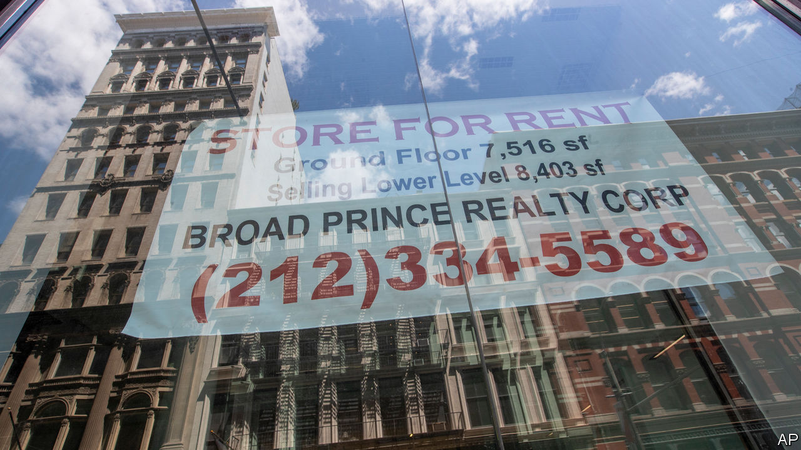
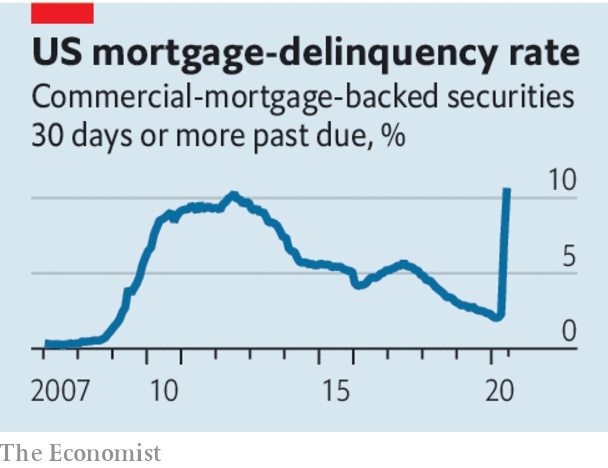

## Commercial property investment

# Investors’ love affair with commercial property is being tested

> The sector faces a shake-up

> Jun 27th 2020

YOU MAY not realise it, but a growing share of your savings and pensions pot has been wagered on the commercial buildings in which you work, shop and sleep. The original idea was that these investments would provide a steady stream of earnings for decades into the future, rather as government bonds did before interest rates fell so low. But now the virus has thrown that assumption into a cement mixer.

Across the world millions of tenants have stopped paying rent, leading to chaos among shopping-mall and office landlords (see [article](https://www.economist.com//finance-and-economics/2020/06/25/is-investors-love-affair-with-commercial-property-ending)). In the longer term, a renewed appreciation of the threat from pandemics, and of the potential of new technologies, could lead to a sharp shift in how commercial buildings are used. Savers and fund managers need to be alert. A safe, slow-moving asset class has become an unpredictable one that demands scrutiny and active management.

Commercial property has become an investment craze over the past two decades. In that period the nominal yield on a long-term American government bond has dropped from over 6% to less than 1%. Desperate to find other steady higher-yielding sources of earnings, pension trustees and fund managers have piled into malls, offices, hotels and warehouses. A corner of the economy that had been the preserve of moguls, amateurs and aristocrats has become increasingly infiltrated by strait-laced institutions and algorithm-crunching fund managers. The typical pension fund’s allocation to commercial property has risen from 5% in 2000 to over 10% now; institutional investors have about $11trn sunk into the asset class. Leases routinely stretch a decade or more into the future. The combination of reliable rental income and capital appreciation has meant that commercial property has successfully given investors annual returns of over 7%. All they needed was patience. That will no longer be enough.

The immediate problem is that tenants are behind on the rent. Every recession involves sporadic delinquencies, but the lockdowns have led to anarchy in some bits of the property business. Perhaps a quarter of free-standing shops, half of mall tenants and 60% of restaurants in America and other Western markets are not paying their dues. This can be a spontaneous rebellion or landlords may have offered holidays. Some cities and governments have introduced moratoriums. Landlords have taken a hit to their income. So far they have been unwilling or unable to repossess buildings that may have no other prospective tenant. A growing number have defaulted on their debts. Commercial-mortgage-backed securities, which bundle up property loans, have seen delinquency rates exceed the levels in the financial crisis of 2007-09.

Temporary delinquencies are only part of the problem. In the longer run the uses of property may change. E-commerce activity has risen to the level pundits had thought it would reach three to five years from now, speeding up the decline of bricks-and-mortar shops and boosting demand for warehouses. Firms that have found remote-working tolerable may shrink the office space they hire. Video calls in lieu of business trips could reduce the number of hotel nights billed. Even as economies open up again, there are signs that behaviour may have changed permanently. The latest mobility-tracking data suggest that activity in offices in America is 36% below normal levels. It is 15% below the usual level for retail and recreation spaces such as restaurants, shops and cinemas.

Savers and the fund trustees who represent them should follow two tracks. The first is to get a realistic picture of the losses they face. If the property industry used to be amateurish, it is now all too often professionally opaque, with layers of holding companies and debt standing between the bricks and girders and their ultimate beneficiaries. The managers of buildings and investment vehicles may have an incentive to mask difficulties. Some, for example, are bailing out struggling retail tenants, perhaps in order to avoid admitting to rent defaults. Others are sticking to unrealistic valuations, which the industry’s arcane accounting practices make easier to sustain.

The bigger task is for investors to embrace the restructuring that must take place. Hotels may need to become apartment blocks; malls may need to be reincarnated as e-commerce-fulfilment centres; and office blocks may need to be refurbished so that desks are farther apart. All of this involves not sitting on properties and milking them for rent, but reinvesting in them and, often, selling them to different owners. That holds open the potential for greater efficiency, but also for fee-skimming and unnecessary losses if unaltered buildings are sold off cheaply.

Property has long been a slow-moving asset class because leases last for years and tenants normally change their behaviour only gradually. Landlords and their financial backers have thus got used to a business that moves at a glacial pace. For two decades a reliably easy way to make money has been to buy a commercial building and go to sleep. Time to wake up.■

## URL

https://www.economist.com/leaders/2020/06/27/investors-love-affair-with-commercial-property-is-being-tested
