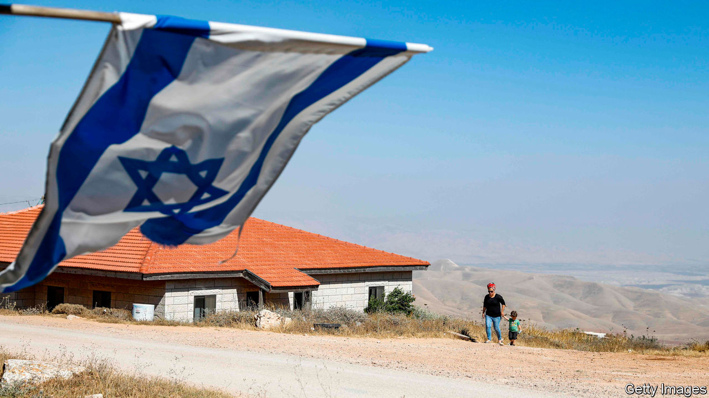

## Consider the cost

# Underestimating the risks of annexation

> The Israeli prime minister’s plan to take parts of the West Bank will upset allies and enemies alike

> Jun 27th 2020

NINE MEN and one woman have led Israel since the six-day war of 1967 brought the West Bank under its control. Nearly all thought it too risky to annex any of the territory beyond East Jerusalem. True, Israel has built scores of settlements since the war, so that more than 400,000 Israelis now live in the West Bank, alongside 3m Palestinians. But its leaders calculated that annexation would bring global opprobrium, destabilise the region and doom the two-state solution—the idea that a Palestinian state and a Jewish one might one day peacefully co-exist.

Binyamin Netanyahu, Israel’s prime minister today, thinks he knows better. Last year he wooed hawkish voters by vowing to absorb a handful of settlements and the entire Jordan Valley. Then, in January, President Donald Trump released a peace plan that would give Israel 30% of the West Bank. The Palestinians, unsurprisingly, rejected it. But Mr Netanyahu wants to proceed with annexation (see [article](https://www.economist.com//middle-east-and-africa/2020/06/25/israel-weighs-the-future-of-the-west-bank)). He is underestimating the costs and moving Israel closer to a fateful choice about its future.

Mr Netanyahu, of course, doesn’t see it that way. He spies a window of opportunity, stemming not only from his friendship with Mr Trump—which may be less useful come November—but also from Israel’s ties with Arab states. A common enemy, Iran, has brought them together, while the question of what to do about the Palestinians has been put on the back-burner. Mr Netanyahu seems to believe he can keep it there. Arab countries, after all, did little more than shout when America recognised the disputed holy city of Jerusalem as Israel’s capital in 2017. Envoys from the Gulf even attended the unveiling of Mr Trump’s peace plan.

The peace process is moribund anyway, say Mr Netanyahu’s men. They blame the Palestinians for spurning past offers and refusing to discuss Mr Trump’s plan, which would establish a Palestinian state (albeit under rather onerous conditions). “The Palestinians continue to reject dialogue and to remain in their deep shit,” says Benny Gantz, the deputy prime minister, who opposed unilateral annexation (and Mr Netanyahu) until recently. Israel, therefore, must act alone, says Ron Dermer, its ambassador to America. Annexation, he claims, will “get the peace process out of the cul-de-sac it has been stuck in for two decades.”

The Israelis’ frustration with the Palestinians is understandable. But Mr Netanyahu shares blame for the failure of the peace process—and annexation seems an odd way to revive it. The risks for Israel are manifold. Start in America, where Mr Trump is lagging behind Joe Biden in the polls. Mr Netanyahu all but ignores the Democratic nominee, who opposes unilateral annexation, and his colleagues, who may not support Israel’s government come what may. Their doubts are shared by European leaders. The EU’s foreign-policy chief, Josep Borrell, says annexation would have “significant consequences” for relations with Israel.

Arab states have also spoken up. Annexation “will certainly and immediately up-end Israeli aspirations for improved security, economic and cultural ties with the Arab world,” wrote Yousef al-Otaiba, an Emirati diplomat, in what is thought to be the first opinion piece by a Gulf official in an Israeli newspaper. King Abdullah of Jordan, who has millions of Palestinians in his country, warns of a “massive conflict”. Some of this is probably bluster. But even Israeli officials worry that annexation could lead to protests or violence.

Even if annexation were to go ahead smoothly, there is another cost to consider. If Mr Netanyahu starts taking bits of the West Bank, Israel could end up facing a profoundly uncomfortable choice. It could decide to grant the Palestinians full Israeli citizenship, and thus risk seeing them one day outnumber and outvote Jews. Or it could choose to leave them shut away in reservations with minimal rights, like an apartheid state. To remain both Jewish and democratic, Israel must find a way to avoid those two outcomes. ■