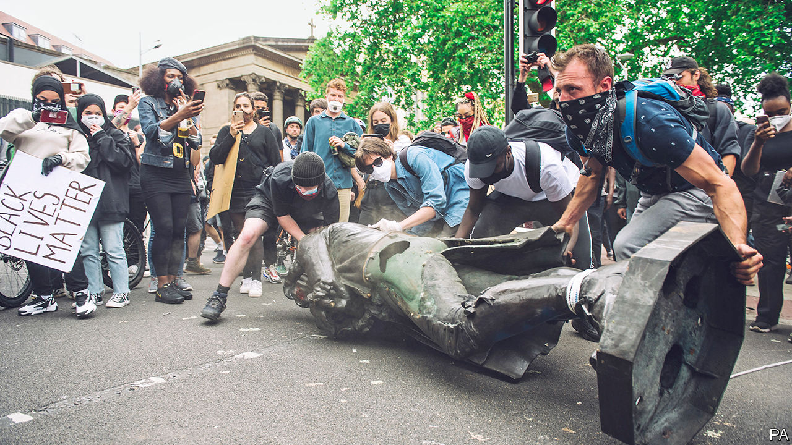
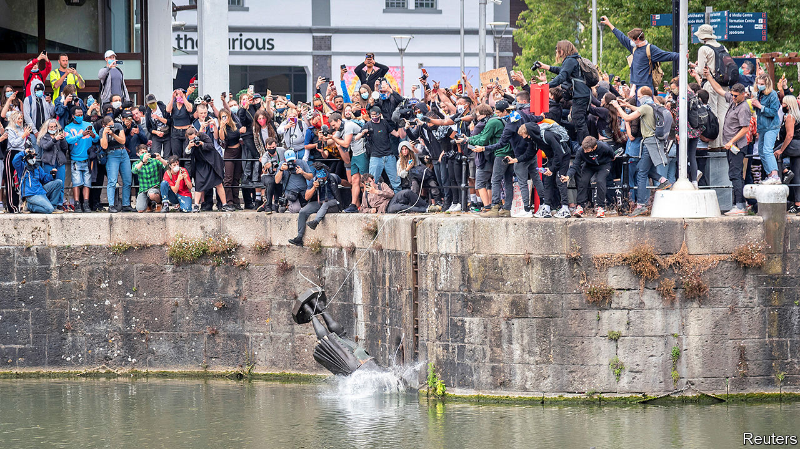
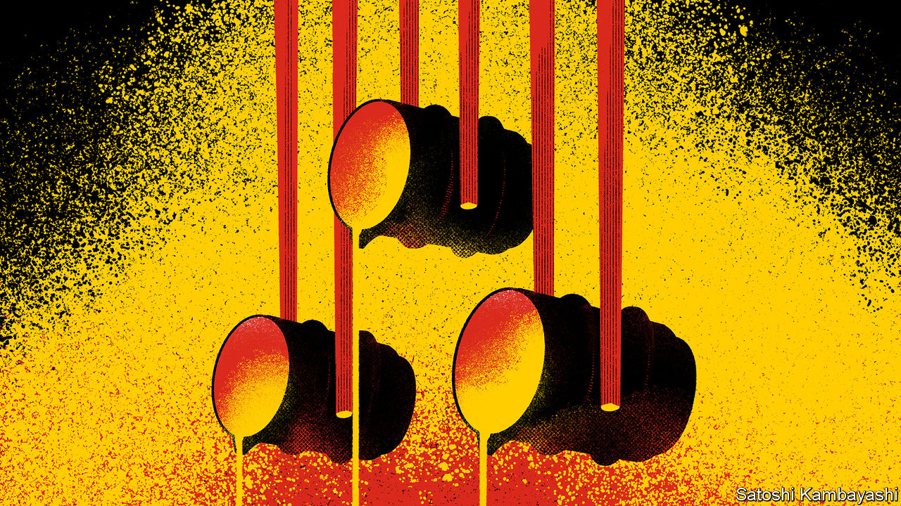

## On statues, Catherine Hamlin, alcohol, metal prices, Colombia, video games, Elon Musk

# Letters to the editor

> A selection of correspondence

> Jun 27th 2020

Letters are welcome via e-mail to [letters@economist.com](https://www.economist.com/https://mail.google.com/mail/?view=cm&fs=1&tf=1&to=letters@economist.com)

You described the fortune of Cecil Rhodes as “grubby”, which is far from true (“Marble monsters”, [June 13th](https://www.economist.com//leaders/2020/06/11/how-to-handle-racists-statues)). In fact, his fortune was rather clean, even if his colonial ambitions were not. His riches started with claims in the De Beers mine, land which had been bought from the eponymous, and white, brothers. It was secured with the formation of De Beers Consolidated, essentially by purchasing Kimberley Central from Barney Barnato for £5,338,650, a huge sum at the time. It was expanded through Gold Fields, which purchased properties on the Rand from their Boer farmers.

What was “grubby” was making black workers live in a compound for the duration of their work and subjecting them to strip searches for stolen diamonds and still more degrading acts. Rhodes’s British South Africa Company drove black people off their land north of the Cape (and worse). And he backed the Jameson Raid, the slapdash failed coup attempt in the Transvaal, albeit with the tacit backing of the Colonial Office. However, these activities were subsidised by his fortune, not a cause of it, which would have been far greater without them.

TREVOR BRADLEYLondon

The difficulty with your pragmatic proposal on which statues should stay and which should go is illustrated by your argument that Oliver Cromwell’s positive contribution to democracy in Britain outweighs his responsibility for mass murder in Ireland. Whatever the merit of Cromwell’s contribution to democracy (which include executing his predecessor, having himself appointed head of state for life, and appointing his son to succeed him), the “terrible suffering” he caused in Ireland (in fact, killing at least 10% of the population), surely makes his main contribution to history “baleful”, in your terms.

Public statues are too often an effort to overturn Shakespeare’s observation that “the evil that men do lives after them; the good is oft interred with their bones”. Rather than liberals and conservatives talking past each other on the merits or otherwise of each statue, perhaps they could agree to remove them all.

MARK HAYDENSauvian, France

* So despite his campaign of massacres and ethnic cleansing in Ireland, the statue of Oliver Cromwell should stay in Parliament Square for his role in the development of democracy. Is this the same Oliver Cromwell who dismissed Parliament and effectively governed Britain as a military dictator?

PATRICK KELLIHEREdinburgh

It is not enough to take down statues of Jefferson Davis. Some southern states celebrate his birthday as a legal holiday and some designate it Confederate Heroes Day, but the purpose is the same, to remind black people of their place. The practice should end.

GEORGE RICHMONDAlbuquerque, New Mexico

A watery grave was an entirely fitting place for Edward Colston’s statue, until it was retrieved by Bristol council. In all likelihood the seabed was the final resting place for some of those slaves who formed his miserable cargo. It would have been better if he had been left to the fish, whose forebears fed on his helpless victims.

STEPHEN POWERSLondon

On the philanthropy that Colston provided, Theodore Roosevelt once said that “No amount of charities in spending such fortunes can compensate in any way for the misconduct in acquiring them.”

JOCK CHANDLERCharlotte, North Carolina

Your leader on the removal of historical statues reminded me of a small area outside the back of the national museum in Tirana, Albania’s capital. Enver Hoxha, Joseph Stalin and their ilk brought down to earth and standing around not sure exactly what went wrong.

BOB RUTHERFORDVictoria, Canada

* Your obituary ([April 11th](https://www.economist.com//obituary/2020/04/08/catherine-hamlin-died-on-march-18th)) on Catherine Hamlin, my mother, whose life ended peacefully on March 18th in Ethiopia aged 97 gave a vivid impression of the endeavour and zeal my mother showed for her medical and humanitarian mission, especially after my father, Dr Reginald Hamlin OBE, died in 1993. They had worked in Ethiopia since 1959, their obstetric careers slightly separate for part of the first decade there. As The Economist proved, any obituary for one needs to mention the other to portray the full picture of their combined medical venture. 

The description of my father as “conventional” and “always used to doing things the way they had been done” invites significant comment. He came across the problem of obstetric fistula in his first six years in Ethiopia while my mother was working as an obstetrician under her Ethiopian Health Ministry contract. He worked on new techniques and extended existing ones in those six years despite local medical advice that it was impossible. He also raised funds for and built a waiting hostel for new patients. He was awarded an OBE by the queen in 1965 for his pioneering work. In the late 1960s, my mother also began to sense the enormity of the fistula condition and its implications, so their team spirit and working partnership was born. My mother’s compassion and stellar ability came forth strongly in the 1970s. This energy carried her fistula work and fund-raising across many decades up to and after 1993. My parents move from Australasia to a radically different life in Ethiopia was unorthodox and flexible in abandoning familiar professional expectations. You say that my mother was “mentally far more flexible, more prepared to experiment” than my father. In fact my parents possessed these qualities in equal measure and expressed them synergistically. They needed that team spirit, both technically and as companions, given the complexity of their medical and humanitarian undertaking, especially at its inception. My father was my mother’s forerunner in the fistula repair field, as she often stated, but they were co-equal in creative drive. After he died, she expanded their mission marvellously for the next 27 years. As a boy and a young man, I felt the flawless and joyful nature of their shared medical passion. That it took several years after my parents’ arrival in Ethiopia for them to realize the dire need of fistula patients adds to the sense of discovery and adventure in their saga. The tone of your obituary conveyed my parents’ distinct calling to a mission in a land far away from theirs and the description of my mother as “not a missionary doctor, but a doctor who was a Christian” is succinctly apt.

RICHARD HAMLINAddis Ababa

Schumpeter ([May 23rd](https://www.economist.com//business/2020/05/23/farewell-for-now-to-a-golden-age-of-drinking)) missed one key opportunity for small booze brands during the lockdown, which is online sales direct to the consumer. Sales through our own website and to other online shops (such as Master of Malt) grew by 300% from March to May. If anything, being able to bypass supermarkets’ buying departments and go straight to the consumer is a big opportunity for small companies.

PADDY FLETCHERPort of Leith DistilleryEdinburgh

In regard to Buttonwood’s article on rising metal prices ([June 13th](https://www.economist.com//finance-and-economics/2020/06/11/the-reasons-behind-the-spectacular-rally-in-metal-prices)), it is important to distinguish raw material from finished steel prices. It is true that the price of iron ore has been surprisingly strong this year. Some of this is driven by supply issues related to covid-19 affecting Brazil and other countries, but another factor is the historically high raw-steel production in China. Even while plagued by the complexities of battling the coronavirus, China has still produced a record 415m tonnes of steel in the year to date. As domestic consumption slows, it becomes harder for China to absorb this steel, hence more of it is exported, depressing international steel prices.

The lingering effects from the pandemic will slow down consumption even further this year and steel production is set to reach new heights: China is on pace to produce 1bn tonnes of steel this year. This does not bode well for finished steel prices globally.

GINTAS KRYZIUSLondon

June 4th). Colombia has made all its procurement spending accessible online in a user-friendly way, regardless of the amount or procurement method, a contrast to most other countries, which try to hide the figures. It is free for anyone to analyse, which has helped uncover a number of cases where politicians abused emergency contracts.

So you can buy equipment fast and still buy openly. If Colombia can do it, we think there are no excuses for other countries not to come clean on their covid-19 contracts too.

NICOLAS PENAGOSHead of Latin America Open Contracting PartnershipBogotá

Your appreciation of “Civilization VI”, the latest in a long-running series of video games, has inspired me to admit to a guilty pleasure (“Will to power”, [May 30th](https://www.economist.com//books-and-arts/2020/05/30/take-over-the-world-in-civilization)). I have been working harder during this pandemic than I ever have. One of the things that has kept me sane is playing little snippets of Civ6 between Zoom calls or doing chores. Playing the game, in which you have to co-ordinate diplomacy, religion, the armed forces, industry and the economy, has been comforting and useful, as I work with a team building an integrated response strategy to covid-19.

E. GLEN WEYLCo-chairHarvard Edmund J. Safra Centre for Ethics Rapid Response Taskforce on Covid-19Cambridge, Massachusetts

I was perplexed by your statement that “no other business figure holds a candle to Sir Richard Branson when it comes to public-relations stunts” (“Still smiling, captain?”, [June 13th](https://www.economist.com//business/2020/06/11/virgin-looks-for-help)). Where were you in February 2018, when Elon Musk launched his own sports car into space as part of the inaugural test of SpaceX’s heavy-lift rocket?

JUSTIN HOTTEREugene, Oregon

* Letters appear online only

## URL

https://www.economist.com/letters/2020/06/27/letters-to-the-editor
