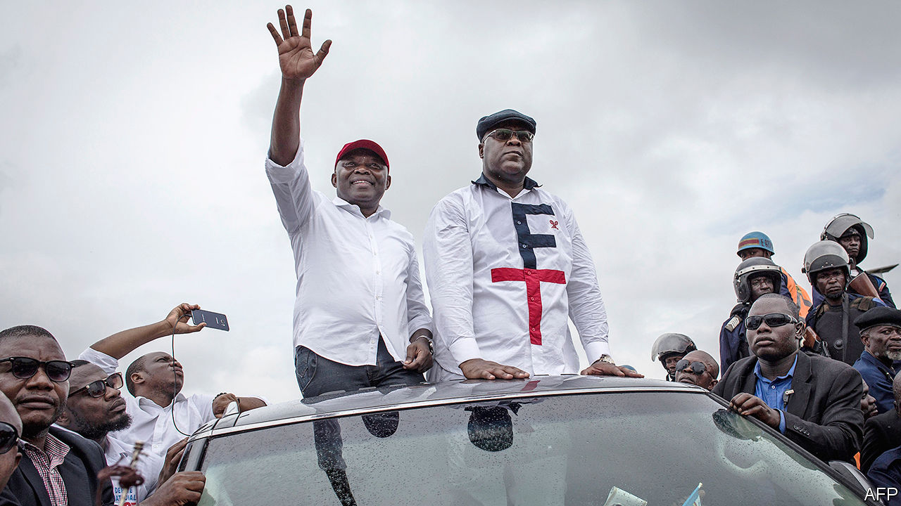

## Laughing all the way to jail

# An aide to Congo’s president gets 20 years for graft

> Vital Kamerhe says he was framed

> Jun 25th 2020

POLITICIANS ARE so rarely punished for stealing public money in the Democratic Republic of Congo that some find the idea absurd. Perhaps that is why Vital Kamerhe, the president’s former chief of staff, laughed aloud as a judge condemned him to 20 years in prison on June 20th.

Footage of his trial was live-streamed. His bedraggled appearance, unshaven in a blue prison jacket, elicited little sympathy. He was found guilty of stealing $48m earmarked for building homes for the poor. Few believe his protestations of innocence. (He says the charges were purely political.)

Mr Kamerhe (pictured below on the left) is the most senior Congolese politician ever to be put away for graft. “We are happy, the big fish has been sentenced,” says an interpreter in Kinshasa, the capital. “It is a good start for the rule of law in Congo.”

Yet it was hardly a model case. Raphael Yanyi Ovungu, the judge who had presided over most of the hearing, died suddenly in May. Initially the police said that he had suffered a heart attack. However, an autopsy revealed that he had been stabbed several times in the head. Somehow, this detail had escaped the cops’ attention. The authorities, who have now started a murder investigation, have yet to explain how the assailant slipped past armed policemen guarding the judge’s house.

Mr Kamerhe’s claim that he was prosecuted for political reasons is not absurd. Even if he did steal a heap of public money, he would hardly be the first Congolese politician to do so. His punishment may have as much to do with his ambition as his morals. He was powerful enough to be feared. He held various senior posts under Mobutu Sese Seko, Congo’s dictator for three decades. He then worked for Laurent Kabila, the rebel who deposed Mobutu in 1997. After Kabila was murdered in 2001, he helped his son Joseph win a dodgy election in 2006. He fell out with the second President Kabila and later teamed up with an opposition figure, Félix Tshisekedi (pictured right). Mr Tshisekedi was then handed the keys to the presidency by Mr Kabila after a brazenly rigged election in 2018.

Mr Kamerhe’s repeated turncoatery may have irked Mr Kabila, who still calls most of the shots in Kinshasa. A pre-election pact with Mr Tshisekedi that would have allowed him to run for president in the next election in 2023 may have blunted the incumbent’s incentive to protect him. Pierre-Olivier Sur, one of Mr Kamerhe’s lawyers, says he was convicted for the “purpose of exclusion in the coming election” and that he “swears his innocence” before the Congolese people.

Mr Tshisekedi may have needed someone to blame for his administration’s many failures. His big infrastructure projects have often stalled. A flyover that was supposed to ease congestion in Kinshasa stands half-built. That plan to build homes for the poor has delivered little. Also sentenced to 20 years alongside Mr Kamerhe was Jammal Samih, a Lebanese businessman whose company was allegedly paid $57m for 1,500 prefabricated houses. Prosecutors say most of that cash has vanished.

The IMF and World Bank, which this week approved a $1bn aid package, are pressing Mr Tshisekedi to reduce graft. Mr Kamerhe’s conviction will doubtless give him a good talking point. But it also puts Mr Tshisekedi in a quandary. For although he needs to satisfy donors that he is cleaning up, he would rather do so without annoying Mr Kabila, whose family has extensive business interests and whose party has more than two-thirds of the seats in parliament—and thus has the power to impeach the president.

The case has knocked a troublesome rival to Mr Tshisekedi out of the running in the next election. But it has also weakened him in his tussle for power with Mr Kabila by depriving him of support in Bukavu, Mr Kamerhe’s home town. Protesters there burned tyres when they heard the verdict.

Mr Kamerhe and Mr Samih have been packed off to Makala prison in Kinshasa, where thousands of inmates are crammed together in stinking cells. Even there, the graft may continue: guards are known to take backhanders in exchange for giving inmates a bit more space and comfort. After decades of colonial plunder and looting by politicians, one trial will not be enough to convince most Congolese that the thieves at the top will be held to account. But it is a start. ■