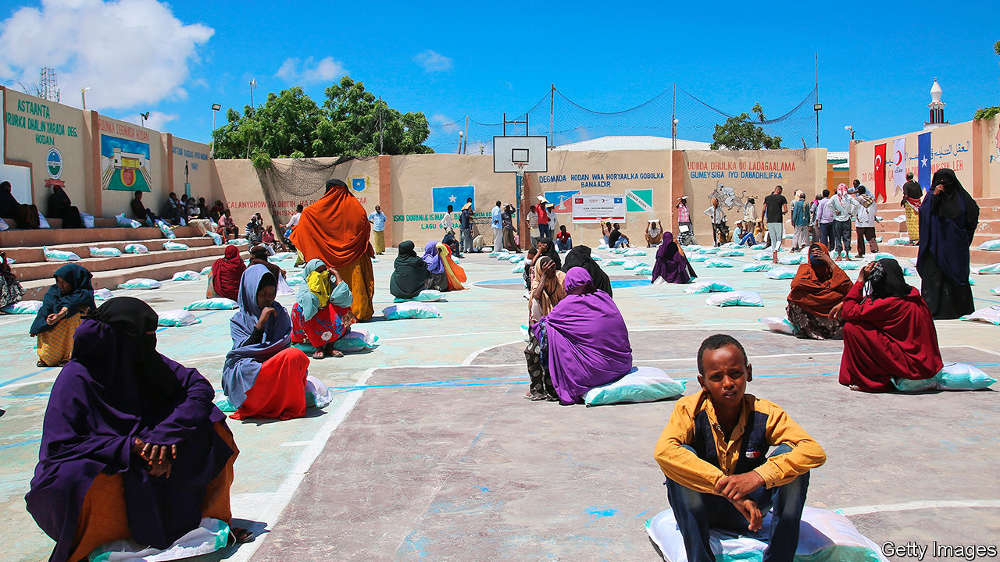

## A stitch in time

# Can early intervention prevent humanitarian disasters?

> The UN hopes to head off crises even as they are brewing

> Jun 25th 2020

IN APRIL DAVID BEASLEY, the head of the World Food Programme (WFP), warned of the danger of “multiple famines of biblical proportions” as a result of covid-19. History suggests that Somalia’s 16m people are especially vulnerable. Famines in 1992 and 2011 each claimed more than 200,000 lives. A drought in 2016-17 displaced more than 1m people and caused losses and damage of over $3bn. This year, in addition to the pandemic, crops have been swept away by floods and ravaged by desert locusts (with a new swarm on the way). The triple blow means that 3.5m people, more than a fifth of the population, face hunger between July and September, according to an agency of the UN and the Famine Early Warning Systems Network, an American-funded outfit that monitors some 30 countries.

Yet this time may be different, if early intervention proves to be as effective as its advocates believe. The UN’s Food Security and Nutrition Analysis Unit activated a prepared plan when projections of the share of the population threatened with hunger crossed a preset threshold. Under the plan, the UN’s Office for the Co-ordination of Humanitarian Affairs (OCHA) released $15m from an emergency fund—the first such “triggered disbursement”. It hopes that the World Bank may chip in as much as $50m to the effort, to ensure that stepping in early really makes a difference. OCHA will announce its priorities for action next week, based on its own pre-prepared menu of options.

That menu was drawn up on the assumption that Somalia’s next crisis would involve another drought, rather than a pandemic, locusts and flooding. Some of the measures it envisages, such as the distribution of drought-tolerant seeds, are not relevant to current circumstances. But many others are. These range from handing out cash to public-information campaigns and providing food for people and livestock.

Humanitarian aid typically comes only once a disaster is in full swing. Distressing images of people in need prompt donors to fund relief efforts, usually tied to specific emergencies. But by then suffering is widespread and relief is not cheap. It costs perhaps 50 times as much to save a child who is already suffering from malnutrition as it does to intervene earlier, says Mark Lowcock, OCHA’s head. It is four times cheaper to feed a goat than to replace one.

Mr Lowcock has been championing early intervention in situations where data can reliably warn of impending crises and where a speedy response can make a big difference. In such cases, an anticipatory-action plan can be prepared in advance, involving a number of agencies as well as the authorities on the ground. Moves and money are ready to be triggered when conditions deteriorate.

Interest in this approach has grown, thanks to a few pilot projects and Mr Lowcock’s lobbying. He has carved out about $140m for anticipatory-action experiments, starting with Somalia, over the next 18 months. A plan for responding pre-emptively to flooding in Bangladesh is ready and likely to be triggered at some point this year (the flooding season starts in July). Another is in the works for Ethiopia, where famine looms because of drought and covid-19, though the trigger-points and the likely impact of early intervention in such a big country are still under discussion. A pre-emptive plan for cholera may follow next year: scientists think they can use data to predict outbreaks in specific areas before a single case has occurred.

Whether anticipatory action works as well as its advocates hope remains to be seen. A report last month by the WFP suggests that its effects on households are “mainly positive”, but the evidence base is slim and the authors stress the need for more rigorous studies. The intervention in Somalia is to be monitored and lessons will be drawn from it with the help of the Centre for Disaster Protection, a London-based agency set up by the British government.

The initial $15m in funding for anticipatory action may not be much. But it could make a big difference to Somalis’ lives, and to the future of ahead-of-the-curve intervention. By proving that the concept works, Mr Lowcock wants to “change the whole mentality and mindset of dealing with predictable emergencies”. ■