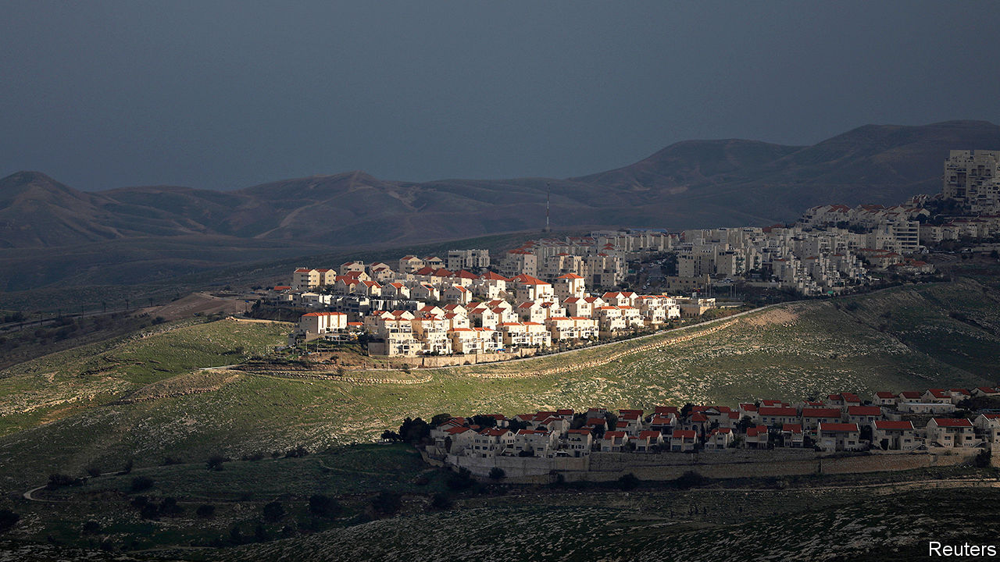
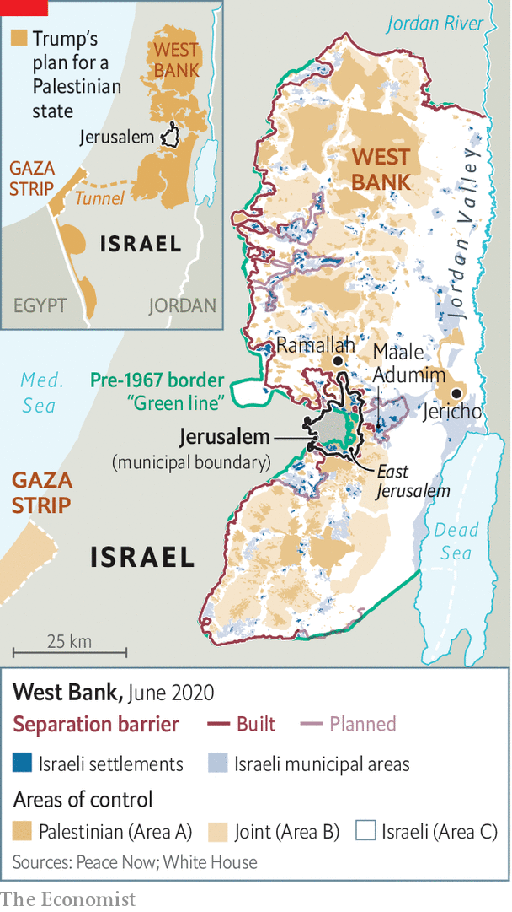

## Into darkness

# Israel weighs the future of the West Bank

> Talk of annexation shows how badly the peace process has failed

> Jun 25th 2020BEIRUT AND JERUSALEM

FAR FROM being a show of strength, it smacked of desperation. On June 22nd thousands of Palestinians held a protest in Jericho against a possible Israeli annexation of parts of the occupied West Bank. They were joined, unusually, by diplomats from across the globe: Britain and Russia, Jordan and Japan. The United Nations envoy, Nickolay Mladenov, made a speech. After months of public warnings and quiet pressure, the world’s collective diplomatic clout perched on plastic chairs beneath the beating summer sun.

On July 1st Israel’s cabinet can start to discuss annexation. The date is less a deadline than a starting-point laid down in the coalition agreement signed in April by Binyamin Netanyahu, the prime minister, and his governing partners. Israel could decide to annex a large swathe of territory or annex nothing at all, or—as seems likely—do something betwixt the two.

If it does anything, it will happen over widespread objections. Some of Mr Netanyahu’s partners are hesitant. The public, although split on the wisdom of annexation, mostly thinks it a distraction from the covid-19 pandemic and a likely recession. Democrats in America oppose the move. So do many European allies. Friendly Arab states warn that it would threaten ties with Israel. Even some Israeli settlers are opposed (albeit for different reasons). And then there are the Palestinians themselves, once again bystanders in their own drama.

It is quicker to list those in favour: some of Mr Netanyahu’s right-wing allies, some Israeli hawks, a few members of Donald Trump’s administration. Yet this narrow band of supporters have pushed annexation from the fringe of Israeli politics into the realm of possibility.

What Mr Netanyahu does matters less than the fact that he might do it. The Oslo Accords, signed in 1993, were to usher in a short transitional period on the way to a Palestinian state. Almost 30 years later the world is scrambling not to clinch a two-state solution but to preserve a status quo that should have ended in 1999—the terminus of a peace process that has become more about process than peace.

Israel has already annexed East Jerusalem and the Golan Heights, two other territories captured in 1967—but not the West Bank, home to 3m Palestinians who see it as the heart of their future state, and 430,000 Israeli settlers. (Another 230,000 settlers live in East Jerusalem.) The West Bank’s status has long been regarded as a question for a final peace agreement between Israel and the Palestinians.

Like his predecessors, Mr Trump took a stab at drafting one. His “Peace to Prosperity” plan, released in January, envisions a Palestinian state—should the Palestinians meet a list of onerous conditions—in Gaza and on 70% of the West Bank (see map). It allows Israel to annex the remaining 30%, which consists of settlements and the Jordan Valley.

The Palestinians rejected the plan. Mr Netanyahu endorsed it and immediately tried to annex the land earmarked for Israel. But the Americans asked him to wait, in part because Mr Netanyahu was at the time fighting for his political survival. Three elections in the span of a year had failed to produce a government until he made a deal with his exhausted rival, Benny Gantz.

As July 1st draws near, though, Mr Netanyahu’s plans remain fuzzy. Israel could annex the full 30% or something smaller, perhaps one or two settlement blocs (such as Maale Adumim, pictured on the previous page). Another option is to annex scattered settlements deep within the West Bank to establish “facts on the ground”. Some in Israel’s security establishment think Mr Netanyahu will do less still: play for time and form a committee to prepare for annexation. On June 3rd security officials held a war game to plan for possible violence on the Palestinian side. They were in the dark about their own government’s intentions. “Annexation? What annexation?” asks an Israeli diplomat.

Like his nine predecessors since 1967, Mr Netanyahu has made no serious moves towards annexation beyond East Jerusalem. It became an issue only on the eve of the election in April last year, when he promised to annex settlements close to the pre-1967 border. Many saw this as a gimmick. Five months later, as another election loomed, he unveiled a proposal to annex the Jordan Valley. Then, five weeks before the last vote, came the Trump plan.

Some who have spoken with Mr Netanyahu believe he wants to be the leader who redrew Israel’s borders. Others still think this a ploy to distract from his ongoing corruption trial and the pandemic. “He needs annexation as a diversion so Israelis won’t speak about the economy,” says Yair Lapid, the opposition leader. “Instead he’s got everyone running around like headless chickens talking about annexation.”

He has met surprisingly fierce opposition from some settlers, for whom any mention of a Palestinian state is anathema. Mr Netanyahu has told them not to fret: the Palestinians will never accept the Trump plan. They are not convinced. “There isn’t a partner on the Palestinian side now,” says Yigal Dilmoni, head of the Yesha Council, a settler lobby. “But who’s to say in the future there won’t be such leadership? They will be able to say that Israel already agreed to them having a state on 70% of the land.”

Few have asked what the Palestinians prefer. “It’s like they’re inviting people to a wedding where the bride doesn’t show up,” says Zahi Khouri, a businessman in Ramallah. There is near-unanimous opposition to annexation, of course, but also a sense of resignation. Palestinians have watched Israeli settlements expand for decades. Hopes for a negotiated peace have faded; their leadership seems powerless to do anything. Over half of Palestinians in the West Bank say they would back a return to “armed struggle” if Israel annexes territory.

About two in five would like to dissolve the Palestinian Authority (PA), their limited self-government, and force Israel to take responsibility for the occupied territories. Unpopular to start with, the PA risks losing its raison d’être: if Israel annexes a large chunk of territory, the PA can no longer claim to be the government of a state-in-waiting. But the PA’s president, Mahmoud Abbas, and the old men around him are loth to take any drastic steps. Even their recent decision to suspend security co-ordination with Israel was largely for show. It has discreetly continued.

If the leadership is static, though, the public is not. A growing share of Palestinians have lost faith in the two-state solution. A poll from February put support at just 39%, the lowest level in a generation. Annexation won’t help. Amos Gilad, a retired general who once led Israeli policy in the territories, says it would cause the Palestinians to “demand rights as citizens in Israel”. Mr Netanyahu has heard similar warnings from his security chiefs. But he believes the Palestinians will capitulate and accept a series of isolated statelets.

That is what Mr Trump offered. But his administration is divided on whether to back unilateral annexation. His ambassador in Jerusalem, David Friedman, used to run a charity that raised millions of dollars for settlements. He wants Israel to move ahead now, in case his boss loses the election in November. Jared Kushner, the president’s son-in-law and the author of his plan, is less enthusiastic. He has no ideological objections but worries annexation will scupper his chance to play peacemaker. Mike Pompeo, the secretary of state, says it is up to Israel.

Outside the administration, annexation carries risks. Bipartisan support for Israel in America has been ebbing for years: Mr Netanyahu’s testy relations with Barack Obama and embrace of Mr Trump hurt his standing with Democrats. Annexation would erode it further. Joe Biden, the Democratic presidential nominee, opposes the move. For now, though, the party has ruled out cutting America’s $4bn in annual military aid to Israel. Warnings from European leaders are also probably just that. Still, none of this is good for Israel.

Egypt, one of two Arab states that has official relations with Israel, has been conspicuously silent. It is busy with other crises, from covid-19 to the war in Libya. Jordan has been louder. King Abdullah worries annexation will trigger unrest among his large Palestinian population and revive talk of “the Jordan option”, which imagines his country as the future Palestinian state. But he has little leverage over Israel; few expect he would go so far as to rip up their peace treaty.

Mr Netanyahu has made much of Israel’s growing ties with Gulf states. None officially recognises Israel. But their armies and spy services swap intelligence and there are discreet economic ties as well. On June 12th Yousef al-Otaiba, the ambassador of the United Arab Emirates (UAE) in Washington, warned on the pages of an Israeli newspaper that annexation would put all this at risk. “We would like to believe Israel is an opportunity, not an enemy,” he wrote. “Israel’s decision on annexation will be an unmistakable signal of whether it sees things the same way.”

Annexation may limit the Gulf states’ friendship with Israel. But their common interests, namely their antipathy towards Iran and political Islam, will endure regardless. Anwar Gargash, the UAE’s minister of state for foreign affairs, has admitted as much. “Can I have a political disagreement with Israel but at the same time try and bridge other areas of the relationship? I think I can,” he said on June 16th.

Perhaps the most telling bit of Mr Otaiba’s opinion piece was not its text but its headline: “Annexation or Normalisation”. For decades Arab states said Israel would enjoy friendly relations only if it granted the Palestinians a state. The choice was occupation or normalisation. But Mr Otaiba made almost no mention of Palestinian independence. In his framing, Israel must only preserve the status quo. Some on the Israeli right count that as a victory. “They used to criticise us over the status quo,” says Gideon Sa’ar, a lawmaker from Mr Netanyahu’s Likud party. “Now they are criticising us for changing the status quo.”

Still, there is little to celebrate. The prospects of renewed talks between Israel and the Palestinians are dim. Israel’s leaders are too hawkish and nationalist, Palestine’s too divided and illegitimate. Mr Trump’s plan was dead on arrival. After three decades of failure, the bar is low indeed: the world wants only to sustain a situation it has long called unsustainable. ■