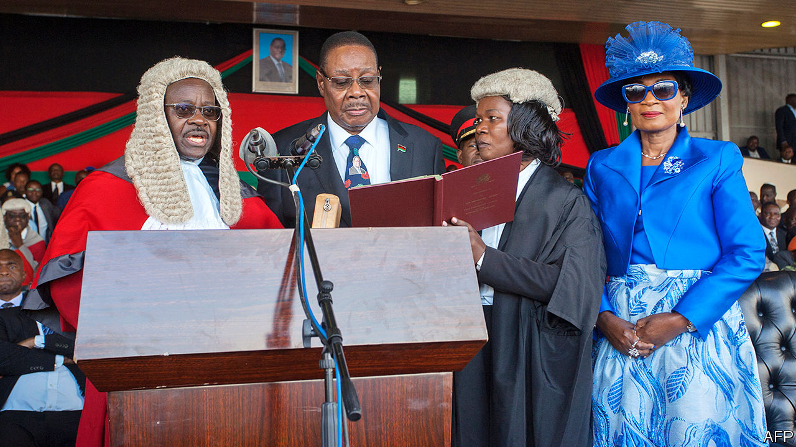

## The Malawi model

# More African judges are standing up to governments

> But authoritarian rulers are fighting back

> Jun 25th 2020NAIROBI

MALAWI’S CHIEF JUSTICE, Andrew Nyirenda, is an industrious chap. Since donning the wig 26 years ago he has racked up 572 days of untaken leave, or so says the office of Peter Mutharika, Malawi’s president. Last week it ordered Mr Nyirenda (above left) to go on holiday immediately. Since the chief justice would reach retirement age before the end of his break, it also said he should step down forthwith.

Mr Nyirenda presides over Malawi’s Supreme Court, which in May upheld a ruling annulling the president’s re-election last year after a lower court found correction fluid had been used to alter the tallies. He will also be the ultimate arbiter of the re-run that took place on June 23rd. Mark Botomani, the information minister, insists these are coincidental: the government merely wants to give Mr Nyirenda enough time to relax and “write his biography”.

Since inducement, intimidation and pressure are occupational hazards that African judges frequently encounter, it might have been reasonable to expect Mr Nyirenda’s capitulation. But he refused to go, as did Edward Twea, another supreme-court judge the government tried to shuffle into early retirement. Malawi’s legal community has rallied around both men. Hundreds of lawyers marched to support them and a court has stayed their dismissal. For the moment, at least, Mr Mutharika (above centre) has had to back down.

The obduracy of Malawi’s judges is not only welcome; it could have consequences beyond the country’s borders. Their demand for a re-run of the presidential vote is only the second time that courts in Africa have overturned a dodgy election; Kenya’s Supreme Court did so in 2017.

Precedent alone will probably not be enough to free Africa’s judiciaries. A culture of subservience to governments runs deep. Allan Hancox, Kenya’s chief justice between 1989 and 1993, was fond of telling colleagues that their chief loyalty was not to the state but to the head of state (then the dictator Daniel arap Moi).

Even where judiciaries were more independent, politicians often got the better of them. Robert Mugabe forced Zimbabwe’s chief justice and many of his colleagues to resign in 2001 after they ruled that his land grabs were unlawful. A chill swept over Senegal’s judiciary after Babacar Seye, the vice-president of the Constitutional Court, was assassinated in 1993 before a ruling on an election petition. And bribery has often been as effective as intimidation in neutering judges.

African judiciaries have grown a little more impartial in recent years. Yet progress is uneven. For every Malawi, there is a Democratic Republic of Congo, where the courts last year upheld President Félix Tshisekedi’s victory in an election he actually lost by some distance. For every Kenya, there is a Zambia, where in 2018 the Constitutional Court allowed President Edgar Lungu to ransack the constitution and serve a third term if he felt like it. Varieties of Democracy, a network of scholars that monitors global freedom, reckons that Africa’s courts are less independent than those of any region bar the Middle East.

Broad reforms will be needed to create truly independent judiciaries. But bolder judges can help, too. Malawi’s ruling, like Kenya’s before it, may inspire some. Others may wonder how judges fare after overturning an election. In Kenya’s case, the answer is mostly discouraging.

After his re-election was overturned in 2017, Uhuru Kenyatta, Kenya’s president, vowed to make life hell for the judges responsible. The court was unable to delay a re-run of the election because five of its seven judges failed to show up for the ruling after gunmen shot up the deputy chief justice’s car the night before.

Since Mr Kenyatta’s re-election, the government has made life difficult for the chief justice, David Maraga, and his colleagues. Judgments against the state are routinely ignored and the president has refused to confirm the appointments of 41 judges since July last year. A backlog of cases has grown to more than 600,000.

Some judges may take solace in Mr Maraga’s refusal to yield, even if they are unwilling to emulate his lonely struggle. In Malawi judges may be in for an easier time, since Mr Mutharika seems unlikely to return to office (the results of the election were not out when The Economist went to press). “Judiciaries in Africa are at a crossroads,” says Willy Mutunga, Mr Maraga’s predecessor as chief justice. “They either become appendages of the forces that subvert their independence or resist those forces in the interests of the country.” ■

## URL

https://www.economist.com/middle-east-and-africa/2020/06/25/more-african-judges-are-standing-up-to-governments
