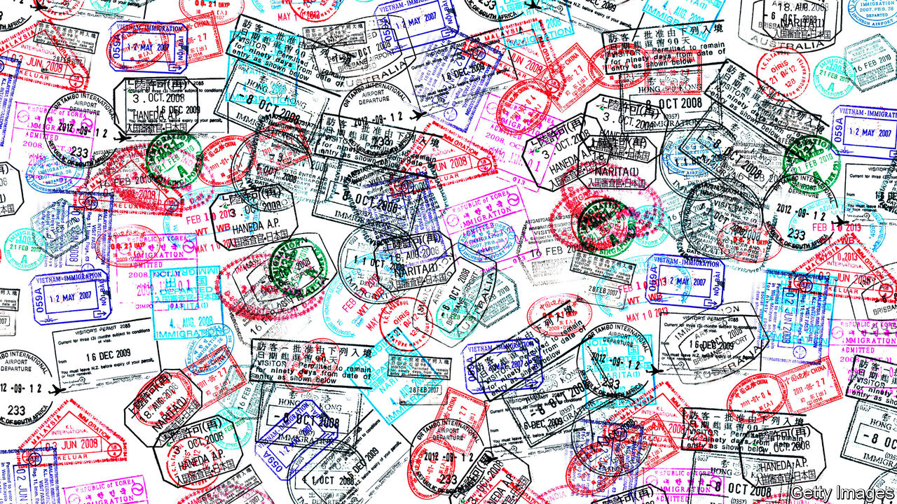
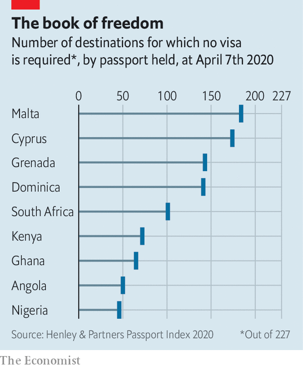

## Travel trouble

# Wealthy Africans are shopping for foreign passports

> If a Nigerian passport opens few doors, buy a Maltese one

> Jun 25th 2020

A NIGERIAN PASSPORT, says Karo Agono, a Nigerian businessman, raises all sorts of “red flags”. For 15 years international deals made by his finance and property business were held up when people saw his green travel document and then asked for stacks of extra paperwork. Fed up, Mr Agono stumped up $150,000 for citizenship of a Caribbean country.

More and more rich Africans are buying second passports or foreign residency rights. They do so because their own passports open few doors (see chart). Henley and Partners, which advises people on how to acquire a spare nationality, says inquiries from Africa are up by a third compared with last year. The firm is opening an office in Lagos, adding to those in Johannesburg and Cape Town. Habila Malgwi of Arton Capital, another adviser, says it has agents in 15 African countries and plans to open an office on the continent “very, very soon”. Covid-19 has led to soaring interest. People, he says, are looking for a Plan B.

Mr Agono, who is waiting for his new passport, hopes it will help him enter new markets. There are intangible benefits, too. Tari Best, who runs a Nigerian logistics company, is expanding his business to Singapore. With his new Grenadian passport “we are treated as equals”, he says. Others wish to whisk a spouse or lover off to the French Riviera or nip over to their kids at Eton without queuing for visas. And a few, of course, want to up sticks altogether.

The wealthy country-shopper has a range of options. A passport from Antigua and Barbuda requires a “contribution” of $100,000 to the government’s National Development Fund or a property investment of $200,000 that can be sold off in five years. Nigerians, says Mr Malgwi, are especially keen on Caribbean passports, which can be had in just three months.

South Africans and Kenyans seem to favour residency in sunny Portugal. The cheapest option is to buy an old rural villa for as little as €280,000 ($315,000). For those hankering after European Union citizenship, a “donation” of €650,000 to the government of Malta, topped up by half a million euros in investment, should ensure that a sleek burgundy passport arrives in the post. The cash that countries earn from these schemes adds up. In Dominica annual inflows from foreigners buying citizenship equal 10% of GDP.

Still, some worry about these “golden passports”. Didier Reynders, the EU Justice Commissioner, fears they can be used for money-laundering and recently warned that covid-19 should not be used as an excuse to run dodgy citizenship schemes. Last year Cyprus moved to strip citizenship from 26 investors after “mistakes” were made in vetting them. Among them is a Kenyan tycoon who has appeared in court on allegations of tax evasion. Citizenship firms are at pains to point out that they vigorously screen their clients (though the ultimate responsibility, they are careful to add, lies with governments).

Do well-heeled Africans eyeing a “golden passport” need to grab one now before they all disappear? Probably not, least of all in Malta, where the family law firm of the prime minister, Robert Abela, had a licence to sell Maltese passports (it stopped doing so after he took office in 2020). One way to reduce the demand for second passports would be to make it easier for Africans to visit and work in rich countries. Until then, their best bet may be to copy another Nigerian businessman who recently got a passport from Dominica and resoundingly declares: “It is a life-changer.” ■