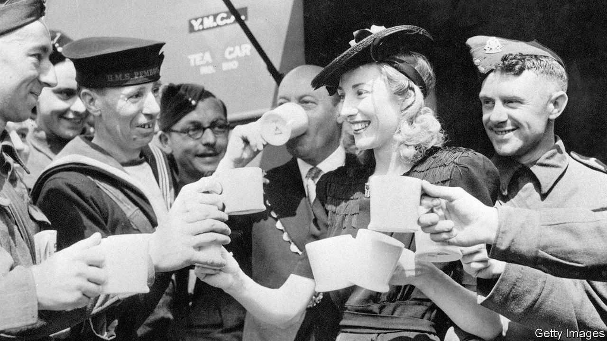

## Queen in all but name

# Vera Lynn died on June 18th

> The singer who kept Britain going through the second world war was 103

> Jun 25th 2020

AS SOON AS her pay for singing with the Bert Ambrose band was doubled in 1938, Vera Lynn bought herself a fur coat. She also got a green Austin 10 with a soft canvas top, and a three-bed semi for herself and her parents in Barking. There she could soak in her very own big bath and go to the lavatory indoors. But the coat was the first thing she bought. It cost £75. Every young girl in the 1930s wanted that sort of coat, of course. And she also felt she needed it, even deserved it, for what she was doing. When it settled heavily on her shoulders, she felt like royalty.

She was always well aware of what she was worth. More than the 6/6d a week she got for sewing buttons in her first job; she left after a day. More than the £20 a week Ambrose paid her for being a “crooner”, so she let him know she could get good work as a non-crooning soloist elsewhere. More than the dismissive look some people gave her because she was toothy and gawky and, when she opened her mouth, talked Cockney—or at least East Ham, which was not the East End, really Essex. And she was worth a lot more, when she started recording, than being just the “vocal refrain” on the B-side of a sixpenny Woolworth’s record. Her ambitions were much bigger than that.

And why not? Her voice was clear and strong, a deep contralto, once songs were pitched low enough to suit it. Her enunciation was crisp and bright. And she had a real nose for a good song. When she went along to Denmark Street to browse through the publishers’ sheet music, she could pick out a winner at once, by the words. She never could read music, but the tune was almost an afterthought. It was all about the feeling. If the lyrics had the right sentiment, were simple and from the heart, the song was right for her. She could believe in it then, and perform it with such complete sincerity that she moved her audience to tears.

So she proved during the second world war, when songs she’d found— “We’ll Meet Again”, “The White Cliffs of Dover”, “There’ll Always be an England”—had an extraordinary effect on Britain. Her voice, whether on scratchy 78s, crackling through a wireless or live in London halls with sirens wailing outside, became the bluebird of “White Cliffs” that flew hopefully above the horrors. On Sunday evenings listeners at home and abroad were glued to her “letter to the forces”, “Sincerely Yours”, as she played requests and relayed messages. She so raised the morale of both the home front and the boys abroad that she was sometimes jokingly credited with winning the war all by herself. And it secured her a status so lasting that 80 years later, in another crisis, Britain turned to her again, giving her a billing and an affection second only to the queen’s.

Not all approved of her wartime popularity. She was at the lowly end of the social scale, the daughter of a plumber and a seamstress, and if she didn’t care about that, others did. It made some people shudder (as it had made her teachers shudder) that she had forged her teenage singing career in those terrible places, working-men’s clubs. High-ups at the BBC called her songs “slush”, and some generals and MPs complained that they might make soldiers desert. Her quick retort was to point to her postbag: 1,000 letters a week from servicemen, who adored her because she was ordinary, friendly and sisterly, the sort of girl they had left behind. What was more, they especially liked the sentimental songs. She knew they would. They were corny but home-bred, like a conversation between two people who found it hard to express their feelings to each other, as many ordinary English people did. We’ll meet again, don’t know where, don’t know when...

She wasn’t glamorous like the Hollywood stars, Betty Grable for example, whom the fighting men all lusted after. Nothing sparkled on her; she wore utility suits and, often, uniform. She was not remote; she brought home closer to the boys and, at home, she was in the fight with everyone else. She sang in factories, on airfields, and in the Underground during the Blitz. After concerts in London she would drive home in her Austin 10, a tin hat beside her in case shrapnel came through the roof. She popped over with flowers to hospitals where soldiers’ wives had just had babies, to announce the good news on her show. And in 1944 she went out to the Far East to sing to her farthest-flung listeners in person.

It was her special duty, she felt, to cheer up boys who were forgotten. In Burma, the toughest part of the trip, she was one girl among 6,000 men. She swapped her flowing chiffon frock for shapeless khakis that at least kept the mosquitoes out, and sang until her make-up ran in the humidity and her voice became a croak. In camp she lived as the boys did, in a grass hut, washing out of a bucket. She drank tea with them, and sat on their beds in field hospitals to chat, even though the stench of gangrene almost overwhelmed her. The battle of Kohima was raging not far off, and she was game to record her songs against the gunfire. That was forbidden but, in any case, she was already the sweet voice of the war.

She traded on that for the rest of her long life. Any brave things she had done were brushed off, as she kept her Burma souvenirs (the tiny secret diary, the fresh-tugged bullet she was given by a surgeon) in a plastic bag stowed in a drawer. After all, she had been one among so many. But she went on singing the songs and working for forces’ charities, and thus stayed firmly fixed in public hearts. Producers of her many concerts and TV shows, from the 1950s to the 1980s, often tried to update her. They persuaded her to wear modern gowns and to sing Lennon-McCartney and country music, both of which she rather liked. But if they dared to suggest that “White Cliffs” or “I’ll Be Seeing You” were outmoded, she was horrified and offended. The songs summed up Britain in its finest hour. She—after 1975, Dame Vera—had to keep that memory alive.

The public certainly understood. Her appearances, even with her voice long gone, drew crowds who cheered her as warmly as ever. In chillier weather the regal fur came out again, if only as a hat. She would smile back in constant delight, regularly waving, as if she had been born to it. Women would sometimes curtsy to her, feeling it was right somehow. For this was like a queen passing.■

## URL

https://www.economist.com/obituary/2020/06/25/vera-lynn-died-on-june-18th
