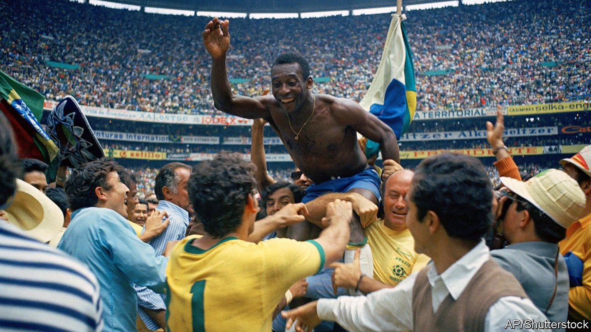

## Corner kicks and cutting corners

# Brazil restarts the beautiful game

> Messily

> Jun 27th 2020SÃO PAULO

BEFORE COVID-19 hit Brazil, Santo André, a football club from the outskirts of São Paulo, was leading the state championship. It hoped to secure a spot in the national one next year. On March 16th, with two regular games left to play, the league shut down. Santo André’s stadium became a field hospital. At least five players whose contracts expired during the hiatus left for other clubs.

In June its president, Sidney Riquetto, learned that other state clubs were flouting quarantines to practise secretly, sometimes without uniforms on municipal pitches. Mr Riquetto cried foul. In a scramble for the ball, “players in better shape will get there first,” he complains.

Brazil, which has won the football World Cup five times (including 50 years ago this week), is eager to resume playing the game it thinks it plays better than anyone else. But kicking off during the covid-19 outbreak is proving tricky and contentious. Brazil has recorded 1.2m cases and 53,830 deaths, more than any other country except the United States.

Ninety-five players from the top league, nearly a sixth, have tested positive for the coronavirus. Nine are from Flamengo, 2019’s national champions from Rio de Janeiro. They hosted Brazil’s first mid-pandemic match on June 18th at Maracanã stadium (against Bangu, with no fans), metres away from a covid-19 field hospital.

In São Paulo, which still bans matches, clubs are getting antsy. “We have been very patient,” says Thiago Scuro, the athletic director of Red Bull Bragantino, though not enough to abide by a league-wide pact not to train as long as clubs in some parts of the state are not allowed. (The club has now agreed to wait until July 1st, when the governor says practice can resume state-wide.)

Brazil’s president, Jair Bolsonaro, a Flamengo fan, is keen for the sport to restart. Odds of a footballer dying from covid-19 are “infinitely small”, he says. But football’s bosses are trying to be more responsible. There is “no evidence” that athletes can’t get ill, say guidelines for clubs published by Brazil’s Football Federation. They recommend no spitting or handshakes. Less reassuring is the suggestion for clubs that do not have coronavirus tests on hand: ask a player to sniff coffee placed 5cm away from his nose. If he can smell it, he’s probably not infected. Santo André plan to house players in rented training centres to keep them covid-free. If other clubs take such care, Mr Riquetto says, football will help restore a “sense of normality” to Brazil. It’s a big if, he admits.■

## URL

https://www.economist.com/the-americas/2020/06/27/brazil-restarts-the-beautiful-game
