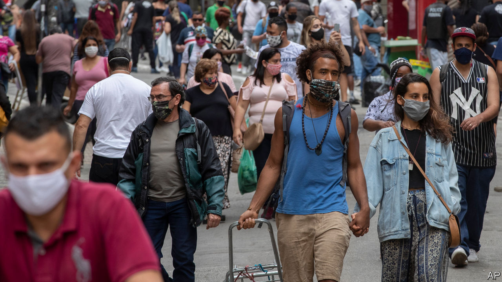
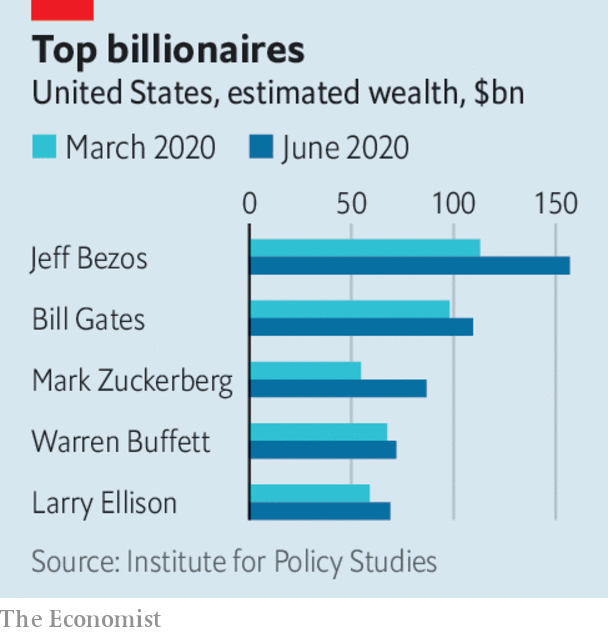

# Business this week

> Jun 27th 2020

The IMF drastically reduced its outlook for the world economy, projecting that it will contract by 4.9% this year. The downward revision was across the board; all regions will suffer shrinkage. America’s GDP is now expected to fall by 8%, Britain’s and the euro area’s both by 10.2% and Japan’s by 5.8%. Most emerging markets will fare little better. China, though, is forecast to grow by 1%. See [article](https://www.economist.com//node/21788601).

Andrew Bailey, the governor of the Bank of England, said that he doesn’t want its bond-buying programme to become a “permanent feature” of the British economy. In a shift of policy from his predecessor, Mark Carney, Mr Bailey indicated that it “would be better to consider adjusting the level of reserves first” before raising interest rates. The central bank recently increased its quantitative-easing programme by £100bn ($125bn).

The Pentagon released a list of 20 companies and state-controlled enterprises it believes are owned or supported by the Chinese army. The publication of the list, which includes Huawei, is mostly symbolic. Congress required the Pentagon to catalogue entities with ties to China’s armed forces in 1999, but no document had ever been made public before.

Wirecard, a German digital-payments company, filed for insolvency after Markus Braun, its chief executive, was arrested to answer allegations of fraud. The company has admitted that €1.9bn ($2.1bn) held on its balance-sheet probably does not exist. In what is one of Europe’s biggest accounting scandals in recent years, Wirecard acknowledged the money was phantom after two banks in the Philippines where it supposedly had been deposited denied having ever received it. See [article](https://www.economist.com//leaders/2020/06/24/wirecards-scandal-shows-the-benefits-of-short-sellers).

Bayer agreed to pay up to $10.9bn to settle claims that its Roundup weedkiller causes cancer. The German drugs and chemicals company inherited the claims when it bought Monsanto, Roundup’s maker, in 2018. It might have to make further payouts to those plaintiffs who are refusing to settle.

Apple said it would start offering desktop and laptop computers powered by chips designed in-house, rather than those from Intel, its current supplier. The chips, derived from designs by ARM, which is based in Britain, will be similar to those that already power its smartphones and tablets. Apple hopes that the ability to run software across multiple devices might boost sales of its Mac computers. See [article](https://www.economist.com//business/2020/06/27/why-apples-developers-are-cross).

Brazil’s central bank blocked Facebook’s digital-payments service on WhatsApp because it had yet to complete its analysis of the implications. WhatsApp Pay was launched in Brazil just a week ago.

Business organisations in America were angered by Donald Trump’s decision to expand the scope of restrictions on immigrant visas for workers. Mr Trump claims this will protect American jobs. But the head of the US Chamber of Commerce, Thomas Donohue, warned that the measures will reduce job creation. See [article](https://www.economist.com//node/21788547).

GVS, an Italian maker of personal equipment to protect against biohazards, went public on the Milan stock exchange, in Europe’s second-biggest IPO of the year so far.

SoftBank sold most of its stake in T-Mobile. The Japanese conglomerate raised almost $20bn by selling shares on the stockmarket and in a private tender, a signal to investors that it still has financial clout following some disastrous investments that left it with an $8.8bn annual loss. Meanwhile, Son Masayoshi, SoftBank’s chief executive, stepped down from the board of Alibaba, bringing an end to the firms’ close relationship.

The British government confirmed that pubs, restaurants and other services such as hairdressers will be allowed to reopen in England on July 4th. Britain has lagged behind France, Italy and other European countries in easing restrictions. Hotels have seen a surge in bookings for July and beyond, but if infections rise again it will be a short-lived break for holiday-makers. See [article](https://www.economist.com//britain/2020/06/27/england-leaves-lockdown).

Perhaps those looking to get away from it all could look to space. Virgin Galactic signed a deal with NASA this week to prepare a plan for taking fee-paying passengers to the International Space Station. That may take some time; the company has yet to take space tourists on its less arduous suborbital flights.

The pandemic has stranded many workers at home, and also sent millions to the unemployment line. But that has meant tech giants have done well as home offices are kitted out with equipment and people communicate remotely. The soaring stock of those companies, and others, has increased the wealth of their bosses and, as a consequence, America has gained nearly 30 new billionaires since March, according to the Institute for Policy Studies, a left-leaning think-tank. The top five are thought to be 26% richer collectively than before covid-19.

## URL

https://www.economist.com/the-world-this-week/2020/06/27/business-this-week
