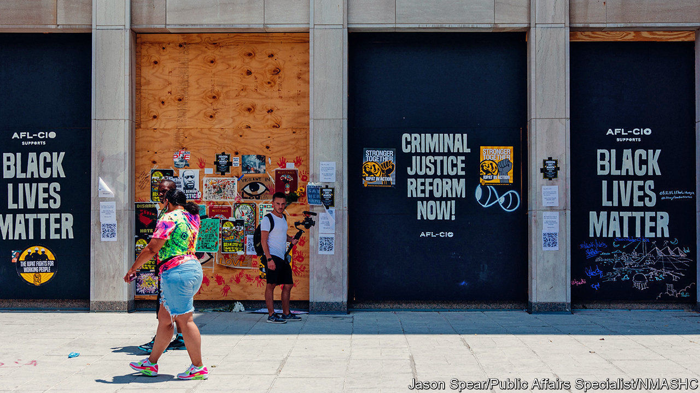

## Instant museums

# America’s blue-chip collectors rush to preserve artefacts from protests

> That Black Lives Matter sign could already be in the Smithsonian

> Jun 27th 2020WASHINGTON, DC

BY COVERING the high steel fence that briefly surrounded the White House this month with slogans, messages and the portraits and names of black Americans killed by police, protesters transformed it into a tableau of anger and grief. Before the barrier was taken down, they carefully moved the signs onto a nearby wall in the newly named “Black Lives Matter Plaza”. Washington’s Smithsonian museums are now taking preservation efforts a step further.

Curators from two institutions on the Mall—the National Museum of African-American History and Culture (NMAAHC) and the National Museum of American History—along with the Anacostia Community Museum, in the city’s predominantly black south-east, are working together to collect remnants of the biggest protests seen in America in half a century. The venture reflects an increasing enthusiasm among museums for “rapid-response collecting”: gathering artefacts as big moments unfold.

Though the term was coined by the Victoria & Albert museum in London, which has a gallery dedicated to objects collected in this way, the NMAAHC has been in the vanguard of the movement. Its recorded collection includes a placard reading “Baltimore: An Uprising not a Riot!” from the protests sparked by the killing of Freddie Gray in 2015 (“Medium: ink on paper with metal, cardboard”) and a broom used to clear up afterwards (“Medium: wood, straw, wire”).

Similar efforts to gather protest paraphernalia are being made by museums across America. In a digital era in which events are recorded in great detail, it may seem odd that often ordinary objects have assumed such value. But digital records are easily lost: online storage systems become obsolete, and laws often get in the way of archiving videos. Digital material is more compelling viewed alongside the physical objects which bring most people to museums. Establishing provenance, which can be complicated for an item collected only a few years later, is straightforward if it is picked up at the scene.

Yet collecting museum pieces in this way can still be a delicate business. Curators have begun the collection process slowly, hanging out, telling demonstrators about their work, and taking the signs they are given. There is no plan yet to display them, says Aaron Bryant, a curator from the NMAAHC, though he expects they will take their place in a wider exhibition. “Our first and most urgent priority is to preserve,” he says.■