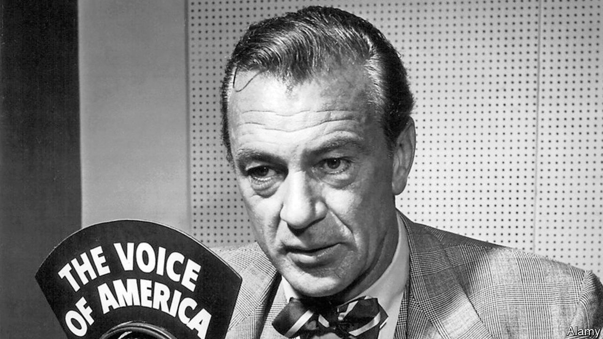

## Radio Free Trump

# Decapitating America’s state-funded media

> The White House takes aim at American soft power

> Jun 25th 2020

IN COMMUNIST times, recalls Stoyana Georgieva, editor-in-chief of the Bulgarian news website mediapool.bg, her grandfather would listen in secret to the American-sponsored shortwave radio stations that were among the few sources of uncensored news behind the Iron Curtain: Voice of America (VOA), Radio Free Europe and Radio Liberty (RFE/RL). When she became a reporter for RFE/RL herself in the 1990s, “it wasn’t just a media outlet, it was a cause...a window to the life that we could have some day.” Over the past decade, when news media in much of eastern Europe have been taken over by governments or oligarchs, RFE/RL has again become a crucial source of independent reporting.

Now the independence of RFE/RL itself is in question. On June 4th the Senate confirmed Michael Pack as the new head of the US Agency for Global Media, the parent organisation of RFE/RL and VOA. Mr Pack, a filmmaker and ex-president of the paleo-conservative Claremont Institute, is a close ally of Steve Bannon, formerly the president’s chief strategist. On June 15th the director of VOA resigned. Two days later Mr Pack fired the heads of RFE/RL and four other organisations in his purview: Radio Free Asia, the Middle East Broadcasting Network, the Office of Cuba Broadcasting and the Open Technology Fund, which builds software for secure news gathering. Government interference in news gathering and editorial decisions is prohibited by law. But firing the directors sent a clear signal.

To those who rely on the American news agencies, it all seemed dismally familiar. In Romania, Bulgaria, Hungary or Russia, the sequence is routine. An independent news outlet is taken over by allies of an oligarch or political party. The editors resign or are fired. Next comes an abrupt shift to a government-friendly editorial line. Can the same happen in America? “I never imagined I would witness something like this,” says Marius Dragomir of the Central European University in Budapest.

Part of the anxiety stems from Mr Pack’s CV. The Claremont Institute has produced some of the most radical alt-right thinking of the Trump era. (In 2016 it published “The Flight 93 Election”, an essay arguing that Hillary Clinton’s election would lead to the destruction of America.) But part stems from his confirmation process. Opposed by Democrats and backed only tepidly by Republicans, Mr Pack’s nomination languished in the Senate for two years.

Then in April the White House unexpectedly attacked VOA for allegedly praising China’s response to covid-19. (It had republished an innocuous Associated Press article on the reopening of businesses in Wuhan.) Suddenly Republicans pushed Mr Pack through on a party-line vote.

The roles played by the American-funded news agencies vary. The most important in eastern Europe is RFE/RL, which broadcasts in native languages and sponsors local subsidiaries. In Romania, Bulgaria and Ukraine, where most newspapers and television channels are owned by oligarchs who use them to slander their enemies, it provides a rare source of impartial information. In Hungary, nearly all media have fallen into the hands of businessmen friendly with Prime Minister Viktor Orban or of a foundation controlled by his Fidesz party. To counter that, RFE/RL plans to open a branch this autumn.

Independent news websites like Atlatzso in Hungary and Hromadske in Ukraine have excellent investigative reporters, but they are vulnerable to retaliation. America’s diplomatic support for RFE/RL outlets, like Bulgaria’s Svobodna Evropa, helps protect them. Then there are authoritarian regimes like Vietnam and China. There, VOA and the regional services (RFE/RL, Radio Free Asia and the Middle Eastern and Cuban outlets) serve the same function as during the Soviet era: getting information past the firewalls of censors.

Of course, Mr Pack could yet hew to the legal firewall that protects the agencies’ editorial independence. Peter Kreko of Political Capital, a Hungarian think-tank, praises the plans developed by Jamie Fly, the fired RFE/RL head. One test will be whether the news services go easy on those whom the White House favours. (Last year America’s ambassador in Budapest unsuccessfully lobbied RFE/RL to promise that its Hungarian outlet would not be too harsh on Mr Trump’s friend, Mr Orban.)

At risk is the credibility these agencies have built over half a century of independence. Their reporters are worried. “We are so stunned by the news that no one knows what to expect,” says a staffer at an RFE/RL subsidiary in eastern Europe. Mr Pack’s new appointees should respect their agencies’ editorial freedom. Otherwise, audiences will think them just as untrustworthy as those controlled by their own oligarchs and politicians. ■

## URL

https://www.economist.com/united-states/2020/06/25/decapitating-americas-state-funded-media
