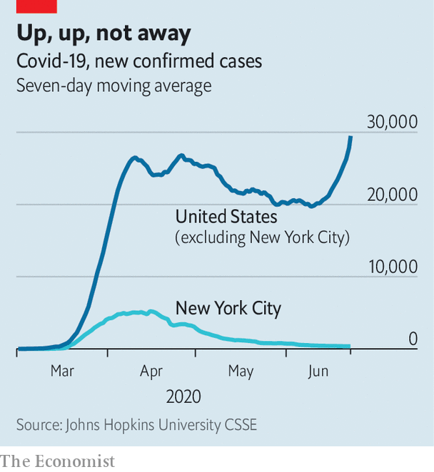

## Unhappy medium

# Decoding the confusing messages of the coronavirus epidemic in America

> The US has too few cases for a total lockdown and too many to open up safely

> Jun 27th 2020

ON JUNE 21ST the World Health Organisation announced a record increase in coronavirus cases round the world: 183,000 new cases during the previous 24 hours, more than at the height of the pandemic in April. A fifth were in the United States, which faced—as Anthony Fauci, an infectious-disease expert, told Congress—a “disturbing surge” in infections.

Five days before, Mike Pence, the vice-president, wrote an article in the Wall Street Journal pouring scorn on “alarm bells over a ‘second wave’ of coronavirus infections”. Pointing to falling numbers of deaths, he claimed that “panic is overblown…we are winning the fight against the coronavirus”. President Donald Trump later told Fox News the virus would just “fade away”.

Such contradictory claims are more than playing with numbers. They reveal a changing pattern of infection which is not only confusing but, in the final analysis, worrying for the future of the pandemic.

America’s death toll and caseload are high, and not only in absolute terms. Per head, it has had twice as many cases as Europe and about 50% more deaths. The number of new cases rose 42% in the two weeks to June 21st, and this national average disguises a more disturbing trend. America’s totals have been dominated by the terrible outbreak in New York City. Greater New York has accounted for about a third of all deaths. If you strip out the area, you find new-case numbers in the rest of the country barely budged in May, rose in June and are now as high as they were at the height of the pandemic (see chart). Outside New York, America has failed to halt the growth of the coronavirus.

The pandemic has spread as it has grown. On June 24th infections were rising in 27 states. In 18, new cases were at record levels. In the early days, the epidemic was concentrated in the north-east. Now it is moving to the sunbelt. Ten of the states where numbers are rising fastest are in the West; they are also rising in all but one of the states of the Confederacy, as well as one confederate territory (Arizona).

This is changing who gets the disease, as well as where. The epidemic began as an infection of inner cities, minorities and Democratic areas. It is now spreading through suburbia, among whites and in Republican places. Bill Frey, a demographer at the Brookings Institution, a think-tank, has been tracking the course of the infection by looking at counties which report significant rises in cases (meaning, by 100 or more per 100,000 people). Early in the disease, at the end of March, 81% of people living in such counties were in cities; 48% were white (less than the white share in the population) and a third had voted for Mr Trump in 2016. In the two weeks to June 14th, 2% lived in inner cities; 70% were white and 58% had voted for Mr Trump.

The spread of disease has not (so far) been accompanied by the disasters that were widely feared. There has been no repetition of New York state’s catastrophe, with its almost 400,000 cases; California, a more populous place, has had less than half that number. The death toll has fallen to roughly 500 a day, compared with more than 2,000 at the peak. There is some evidence that the disease is getting less fatal as it spreads. In California and Florida, deaths from covid-19 are running at about 3% of the number of cases. That is lower than in New York, where the figure is 8%, and far below the worst-hit countries in Europe, where it is 14-18%. (It should be said that these numbers are notoriously unreliable because they vary according to the testing regime; still, the disparity is striking.)

All this shows there have been successes in America’s response to the pandemic, as well as problems. Compared with the number of cases, its death toll is modest, perhaps because victims tend to be relatively young. Its hospitals and doctors seem to be getting better at treating the disease. Even the Black Lives Matter protests have not been super-spreader events, perhaps because (suggests a study by Dhaval Dave of Bentley University, Massachusetts) other Americans reacted by not going out, limiting the spread of infection.

But these successes do not compensate for the failures. Rather, they leave America stuck between two poles. New cases are too low to justify reimposing lockdowns in order to control the virus. But they are too high to reopen states safely and resume normal life. It is an unhappy medium. At best, America is likely to stumble along with its current levels of infection over the next few months. At worst, as Dr Fauci told Congress, America could face a second, more damaging wave this winter. ■

## URL

https://www.economist.com/united-states/2020/06/27/decoding-the-confusing-messages-of-the-coronavirus-epidemic-in-america
