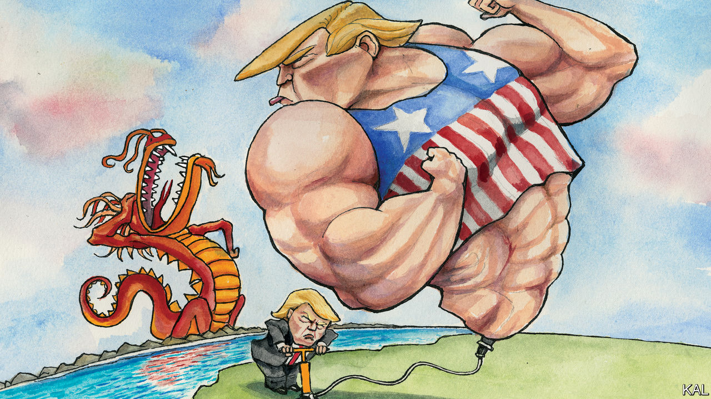

## Lexington

# Is Donald Trump tough on China?

> John Bolton destroys the president’s signature foreign policy boast

> Jun 25th 2020

AT TWO RALLIES this week President Donald Trump really let China’s Communist Party have it. Fully three times he referred to covid-19 as the “kung flu”. This was a significant escalation of his more tentative (though still shocking at the time) reference to the “Chinese virus” in March. Forewarned by the president’s terrific build-up (“It’s a disease, without question, has more names than any disease in history…”), the unmasked MAGA crowds loved it. For many others, however, the case for Mr Trump’s fabled toughness on China has rather fallen apart.

The main service of John Bolton’s White House tell-all, “The Room Where It Happened”, is to describe this disintegration in meticulous, largely dispassionate and thus credible detail. Mr Trump’s expressed commitment to pegging back a more assertive China was timely—even if less agenda-setting than often suggested, his former national security adviser writes. It “embodies” a pre-existing bipartisan and cross-government desire for a tougher US posture towards China. Yet the president’s efforts were from the start cynical, contradictory and fundamentally self-defeating.

The administration’s permanent state of chaos—in which “panda-huggers” such as Steve Mnuchin and dragon-slayers like Robert Lighthizer and Peter Navarro vied to influence the daily policy lurches—played a role in that. But the main reason was Mr Trump. In Mr Bolton’s telling, he showed little ambition and none of the patience necessary to address the ways in which China games the economic system. He had no interest in pushing back on Xi Jinping’s growing authoritarianism; he admired it. Herding a million Uighurs in prison-camps was “exactly the right thing to do”, the president allegedly told his Chinese counterpart more than once. (His fawning before Mr Xi—you’re the “greatest leader in Chinese history”—is often toe-curling.) Mr Trump’s sole concern, in Mr Bolton’s telling, was to strike a trade deal that he could spin to his base as a win, however insubstantial its contents. In time this became his explicit negotiating pitch: Mr Bolton describes the president “pleading with Xi to ensure he’d win” re-election by promising to buy more American soyabeans and wheat. It was apparently for this that Mr Trump waged a trade war estimated to have cost 300,000 American jobs before the pandemic struck.

China, which was also suffering badly from the tariffs, must have been amazed that America would settle for so little. And, given Mr Trump’s desperation for the “phase one” trade deal signed in January, there was always going to be a fair chance it would be able to wriggle out of honouring its commitments. Sure enough, China is already undershooting its promise to spend $211bn on American goods and services by the end of the year—such that Mr Navarro declared the deal “over” this week. The president tweeted back that, no, it was “fully intact”. Mr Trump’s coarsening of America’s political culture is often described, in Daniel Patrick Moynihan’s artful phrase, as a case of “defining deviancy down”. He is increasingly defining toughness on China down, too.

The collateral damage from Mr Trump’s trade policy goes beyond America’s hard-hit farmers and factories. Mr Bolton describes the president intervening to block routine law enforcement of Chinese corporate abuses—including the sanctionsbusting of ZTE, a telecoms firm—for fear it would hurt his prospect of a deal. America’s allies were “discouraged and confused” by such capriciousness. China appears to have been encouraged. It is hard to see any sign—in its assertiveness during the pandemic and otherwise—that Mr Trump has caused it to rethink its economic model or global influence campaign.

Perhaps the best that can be said for Mr Trump’s blundering is that it didn’t produce even worse outcomes. The US-China relationship is in poor shape; yet he has shown it to be more resilient than many feared. It no doubt helped that Mr Trump has little interest in China’s most neuralgic strategic concerns. If he wins a second term, Mr Bolton predicts, he may well “abandon” Taiwan.

Another consolation is that the president’s effort to weaponise China electorally appears to be failing. Surveys suggest Joe Biden enjoys the same seven-point lead on handling China that he has overall. It seems Mr Trump’s ambition to define himself as strong on China and “Beijing Biden” as weak has been overtaken by events. Who cares that he barred travellers from China in February when the European Union is considering banning entrants from virus-ravaged America today? Especially—if Mr Bolton is right—when Mr Trump’s China policy is partly to blame for that tragedy. In a television interview, he alleged: “Trump didn’t wanna hear about [the virus]...He didn’t wanna hear bad things about Xi Jinping...He didn’t wanna hear bad things about the Chinese economy that could affect the ‘fantastic’ trade deal he was working on.”

A third upside, given undimmed bipartisan enthusiasm for confronting China, is that Mr Trump has provided a number of lessons in how not to go about that. And the weaker he looks, the more they are being heeded. Almost every Republican in Congress supported the Uighur human-rights bill that Mr Trump grudgingly signed into law last week. A bipartisan Tibet human-rights bill is in the pipeline. Meanwhile Mr Biden’s campaign, which three months ago was being pushed to sound more strident on China by the protectionist left as well as by the president, is instead starting to sound more thoughtful.

A senior adviser to the former vice-president on China describes plans to identify and invest in the sources of America’s competitiveness. He cites the country’s economy, alliances and democratic values. It is too early to detect in this the makings of a successful China policy. Mr Biden has got a lot of foreign policy wrong over the decades. But it does have the advantage of sounding serious. “Being wrong” about America’s interests is another thing Mr Trump has defined down.■

## URL

https://www.economist.com/united-states/2020/06/25/is-donald-trump-tough-on-china
