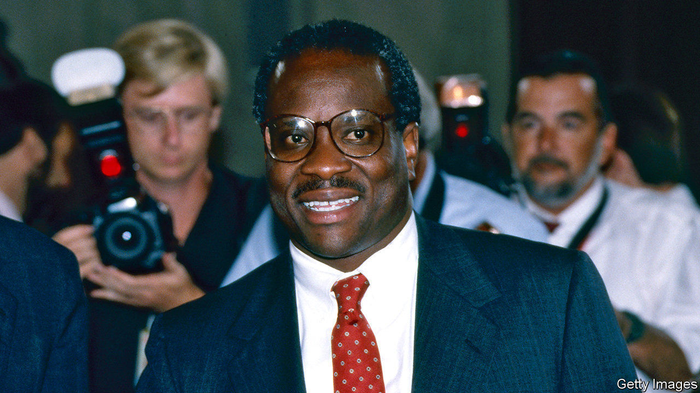

## Radical justice

# Will Clarence Thomas stick it out for a 30th year on the court?

> Some conservatives would like Donald Trump’s favourite justice to step aside

> Jun 27th 2020NEW YORK

WHEN HIS nomination to the Supreme Court was approved by a 52-48 Senate vote in 1991, Clarence Thomas was in the bath. “Whoop-de-damn-doo!” he cried to his wife, who had delivered the news. Nearly three decades after his confirmation battle, in which he was bruised by charges of sexual harassment, America’s second black justice has cultivated a defiant jurisprudence. He also has the distinction of being Donald Trump’s favourite judge.

The most conservative jurist on the Supreme Court, now aged 72, disdains affirmative action, abortion and gay rights (but views gun rights as fundamental). He rebuffs challenges to the death penalty and seeks to rein in federal power and agencies like the Equal Employment Opportunity Commission, which he chaired under Ronald Reagan in the 1980s. His lone vote to gut the Voting Rights Act in 2009 presaged Shelby County v Holder, a 5-4 decision that did just that four years later. Justice Antonin Scalia (who was a close friend) once called him a “bloodthirsty” originalist: he hews to his perceptions of what the constitution meant when it was ratified.

Mr Thomas has travelled a lonely road. He grew up impoverished in Georgia in the 1950s, dropped out of a Catholic seminary and embraced black nationalism—the militant approach of Malcolm X and Stokely Carmichael—as a college student. At Holy Cross in Worcester, Massachusetts, Mr Thomas and friends founded a black student union to forge “a sense of racial identity and group solidarity” and “expose and eradicate social inequities and injustices.” Some of the organisation’s demands were similar to those heard on campuses today: more black students and faculty, courses in black history and literature, celebration of black culture. Other principles might sound less familiar: the “black man” wants “the right to perpetuate his race” and “does not want or need the white woman.”

Mr Thomas’s radicalism crested in 1969 when he took part in a sit-in to protest against campus recruiters for General Electric, a company thought to discriminate by race. The next year, he joined a violent march on Harvard Square against the Vietnam war and the jailing of Black Panther leaders. Back at Holy Cross, he resolved to quell his anger at the assassination of Martin Luther King and at the Catholic church’s failure to stand up to racism. After a dalliance with leftist activism, he wrote in his memoir of 2007, “I grew up.”

Mr Thomas’s move to the right began at Yale Law School, where his admission under a racial-quota programme became, he wrote, “the soft underbelly of my career”. White liberals might not be openly racist, but they were “more likely to condescend to blacks” and (he discovered after graduation) just as unlikely to offer him a job. When at last he secured a position working for Missouri’s attorney-general, Mr Thomas found his muse in Thomas Sowell, a Marxist-turned-conservative economist. Black grit and self-sufficiency, Mr Sowell wrote—not reliance on white benevolence—were the way forward.

As a lawyer for Monsanto and through eight years in the Reagan administration, Mr Thomas became increasingly sceptical that racism could be unravelled from the fabric of American society. “There is nothing you can do to get past black skin,” he said in 1987. “You’ll never have the same contacts or opportunities, you’ll never be seen as equal to whites.”

Opportunity came in 1990 when George H.W. Bush tapped Mr Thomas for the Circuit Court of Appeals for the District of Columbia and, 16 months later, for the seat that Thurgood Marshall, the first African-American on the Supreme Court and an icon of civil rights, would soon vacate. Mr Bush introduced his nominee as the “best-qualified” for the job, a claim that even Mr Thomas saw as “extravagant”.

This experience as a wary beneficiary of affirmative action echoes in Justice Thomas’s dissent from a 2003 ruling, upholding the University of Michigan law school’s race-conscious admissions policy. Justice Thomas quoted Frederick Douglass: “The American people have always been anxious to know what they shall do with us...Do nothing with us!” Well-meaning yet “meddling” admissions officers consumed by “a faddish slogan of the cognoscenti”—classroom diversity—were discriminating on the basis of race and undermining black students. Whites should give a black applicant not a leg up but, in Douglass’s words, “a chance to stand on his own legs.”

Justice Thomas’s votes almost always match those of his conservative colleagues, but they often reflect his idiosyncratic views of race in America. Burning a cross is not free expression protected by the First Amendment, he wrote in a dissent in 2003, as it is conduct, not speech. Government vouchers for religious schooling not only square with religious liberty but save “poor urban children otherwise condemned to failing public schools,” he wrote the previous year. But de facto segregation in those schools, he argued in 2007, cannot be a government concern, as “racial imbalance can also result from any number of innocent private decisions, including voluntary housing choices.”

This mindfulness of race extends to disparate matters. The right to bear arms, Justice Thomas contended in 2010, was often “the only way black citizens could protect themselves from mob violence” after the civil war. Last year he dissented from a decision overturning the conviction of a man whose prosecutor systematically struck off black jurors. (He thought the jurors were struck off for race-neutral reasons, and also believed the man was guilty.) In an abortion case, he tied the pro-choice movement to America’s history of racist eugenics.

Only one of these adventures in creative jurisprudence attracted a second signature. Some included his frequent call to reconsider—and overturn, if necessary—Supreme Court rulings that went awry. Justices “are obligated to think things through constantly”, Mr Thomas says, “to re-examine ourselves, to go back over turf we’ve already ploughed.” When a decision is “demonstrably erroneous”, he wrote in 2019, the doctrine of stare decisis, letting precedents stand, must give way.

His jurisprudence may be harsh, but Justice Thomas is gregarious and warm. During oral arguments he jokes with liberal Justice Stephen Breyer, and offers a hand to even-more-liberal Justice Ruth Bader Ginsburg as she descends the stairs. He seems to relish his independent pen. A tally by Adam Feldman, a Supreme Court statistics guru, reveals he writes 24 opinions per year compared with 15, on average, for his eight colleagues. That prodigious output may seem to contradict his famous reticence during oral arguments. Until he found his voice last month for two weeks of pandemic-adapted hearings conducted by telephone, Justice Thomas averaged less than a minute of air-time per year over his nearly three decades on the bench.

With Mr Trump’s electoral prospects and the Republicans’ hold on the Senate both looking shaky, Justice Thomas faces an option Justice Ginsburg rejected between 2009 and 2014. The leader of the court’s liberal wing could have stepped aside and given Barack Obama a third high-court appointment before the Senate flipped to Republican control in 2015. Now, at 87 and after four bouts of cancer, her nail-biting decision to try to stick it out seems irresponsible to some on the left.

Melissa Murray, a law professor at New York University, thinks Justice Thomas may be motivated to stay by the prospect of a 6-3 conservative majority once Justice Ginsburg goes. His former clerk Erik Jaffe says activists on the right may try to ease him out before November, to ensure his seat is filled by a young conservative. But, he says, Justice Thomas “sure as hell is not thinking about retiring.”■

## URL

https://www.economist.com/united-states/2020/06/27/will-clarence-thomas-stick-it-out-for-a-30th-year-on-the-court
