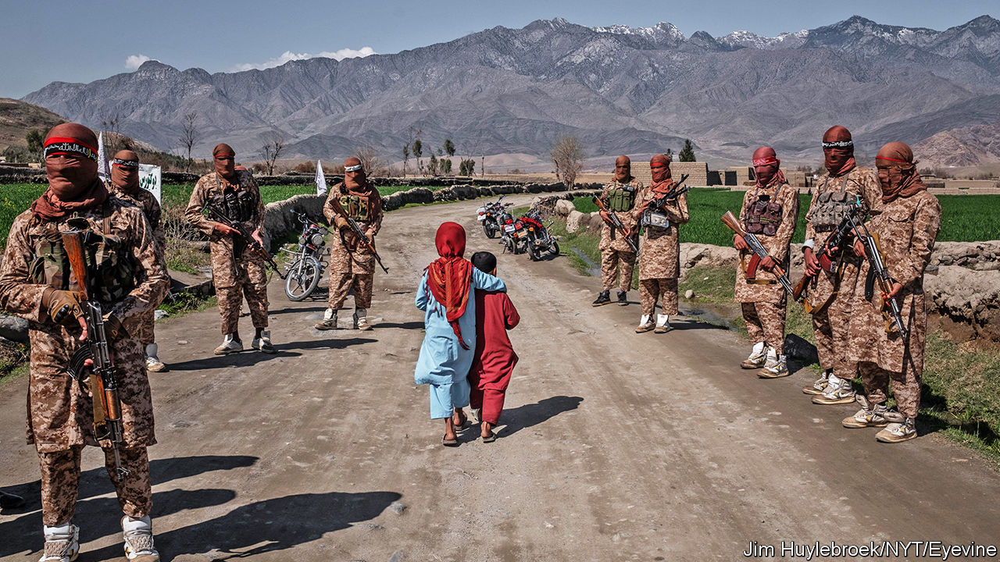

## Withdraw first, ask questions later

# America is rapidly pulling troops from Afghanistan

> The future of the country they are leaving behind is more uncertain than ever

> Jul 2nd 2020ISLAMABAD

FAIZA IBRAHIMI is too young to remember when the Taliban ruled Afghanistan as a theocracy. She can scarcely believe her parents’ stories about it. She is a radio presenter in the western city of Herat. The idea that gun-toting zealots from the countryside used to forbid women to leave home unless fully veiled and accompanied by a male relative seems almost inconceivable: “My mother was unable to work and find bread. I couldn’t imagine that time again.”

It was only in 2001 that American forces toppled the Taliban regime, when the mullahs who led the movement refused to hand over Osama bin Laden after the 9/11 attacks. But nearly two-thirds of the population is less than 25 years old, and so has little or no memory of the Taliban’s rule. They are having to brush up on their history, however, as they contemplate the prospect of the Taliban returning to power in some form. The American troops that have propped up the Afghan government and held the Taliban at bay for the past 19 years are on their way out. Over the past four months the number of American soldiers in the country has fallen by a third, from around 13,000 to 8,600. The administration of President Donald Trump has pledged to reduce their strength still further, as part of a deal it signed with the Taliban on February 29th. In exchange the Taliban are supposed to cease providing shelter to foreign militants and—an element of the peace plan that is proceeding much less smoothly—enter into talks with the Afghan government.

“Intra-Afghan talks”, in which the government, the Taliban, opposition politicians and representatives of civil society were to discuss the country’s future, had been due to start within days of the signing of the accord. But the process immediately bogged down. First, the government and the Taliban bickered over a prisoner exchange outlined in the deal. America had promised that the Afghan government, which was not party to the agreement, would release “up to” 5,000 Taliban prisoners as a gesture of goodwill. The Taliban, in return, were to free 1,000 policemen and soldiers it held captive. Ashraf Ghani, the president, said 5,000 was too many, but the Taliban were adamant. Months passed.

Another sticking point has been the Taliban’s continuing attacks on soldiers and civilians. Although the insurgents observed something close to a ceasefire in late February, to pave the way for the signing of the deal, they reverted to their old ways soon afterwards. The government says they carried out 422 attacks in a single week in June. This breaks a promise to reduce violence, the American and Afghan authorities say. But if the Taliban made such a pledge, it was only in private: the text of the deal did not spell out any truce.

The Taliban did at least cut back on attacks during the Eid holiday in late May. That seems to have spurred Mr Ghani to release most of the required prisoners, even though violence subsequently increased again. There is lingering disagreement, too, over 200-odd people the Taliban want freed, some of whom are accused of terrible atrocities. Nonetheless, diplomats believe the way may at last be clear for talks to begin within weeks, probably back in Qatar, where the original accord was signed.

These discussions, should they go ahead, will give Afghans a glimpse of how much the Taliban have changed their spots since the 1990s. Perhaps unsurprisingly, they have not been clear what they want for the country, beyond the departure of American troops. Their statements speak vaguely of Islamic government. When asked whether their attitudes to women have changed, they say only that women’s rights will be protected in accordance with Islamic teachings. Although they claim no longer to oppose girls going to school, for instance, girls do not seem to be allowed to remain in education past puberty in the rural areas controlled by the Taliban, according to a report published this week by Human Rights Watch, a pressure group.

Some Afghans believe that the Taliban’s refusal to elaborate on their stances is a sign that they are not serious about negotiations, and plan to attempt to seize power by force once the Americans are gone. Others assume that divisions within the organisation make it hard to stake out clear positions. Although the talks with America suggested an element of pragmatism, the Taliban still insisted on referring to themselves as leading an “Islamic emirate”, just as they did when they ruled the country in the 1990s. “If this thing moves forward, the day’s going to come where they can’t just say, ‘We will settle that later’,” says Andrew Watkins of International Crisis Group.

The government, for its part, has said it wants to preserve “a sovereign, democratic and united republic”. It will definitely resist the re-creation of a doctrinaire Islamist regime. In a speech by video-link to an American think-tank on June 24th Abdullah Abdullah, in effect the government’s chief negotiator, said, “We cannot achieve peace with sacrificing the basic and fundamental rights of our people.” He has said he will include women in his negotiating team. But he also concedes that the government will have to compromise to win the Taliban over—without specifying how.

Yet more uncertainty surrounds America’s part in Afghanistan’s future. The only element of the peace plan going according to schedule is the withdrawal of American forces. “It is not the duty of US troops to solve ancient conflicts in far away lands that many people have never heard of,” Mr Trump told cadets at the US Military Academy at West Point on June 13th. Claims that Russia paid a bounty to the Taliban for every American soldier they killed are causing him embarrassment (see [article](https://www.economist.com//united-states/2020/07/02/russia-allegedly-offered-bounties-for-killing-american-soldiers)). Joe Biden, his rival in November’s election, has long been sceptical about state-building in Afghanistan. How forcefully either man would push to preserve Afghan democracy is unclear. Many doubt that either would send troops back in should the Taliban come close to toppling the elected government.

Covid-19 has made all these questions more fraught. The disease is said to be barrelling through the Afghan security services. The American troops who remain in Afghanistan are providing less training to the Afghan army in part to avoid catching it from their Afghan comrades. Attempts to contain the spread of the virus have also hit the already sputtering Afghan economy. Nation-building, under any government, is looking harder than ever.

Afghans like Miss Ibrahimi anxiously await the start of talks. She wants to remain working in Afghanistan to justify her parents’ sacrifices. But she doubts that the gun-toting zealots her mother told her about have changed much. “If the Taliban come with that ideology that they had before 2001, then it won’t be a change for peace, or better security or a better country,” she says grimly. ■

## URL

https://www.economist.com/asia/2020/07/02/america-is-rapidly-pulling-troops-from-afghanistan
