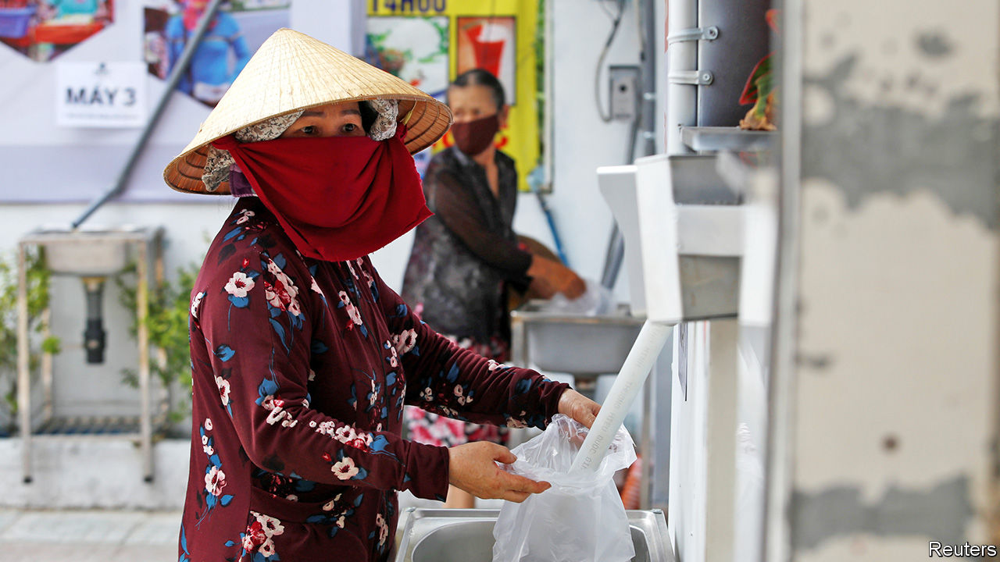

## Your loss, my grain

# As covid-19 saps Vietnam’s economy, private charity is blossoming

> That is unusual for a workers’ paradise

> Jul 2nd 2020HANOI

Editor’s note: Some of our covid-19 coverage is free for readers of The Economist Today, our daily [newsletter](https://www.economist.com/https://my.economist.com/user#newsletter). For more stories and our pandemic tracker, see our [hub](https://www.economist.com//news/2020/03/11/the-economists-coverage-of-the-coronavirus)

DESPITE THE mid-morning heat, residents of the Vietnamese capital, Hanoi, swarm around the dispenser filling their brown paper bags. Having taken her share, Vu Thi Hoan straps the 2kg package to her bicycle and prepares for the journey home. Ms Hoan, who collects and sells trash for a living, has seen her income diminish in recent months, “probably because now there are more trash collectors”. Before covid-19 struck she sold cardboard for 3,000 dong ($0.12) a kilo. Now she is lucky to get a third of that. Like many others, Ms Hoan, a migrant from rural Thai Binh province, only gets by thanks to a free weekly visit to the “rice ATM”.

A property company called Cen Group set up the dispenser in late May to support Hanoi’s poorest through the epidemic. The firm only provided the first five tonnes of rice, however; since that ran out the scheme has continued with donations from the public, says Pham Thanh Hung, Cen Group’s vice chairman. The local authorities have helped, too, says Mr Hung, by expediting the necessary permits, referring people in need and providing police for security. Indeed, generous coverage in the state-controlled media suggests that the top ranks of the Communist Party have blessed the initiative.

Cen Group’s was not the first rice ATM. Hoang Tuan Anh, an entrepreneur, came up with the idea and built the first prototype after hearing about a factory worker who committed suicide after losing her job. Now a handful of companies make them, supplying tens of locations in cities across the country. Each ATM distributes 1.5-2kg of rice per person, enough to feed a small family for three days. Some machines get through three tonnes of rice a day, serving up to 2,000 people.

Vietnam, impressively, fended off covid-19 without a single confirmed fatality. But the pandemic nonetheless caused the economy to sicken. The IMF has slashed its growth forecast this year from 7% to 2.7%. The decline in global consumption has battered manufacturing, which accounts for a sixth of GDP. The sealing of borders has been catastrophic for tourism, another big industry. According to the government, 5m people either lost their jobs or saw their incomes shrink during the first four months of the year. Things are unlikely to have improved much since, although Vietnam did start lifting its lockdown in late April.

At the same time the government approved a 62trn dong ($2.6bn) scheme to help those who have lost their jobs because of covid-19. But would-be recipients complain it has been slow to get off the ground. It is still not clear, for instance, whether migrant workers in informal jobs, the bulk of those using rice ATMs, are covered.

All this may help explain the government’s surprising embrace of private charity, not something people are supposed to need in a proletarian paradise. Large-scale philanthropy is rare in Vietnam, says Danielle Labbé of the University of Montreal, but it is a country where “good ideas replicate quickly.” The theatre of the machines, abetted by favourable press coverage, seems to be an effective way to drum up donations. But one beneficiary waiting to make a withdrawal has an idea of her own. “This is really time-consuming. Why don’t they just put the rice in bags and give it to us straight away?” ■

Editor’s note: Some of our covid-19 coverage is free for readers of The Economist Today, our daily [newsletter](https://www.economist.com/https://my.economist.com/user#newsletter). For more stories and our pandemic tracker, see our [hub](https://www.economist.com//news/2020/03/11/the-economists-coverage-of-the-coronavirus)