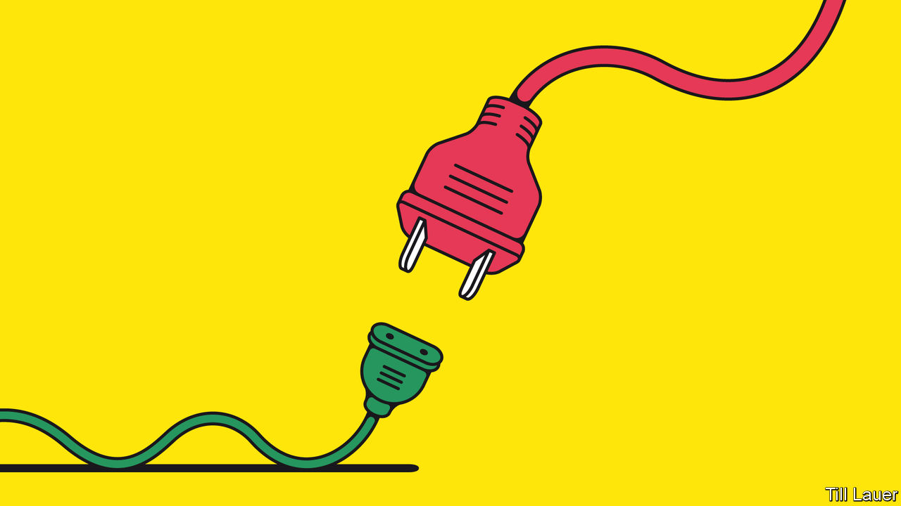

## Banyan

# Chinese investment in Pakistan was supposed to be a showcase

> Instead, it illustrates the limits of China’s new development diplomacy

> Jul 2nd 2020

WHEN XI JINPING launched his Belt and Road scheme of global development aid with Chinese characteristics, he needed a country to showcase it. Pakistan seemed the obvious choice. It was China’s only real ally, a security partner on a vulnerable flank. Meanwhile a new prime minister, Nawaz Sharif, and his business-friendly Pakistan Muslim League had just come to power pledging big infrastructure projects and an end to the country’s notorious brownouts. In 2015 the China-Pakistan Economic Corridor (CPEC) was announced, involving promised sums that soon topped $60bn. This was a “game- and fate-changer” for the country, Mr Sharif crowed. What could possibly go wrong?

Quite a lot, as it happens. The latest evidence is a fresh report by a committee convened by Mr Sharif’s successor, Imran Khan, to look at problems in power generation. It accuses Chinese companies of “malpractices”, including inflating costs. The contractors of two coal-fired plants, at Port Qasim in Sindh province and Sahiwal in Punjab, are allegedly overcharging by $3bn. Construction costs alone were padded by over $200m, it claims.

Pakistan’s indebted power industry is notorious for sleaze, and the findings of the committee, which also faulted local contractors, should come as no surprise. Mr Khan himself campaigned for office by attacking corruption on CPEC projects. After he won the election in 2018, with a little help from Pakistan’s powerful generals, he thought to berate China into renegotiating terms and offering other financial help—he had, after all, inherited a full-blown balance-of-payments crisis. Yet Mr Khan’s first trip to Beijing was mortifying. He got nothing like the money he demanded. And China’s leaders scolded him for airing dirty laundry in public—a Belt and Road no-no.

By late last year things were looking better. Mr Khan had secured an IMF bail-out. The China relationship was back on track, albeit with a greatly pared-down CPEC. Gone were the proposals for industrial co-operation and most of a welter of special economic zones. But work had restarted on other projects. They included a port at Gwadar on the Arabian Sea and a railway from Peshawar to Karachi: that cost a ruinously expensive $8bn, but was too conspicuous a project to abandon. Reassuring both China and Pakistan’s top brass, a retired general was put in charge of a new CPEC authority. It was to serve as a one-stop shop and cut through Pakistan’s enterprise-choking red tape.

Even before the authority had a chance to fail, along came covid-19. Specialist Chinese workers were stuck in their hometowns celebrating the Chinese new year. The government hardly wants to see 75,000 Pakistani employees on CPEC projects laid off, but it cannot afford to keep them at work either. The economy faces its first recession in decades, and yet another balance-of-payments crisis. And since the government eased lockdown regulations in May, coronavirus infections are rising. Mr Khan is desperately pushing for debt relief from all Pakistan’s creditors.

The committee’s report, which the generals presumably approved, is part of the campaign. It raises the stakes with China, which must be appalled at the display of laundry just as America is loudly contending that Belt and Road is all about entrapping poor countries through debt. Yet the evidence of malpractice Mr Khan has revealed may give him leverage to seek better terms; a similar gambit worked for Malaysia last year. To save China’s face, Mr Khan’s government has postponed a corruption investigation. Instead, according to the Financial Times, it is asking to delay repayments for up to a decade.

More concessions are coming. In other words the CPEC game, as a prominent economic commentator, Khurram Husain, puts it, is still on. Yet it will be a much reduced one, with some projects stalled or slowed, and others abandoned. There will be some real benefits: brownouts in much of the country are a memory. But, says Andrew Small, author of a book on China and Pakistan, CPEC “will be defined by the things that might have happened but won’t”.

Pakistan, for instance, will not stop lurching from one economic crisis to the next. Nor will it have the economic confidence to transform its paranoid relations with India. Above all, it will not serve as a model to the world of a new form of relations with a magnanimous China, in which mutual advances in security and economic development are forever blissfully intertwined.