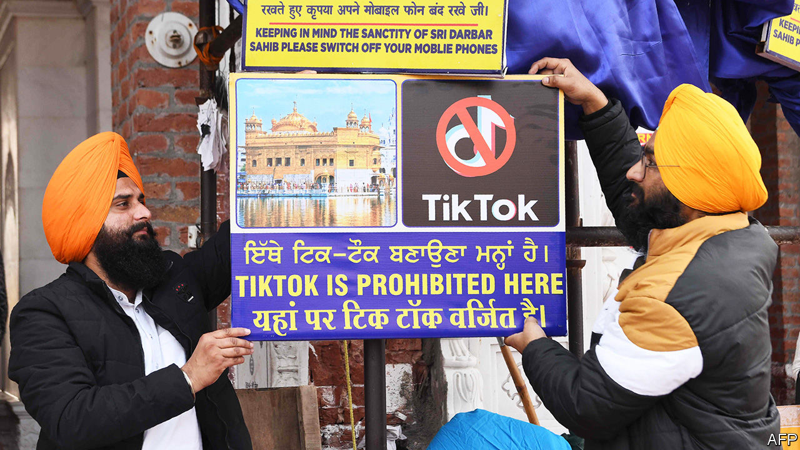

## Fifteen seconds of fame

# India’s ban on TikTok deprives the country of a favourite pastime

> The app provided a window on the heartland

> Jul 2nd 2020DELHI

IN INDIA, AS elsewhere, TikTok looks like a cornucopia of bright and busy nonsense: an endless, blooming, buzzing confusion of shaky videos and cheap special effects, dispensed free of charge in 15-second doses. But time spent on the app—or on its Chinese-owned peers, all of them abruptly blocked by the government on June 29th—had a way of leading curious users far from the big cities and celebrities that typically define Indian pop culture. Not just TikTok, but also Helo, Likee and Bigo Live, were virtual highways to places no actual highways serve, in small-town and rural India. They revealed a part of the country that is changing rapidly.

Thousands of people around India appear to have made a living recording and broadcasting short videos, mostly of shimmying, lip-synching and prat-falling, for millions of other Indians to whom they would otherwise have remained utterly obscure. TikTok had about 1.2m content creators and 120m monthly viewers. A striking proportion of the creators hailed from marginalised groups. A scrawny cloth-seller from a small city could start an overnight dance sensation; swaggering young Muslim comics found audiences as big as those of mainstream Hindi films; transsexual performers shared make-up tips with fans and gawkers; rural grannies taught cooking and a girl built a fanbase while lip-synching to a rap in Hmar, a language spoken in a few small patches of the sparsely populated north-east. A cottage industry of disdainful urbanites had sprung up on YouTube to mock the TikTok army, in classist and sometimes casteist terms. Yet an aspiring dietician from the state of Haryana could build a following of 11m on the strength of his resemblance to Virat Kohli, captain of India’s cricket team. Eventually Mr Kohli himself became his collaborator.

Amit Varma, a podcaster from Mumbai who ran an online course about TikTok, puts the app’s success down to timing. It arrived in 2017, just after Reliance Industries, a huge conglomerate, had launched Jio, a 4G telecoms operation which radically reduced the cost of mobile data. Instead of a gigabyte a month, smartphone users suddenly had a gigabyte a day to play with. Cheaper Chinese handsets, meanwhile, made owning a smartphone more affordable.

“This is not content made by clueless elites,” Mr Varma says. “In Bollywood a few big shots run the whole thing. But they have outdated ideas about what people want.” What they really want, if TikTok’s algorithms had it right, is weirder, homelier and more varied material than they could find on television, YouTube, Instagram or any of the English-first apps favoured by wealthy urbanites. Bidding fans farewell on the evening of June 30th, one TikTok star after another urged them to regroup on one or another of those apps, or on one of the close to 100 Indian copycats that have sprung up.

## URL

https://www.economist.com/asia/2020/07/02/indias-ban-on-tiktok-deprives-the-country-of-a-favourite-pastime
