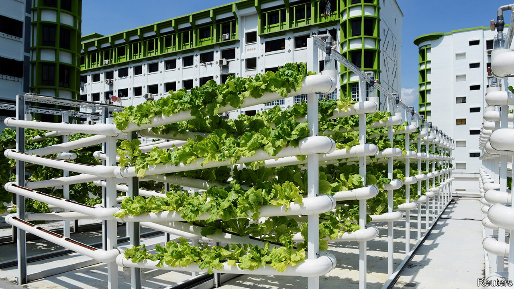

## The rise of the rooftop farmer

# Singapore looks to the skies—for fields

> Government subsidies make excellent fertiliser

> Jul 4th 2020SINGAPORE

BENJAMIN SWAN’S farm is on the fourth floor of an office building in an industrial part of Singapore. To see his crops, visitors are escorted past a door unlocked with a thumbprint and through an airlock. (“Our air is certified,” says an assistant.) Room after room is filled with plumes of kale and lettuce, evenly spaced on long trays stacked in floor-to-ceiling racks. Cables snake across the racks and ceilings, like an electrical root system. LED lights, designed to emit only the part of the electromagnetic spectrum that plants can absorb, cast a purple glow. The greens are planted in a substrate—not a speck of soil is in sight. 

Singapore is a hymn to concrete and metal. But look closely and you can see farms mushrooming across the city-state: on the roofs of malls and car parks, in schools, warehouses and even the site of a former prison. This is new. Commercial farming in the land-scarce city was phased out in the 1970s and 1980s. “Unlike virtually any other country on earth, Singapore has lost a generation of farmers,” says Bradley Busetto of the Global Centre for Technology, Innovation and Sustainable Agriculture, a UN outfit based in Singapore. Today less than 1% of Singapore’s 720 square-kilometre land mass is set aside for farms. But a new crop of entrepreneurs are betting on rewards from finding idle spaces where lettuces may be coaxed to life. Since 2014, 31 commercial urban farms have sprouted. 

The government is delighted. Singapore imports more than 90% of its food. It is “extremely vulnerable to fluctuations in our food availability that may be brought about by climate change, disease outbreaks and global food situations,” says Low Li Ping of the Singapore Food Agency. In 2019 the government said the country should produce 30% of its food by 2030.

It has put its money where its mouth is. Before the pandemic the government had pledged S$207m ($149m) to help farmers boost productivity and to spur research. In April the government, spooked by the pandemic’s (small) disruptions to global markets for food, promised an extra S$30m to help farmers grow more in the next six to 24 months, and invited urban farmers to apply to rent the roofs of nine government-owned car parks. Mr Swan, the indoor kale farmer, credits the government with helping to fund his company’s R&D and introducing him to investors. 

Such help is gratefully received. Farming in the city can be expensive. Property and labour are costly. To maximise space, farmers stack plants. Some go inside, which means losing a free and plentiful input—the sun—but allows greater control of the environment. “Every room is its own climate,” says Sven Yeo of Archisen, an indoor farm that tinkers with temperature, humidity, carbon dioxide, light, water and nutrients to produce tastier lettuce, sorrel and chard. The technology does not come cheap, but it does allow for more frequent and bountiful harvests. Mr Swan says his farm yields 178 times more lettuce per square metre than a traditional one. It started production in 2015 and broke even for the first time in 2018. His labours are bearing fruit. ■

Correction (July 6th 2020): An earlier version of this story said that 720 square kilometres of land had been set aside for farms.