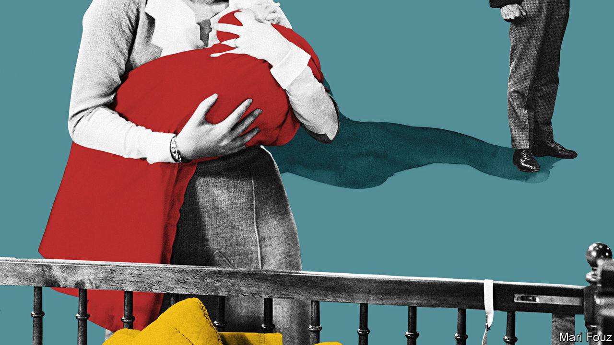

## Cherchez les femmes

# A French politician’s secret child re-evaluates her life

> But in “The Margot Affair” it is her mother, not her absent father, who commands most attention

> Jul 2nd 2020

The Margot Affair. By Sanaë Lemoine.Hogarth; 336 pages; $27. Sceptre; £16.99.

WHEN THE existence of François Mitterrand’s secret child was revealed by Paris Match in 1994, many insiders in France shrugged. “Everyone knew,” people said of the president’s mistress and of Mazarine, his daughter. Discretion over adultery is widely considered a French speciality—yet such deception has its costs. In a new novel about a politician’s secret family, it taints every aspect of life.

Sanaë Lemoine was just a girl when “L’affaire Mazarine” burst into the headlines. Out of the contradictions of this quintessentially French arrangement she has spun “The Margot Affair”, an unusual and accomplished first novel. With a quick wink to the real-life case, she dives deep into the intense, duplicitous relationships at the heart of such a ménage.

Seventeen-year-old Margot is the result of an illicit liaison between Anouk, a glamorous actress, and the married minister of culture. She adores her mainly absent father, fights with her complicated, remote mother and suffers from a “confused feeling of unhappiness”. On the cusp of adulthood she suddenly sees that, relegated to the shadows as they are, she and her mother are “on the wrong side of Father’s double life”, a realisation that sets off a destructive chain of events.

What follows is anything but predictable. Ms Lemoine’s story moves in intriguing leaps and twists until her real subject is revealed: not the famous father, but the fraught relationship between mothers and daughters. In Margot’s eyes, Anouk is always performing, but she repels more than she attracts. Anouk, for her part, practises a harsh, tough kind of love. “A mother is not a friend,” she says. As their world falls apart, it appears that neither she nor Margot’s father is capable of placing the teenager’s welfare above their own.

Though their cloistered life revolves around a distinguished man, it is the feelings of the women that the author charts. Using clever anecdotes, nods to French cinema and allusions to “Bonjour Tristesse”, Françoise Sagan’s classic coming-of-age tale, the novel asks what exactly makes a “good mother”. Darker themes of female violence emerge, yet the story is strangely silent about the father’s responsibility for what happens to his daughter.

Above all, this is a lacerating portrait of a solitary, secretive girl who is both vulnerable and cruel. Margot is “formed and unformed”, observes a woman who offers to ghostwrite her memoir. She seesaws between the child aching for love and a hardened soul who is expert at withholding feelings and truths. The plot’s twists partly flow from her manipulative, almost sociopathic disregard for others.

Good novels can supply insights into other cultures, and, for outsiders, one of this book’s pleasures is the glimpse it affords into French mores and habits. Ms Lemoine is half-French and half-Japanese, but she studied in America and writes in English. Here she lifts the window slats not just on the covert behaviour of consenting adults, but on many facets of bourgeois Parisian life, from its obsession with female bodies and clothes to recipes for clafoutis and vinaigrette. ■